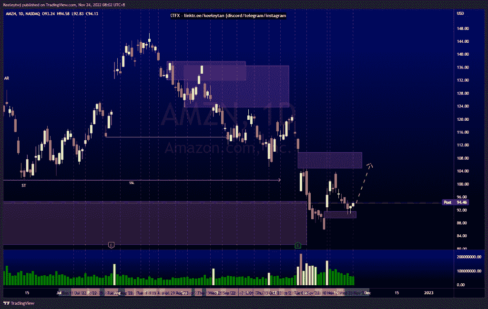
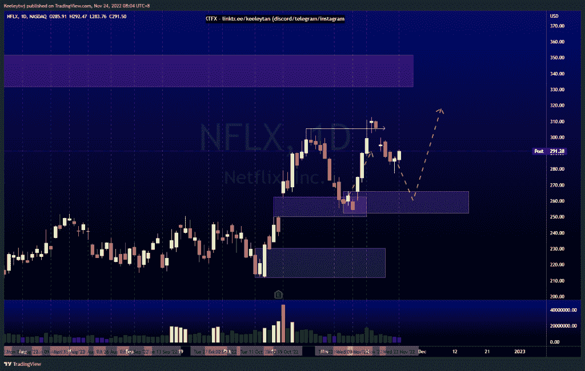
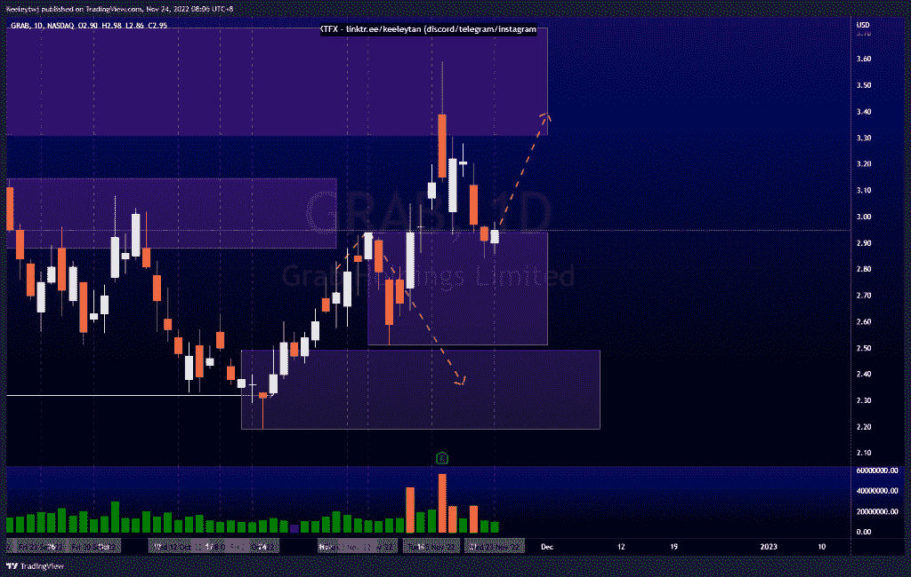

# 股票技术分析# AMZN # NFLX #抓取

> 原文：<https://medium.com/coinmonks/stocks-technical-analysis-amzn-nflx-grab-202b96ef2992?source=collection_archive---------29----------------------->

在这里了解更多关于我的信息(YouTube/insta gram/Telegram):[https://www.linktr.ee/keeleytan](https://www.linktr.ee/keeleytan)

如果你觉得我的帖子有帮助，如果你能在这个帖子上给我一个赞，并关注我以后的类似帖子，我将不胜感激。如果您有任何意见/反馈，请随时使用上面的谷歌表单链接。

不和谐的免费信号服务正式启动。如果有兴趣，请到我的不和谐来看看！

#AMZN

价格未能填补 109.77 的公允价值缺口，并从那里走低。然而，价格最近填补了 91.65 的公允价值缺口，并对其做出了反应。从这里，我预计价格将继续走高，以填补 FVG 在 109.77

[https://www . trading view . com/chart/AMZN/DC 3 w5 fnk-AMZN-Analysis/](https://www.tradingview.com/chart/AMZN/dc3w5FNK-AMZN-Analysis/)

#NFLX

根据我之前的分析，价格很好地尊重了所有的看涨点。根据订单流，我预计价格将在继续上涨之前在 266.08 缓解看涨的 POI。

[https://www . trading view . com/chart/NFLX/cm 5 CWD ka-NFLX-分析/](https://www.tradingview.com/chart/NFLX/cM5cWdKa-NFLX-Analysis/)

#抓取

我预计价格将从看跌点 2.88 反弹，并继续走低。然而，价格使 POI 无效，并再次直奔看跌的 POI 3.72，并对其做出反应。目前，价格正在缓解 2.94 的看涨点，我预计价格将从这里反弹更高。

[https://www . trading view . com/chart/GRAB/m3 dgpngg-GRAB-Analysis/](https://www.tradingview.com/chart/GRAB/m3DGPngg-GRAB-Analysis/)

如果你持有这些公司中的任何一家，就可以点赞、分享和评论！

让我知道，如果你有任何你想让我分析的行情。

一定要在其他社交平台上看看我，我在交易、分析和心理学上发布内容。看看我这里:[https://www.linktr.ee/keeleytan](https://www.linktr.ee/keeleytan)

*原载于 2022 年 11 月 24 日 http://2minutesliteracy.wordpress.com***。**

> *交易新手？试试[加密交易机器人](/coinmonks/crypto-trading-bot-c2ffce8acb2a)或者[复制交易](/coinmonks/top-10-crypto-copy-trading-platforms-for-beginners-d0c37c7d698c)*