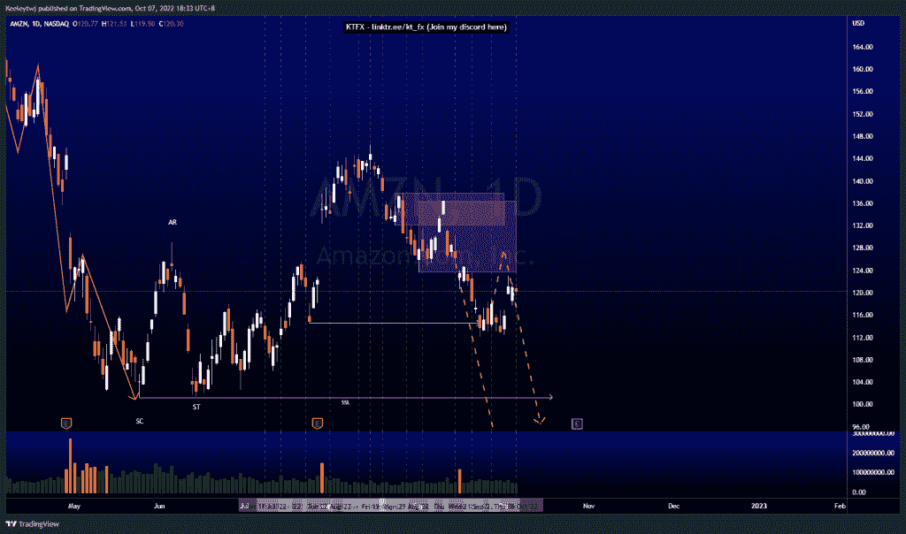
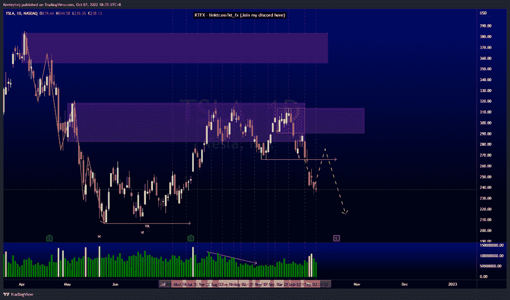
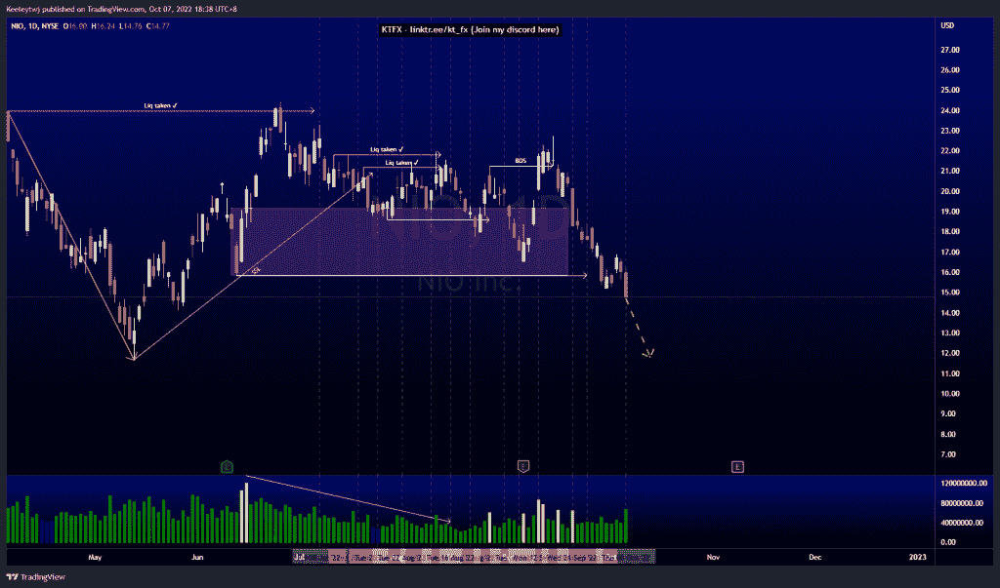

# 股票技术分析#AMZN #NIO #TSLA

> 原文：<https://medium.com/coinmonks/stocks-technical-analysis-amzn-nio-tsla-d01784828b9f?source=collection_archive---------13----------------------->

在这里了解更多关于我的信息(YouTube/insta gram/Telegram):[https://www.linktr.ee/keeleytan](https://www.linktr.ee/keeleytan)

如果你觉得我的帖子有帮助，如果你能在这个帖子上给我一个赞，并关注我以后的类似帖子，我将不胜感激。如果您有任何意见/反馈，请随时使用上面的谷歌表单链接。

不和谐的免费信号服务正式启动。如果有兴趣，请到我的不和谐来看看！

#AMZN

根据上周的分析，价格表现良好。价格到达看跌点 136.49。从这里开始，我预计价格将进入看跌点并继续走低。

#TSLA

根据上周的分析，价格表现良好。在 266.15 的低点后，价格未能推高至 313.80 的熊市点。我预计价格将继续走低，以将卖方流动性收于 206.86。

#NIO

根据上周的分析，价格表现良好。我预计 15.84 的低点会被接受，但也预计会有一个看涨的回撤。价格显示了微弱的看涨走势，市场结构向下破碎。从现在开始，我预计价格会继续走低。

如果你持有这些公司中的任何一家，就可以点赞、分享和评论！

让我知道，如果你有任何你想让我分析的行情。

一定要在其他社交平台上看看我，我在交易、分析和心理学上发布内容。看看我这里:【https://www.linktr.ee/keeleytan】T2

*原载于 2022 年 10 月 7 日***。**

> *交易新手？尝试[加密交易机器人](/coinmonks/crypto-trading-bot-c2ffce8acb2a)或[复制交易](/coinmonks/top-10-crypto-copy-trading-platforms-for-beginners-d0c37c7d698c)*