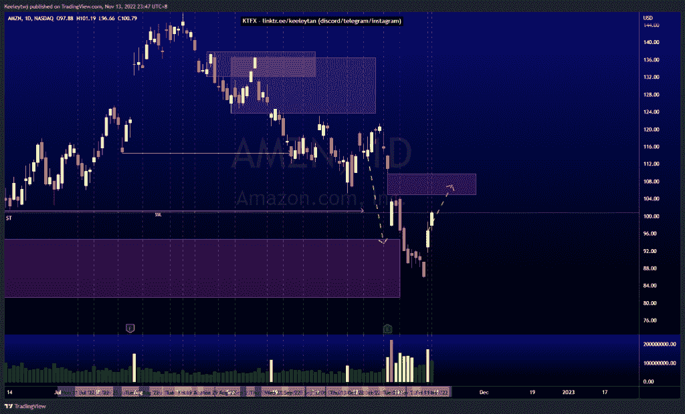
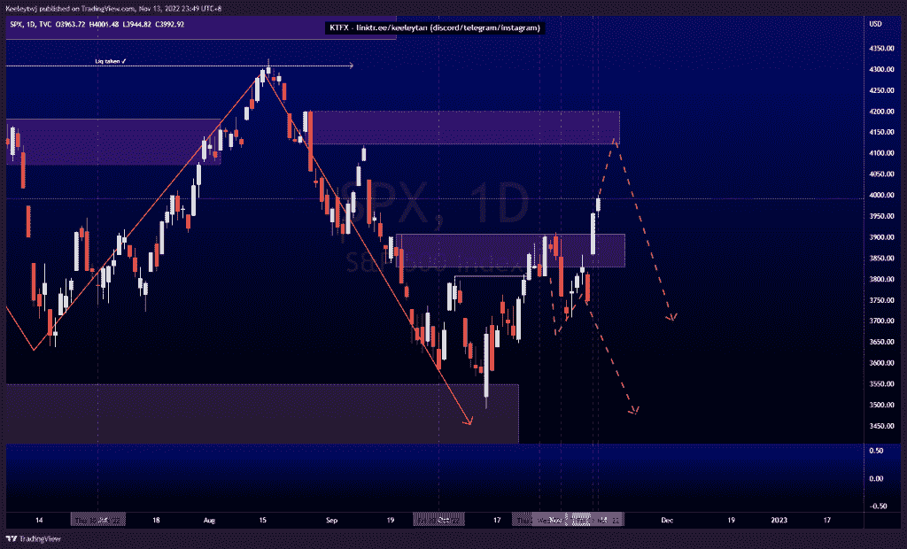
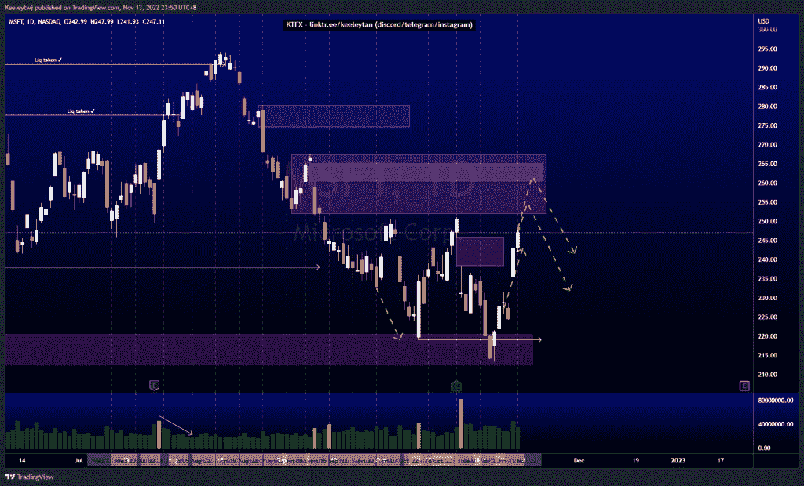

# 股票技术分析#AMZN #SPX #MSFT

> 原文：<https://medium.com/coinmonks/stocks-technical-analysis-amzn-spx-msft-c52853810097?source=collection_archive---------15----------------------->

在这里了解更多关于我的信息(YouTube/insta gram/Telegram):[https://www.linktr.ee/keeleytan](https://www.linktr.ee/keeleytan)

如果你觉得我的帖子有帮助，如果你能在这个帖子上给我一个赞，并关注我以后的类似帖子，我将不胜感激。如果您有任何意见/反馈，请随时使用上面的谷歌表单链接。

不和谐的免费信号服务正式启动。如果有兴趣，请到我的不和谐来看看！

#AMZN

价格回升，从看涨点反弹至 94.71。从这里开始，我预计价格将朝着 109.77 的公允价值差距前进，并看看价格将从那里做什么。

[https://www . trading view . com/chart/AMZN/vpkp 94 ig-AMZN-Analysis/](https://www.tradingview.com/chart/AMZN/vPkP94IG-AMZN-Analysis/)

#SPX

价格使看跌点在 3907.07 无效。下一个潜在目标是 4119.97 点的看跌点，在此位置，随着更高的时间框架订单流，价格继续走低的可能性更大。

[https://www . trading view . com/chart/SPX/ft 9 mfq 6m-SPX-Analysis/](https://www.tradingview.com/chart/SPX/fT9Mfq6M-SPX-Analysis/)

#MSFT

根据上周的分析，价格上涨了。价格填补了 245.83 英镑的公允价值缺口。下一个潜在目标是缓解 251.94 的看跌点，并填补 260.40 的公允价值缺口。

[https://www . trading view . com/chart/MSFT/I 8 oo E0 GD-MSFT-Analysis/](https://www.tradingview.com/chart/MSFT/I8Ooe0Gd-MSFT-Analysis/)

如果你持有这些公司中的任何一家，就可以点赞、分享和评论！

让我知道，如果你有任何你想让我分析的行情。

一定要在其他社交平台上看看我，我在交易、分析和心理学上发布内容。看看我这里:[https://www.linktr.ee/keeleytan](https://www.linktr.ee/keeleytan)

*原载于 2022 年 11 月 15 日 http://2minutesliteracy.wordpress.com***。**

> *交易新手？试试[加密交易机器人](/coinmonks/crypto-trading-bot-c2ffce8acb2a)或者[复制交易](/coinmonks/top-10-crypto-copy-trading-platforms-for-beginners-d0c37c7d698c)*