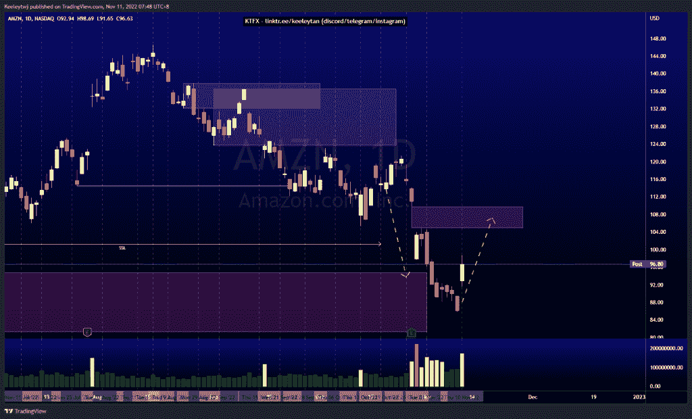
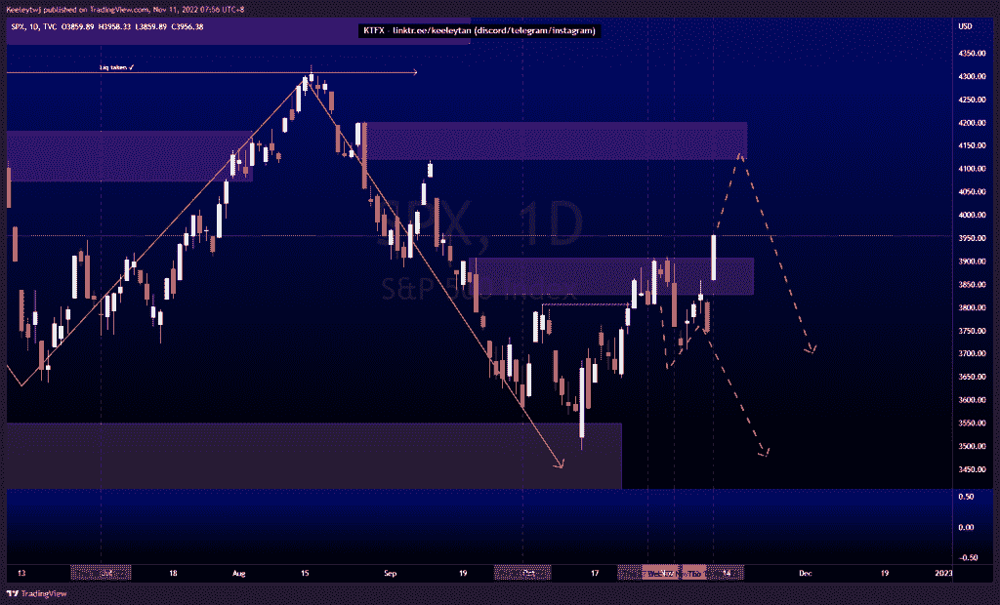
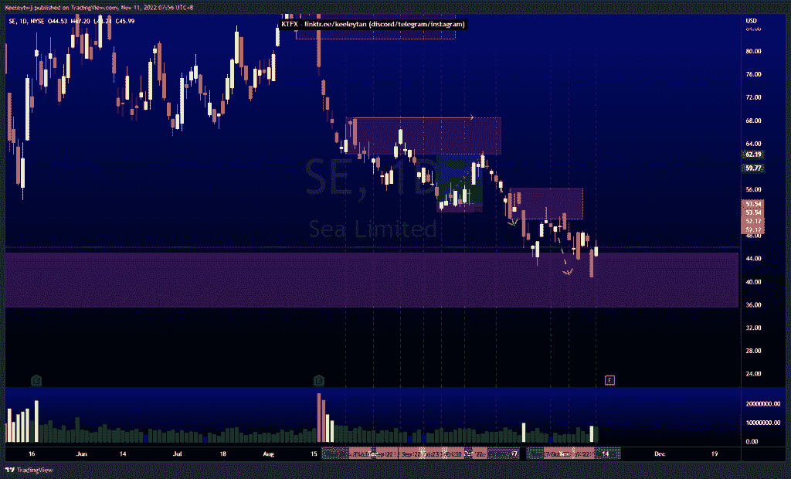

# 股票技术分析#AMZN #SPX #SE

> 原文：<https://medium.com/coinmonks/stocks-technical-analysis-amzn-spx-se-3fc27bf00da1?source=collection_archive---------6----------------------->

在这里了解更多关于我的信息(YouTube/insta gram/Telegram):[https://www.linktr.ee/keeleytan](https://www.linktr.ee/keeleytan)

如果你觉得我的帖子有帮助，如果你能在这个帖子上给我一个赞，并关注我以后的类似帖子，我将不胜感激。如果您有任何意见/反馈，请随时使用上面的谷歌表单链接。

不和谐的免费信号服务正式启动。如果有兴趣，请到我的不和谐来看看！

#AMZN

价格的走势与上周的分析完全一致。价格缓解了 94.71 的看涨点。我预计在这种反应下，牛市回撤将填补 109.77 的公允价值缺口。

[https://www . trading view . com/chart/AMZN/e 5 ilta 2 I-AMZN-Analysis/](https://www.tradingview.com/chart/AMZN/e5ILtA2I-AMZN-Analysis/)

#SPX

根据我之前的分析，价格未能尊重 3907.07 的看跌点。从这里开始，我预计价格将达到 4119.97 的熊市点，然后随着更高的时间框架订单流继续下行。

[https://www . trading view . com/chart/SPX/vdhn 2 om 9-SPX-Analysis/](https://www.tradingview.com/chart/SPX/vDHn2om9-SPX-Analysis/)

#SE

价格与我上周的分析相符。价格在 45.00 减轻了看涨 POI，现在更深。我预计在第三季度收益发布之前，价格将在这个范围内盘整。

[https://www.tradingview.com/chart/SE/8tJdmIYg-SE-Analysis/](https://www.tradingview.com/chart/SE/8tJdmIYg-SE-Analysis/)

如果你持有这些公司中的任何一家，就可以点赞、分享和评论！

让我知道，如果你有任何你想让我分析的行情。

一定要在其他社交平台上看看我，我在交易、分析和心理学上发布内容。看看我这里:[https://www.linktr.ee/keeleytan](https://www.linktr.ee/keeleytan)

*原载于 2022 年 11 月 10 日 http://2minutesliteracy.wordpress.com***。**

> *交易新手？试试[加密交易机器人](/coinmonks/crypto-trading-bot-c2ffce8acb2a)或者[复制交易](/coinmonks/top-10-crypto-copy-trading-platforms-for-beginners-d0c37c7d698c)*