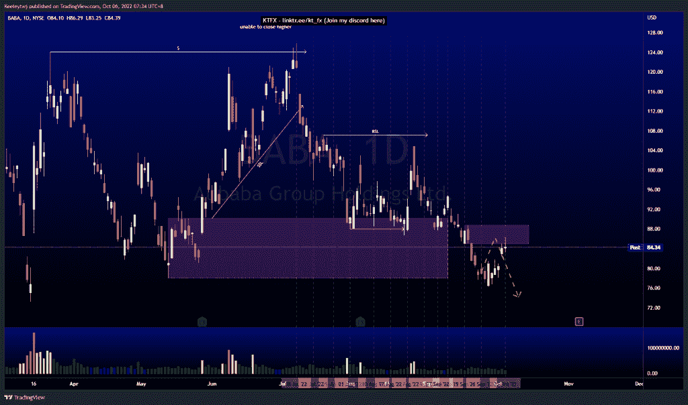
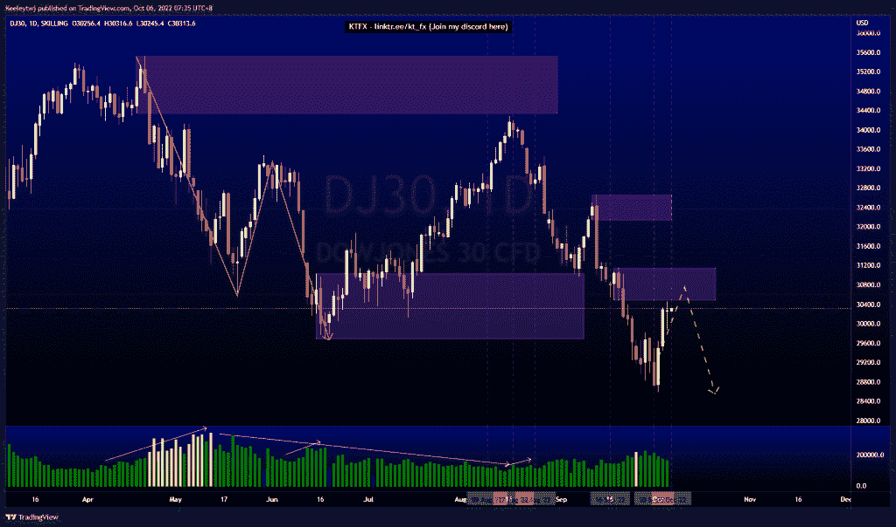
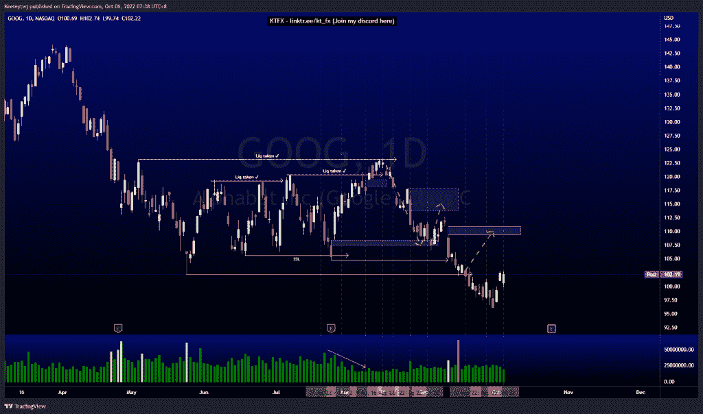

# 股票技术分析#BABA #DJ30 #GOOG

> 原文：<https://medium.com/coinmonks/stocks-technical-analysis-baba-dj30-goog-3d0e63eb222?source=collection_archive---------38----------------------->

在这里了解更多关于我的信息(YouTube/insta gram/Telegram):[https://www.linktr.ee/keeleytan](https://www.linktr.ee/keeleytan)

如果你觉得我的帖子有帮助，如果你能在这个帖子上给我一个赞，并关注我以后的类似帖子，我将不胜感激。如果您有任何意见/反馈，请随时使用上面的谷歌表单链接。

不和谐的免费信号服务正式启动。如果有兴趣，请到我的不和谐来看看！

#巴巴

根据上周的分析，价格正在上涨。价格目前在 85.00 减轻看跌点。我预计这一点保持和价格继续走低。

#DJ30

正如上周分析的那样，价格表现良好。价格正朝着 30485.6 的熊市方向发展，我预计价格会有所缓解，然后继续走低。

#GOOG

根据上周的分析，价格上涨了。价格最近打破了次要的市场结构。从这里开始，我对价格走向填补 110.93 的公允价值缺口的最初预期保持不变。

如果你持有这些公司中的任何一家，就可以点赞、分享和评论！

让我知道，如果你有任何你想让我分析的行情。

一定要在其他社交平台上看看我，我在交易、分析和心理学上发布内容。看看我这里:【https://www.linktr.ee/keeleytan】T2

*原载于 2022 年 10 月 5 日***。**

> *交易新手？尝试[加密交易机器人](/coinmonks/crypto-trading-bot-c2ffce8acb2a)或[复制交易](/coinmonks/top-10-crypto-copy-trading-platforms-for-beginners-d0c37c7d698c)*