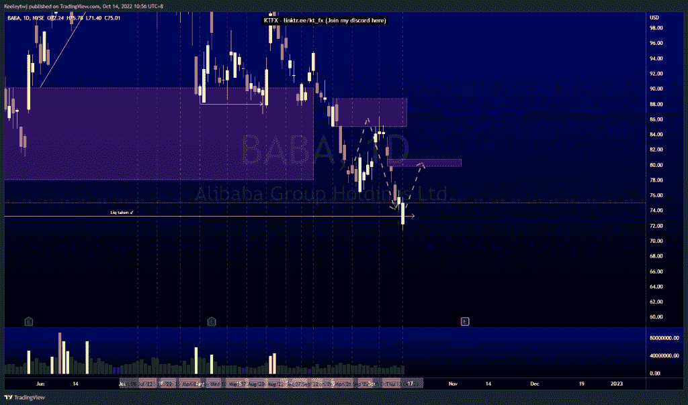
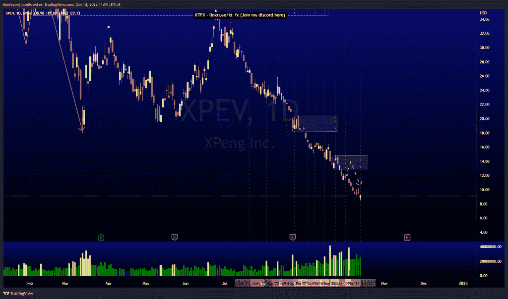
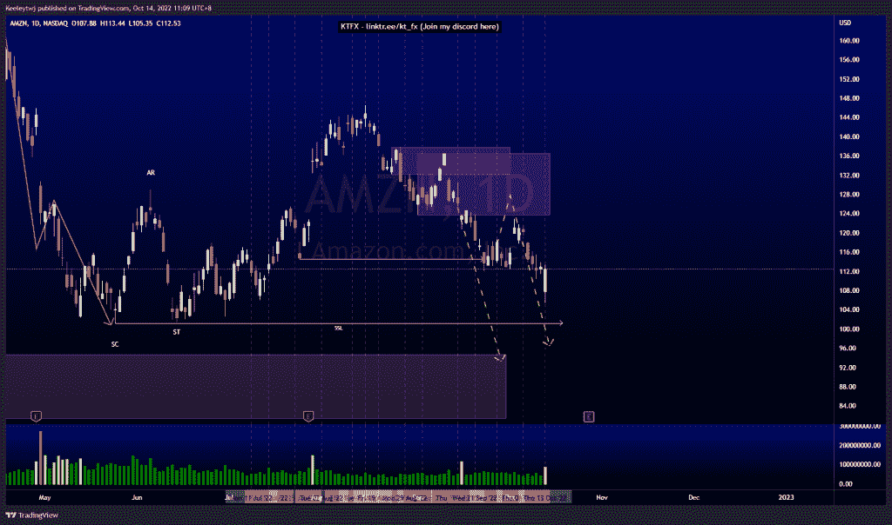

# 股票技术分析#BABA #XPEV #AMZN

> 原文：<https://medium.com/coinmonks/stocks-technical-analysis-baba-xpev-amzn-31ef02edfc7?source=collection_archive---------18----------------------->

在这里了解更多关于我的信息(YouTube/insta gram/Telegram):[https://www.linktr.ee/keeleytan](https://www.linktr.ee/keeleytan)

如果你觉得我的帖子有帮助，如果你能在这个帖子上给我一个赞，并关注我以后的类似帖子，我将不胜感激。如果您有任何意见/反馈，请随时使用上面的谷歌表单链接。

不和谐的免费信号服务正式启动。如果有兴趣，请到我的不和谐来看看！

#巴巴

价格的走势与上周的分析完全一致。价格从 85.00 的看跌点反弹，并从那里走低，在 73.28 的低点反弹。从这里开始，我预计一个看涨回撤将填补 79.79 的公允价值缺口。

#XPEV

价格在下跌前未能触及 12.86 的熊市点，但根据我的分析，它仍然表现良好。根据过去几个月的分析，价格没有按照 wyckoff 累积图运行，目前处于下降趋势。我预计价格将在继续走低之前，在 12.86 的位置做一个看涨回撤回到看跌点。

#AMZN

根据我最后的分析，价格表现良好。价格走低，但没有缓解 136.49 的看跌点，并打破了市场下行结构。这一下跌的潜在目标是在 101.26 处接受低点，并在 94.71 处缓解看涨的 POI。

如果你持有这些公司中的任何一家，就可以点赞、分享和评论！

让我知道，如果你有任何你想让我分析的行情。

一定要在其他社交平台上看看我，我在交易、分析和心理学上发布内容。看看我这里:【https://www.linktr.ee/keeleytan】T2

*原载于 2022 年 10 月 14 日*[*http://2minutesliteracy.wordpress.com*](https://2minutesliteracy.wordpress.com/2022/10/14/stocks-technical-analysis-baba-xpev-amzn/)*。*

> 交易新手？尝试[加密交易机器人](/coinmonks/crypto-trading-bot-c2ffce8acb2a)或[复制交易](/coinmonks/top-10-crypto-copy-trading-platforms-for-beginners-d0c37c7d698c)