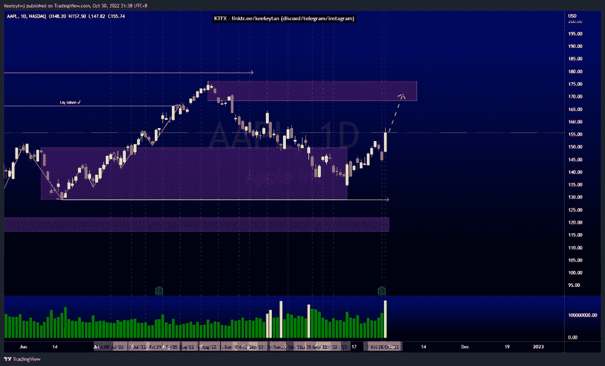

# 股票技术分析#DIS #DJ30 #AAPL

> 原文：<https://medium.com/coinmonks/stocks-technical-analysis-dis-dj30-aapl-8e05325d0eae?source=collection_archive---------12----------------------->

在这里了解更多关于我的信息(YouTube/insta gram/Telegram):[https://www.linktr.ee/keeleytan](https://www.linktr.ee/keeleytan)

如果你觉得我的帖子有帮助，如果你能在这个帖子上给我一个赞，并关注我以后的类似帖子，我将不胜感激。如果您有任何意见/反馈，请随时使用上面的谷歌表单链接。

#DIS

根据上周的分析，价格运行良好。现在，我的期望没有改变。我预计在价格反应走低之前，价格将在 109.88 缓解看跌点。

[https://www . trading view . com/chart/DIS/OWA cy 1 my-DIS-Analysis/](https://www.tradingview.com/chart/DIS/oWaCy1My-DIS-Analysis/)

#DJ30

根据上周的分析，价格表现良好。价格目前在 32713.6 减轻看跌点。我预计，一旦确认了较低的时间框架，价格将从这里走低。

[https://www . trading view . com/chart/DJ30/lEoMlytC-DJ30-Analysis/](https://www.tradingview.com/chart/DJ30/lEoMlytC-DJ30-Analysis/)

#AAPL

价格并没有像上周分析的那样发挥作用。我原本预计收益后价格会继续走低，但价格突破了熊市。目前，我预计上涨将继续，在我们看到任何熊市回撤之前，可能会进入熊市点 168.19。

[https://www . trading view . com/chart/AAPL/l 8 ww 54 gv-AAPL-Analysis/](https://www.tradingview.com/chart/AAPL/L8Ww54gV-AAPL-Analysis/)

不和谐的免费信号服务正式启动。如果有兴趣，请到我的不和谐来看看！

如果你持有这些公司中的任何一家，就可以点赞、分享和评论！

让我知道，如果你有任何你想让我分析的行情。

一定要在其他社交平台上看看我，我在交易、分析和心理学上发布内容。看看我这里:[https://www.linktr.ee/keeleytan](https://www.linktr.ee/keeleytan)

*原载于 2022 年 10 月 30 日 http://2minutesliteracy.wordpress.com***。**

> *交易新手？试试[加密交易机器人](/coinmonks/crypto-trading-bot-c2ffce8acb2a)或者[复制交易](/coinmonks/top-10-crypto-copy-trading-platforms-for-beginners-d0c37c7d698c)*