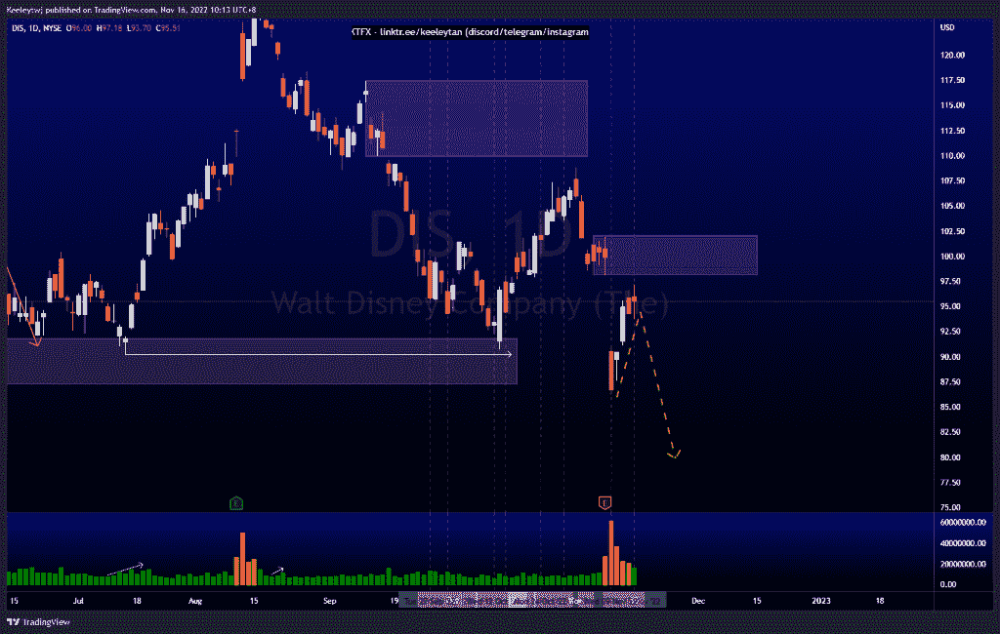
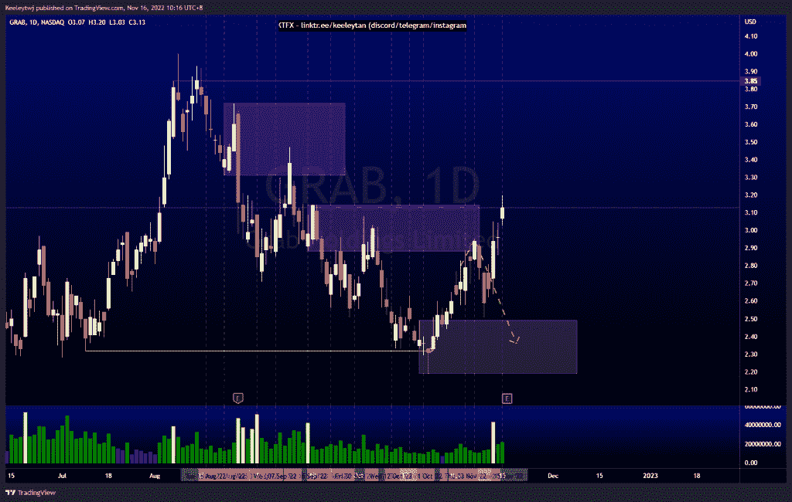
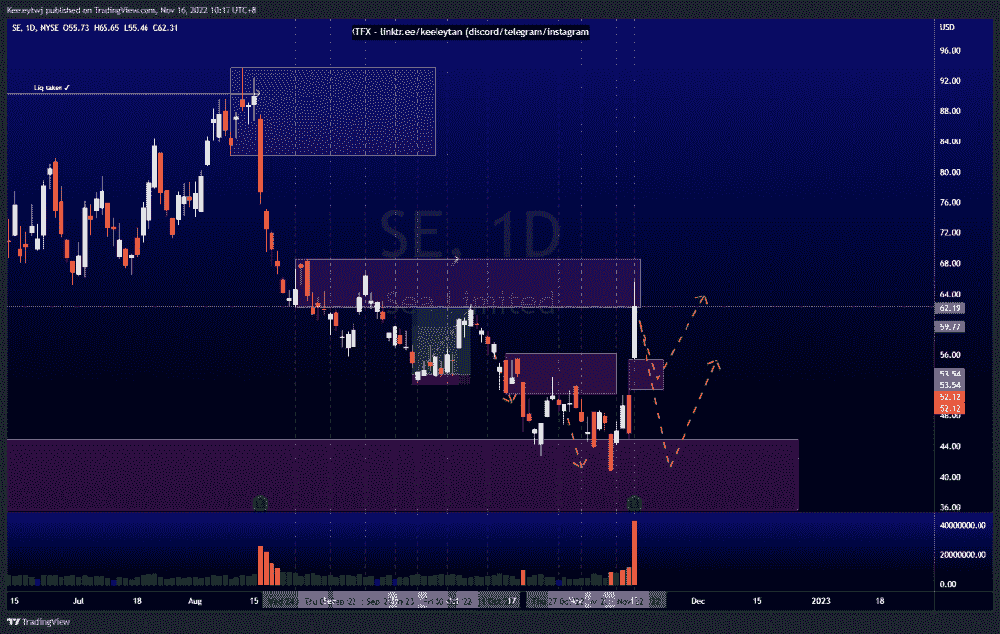

# 股票技术分析#DIS #GRAB #SE

> 原文：<https://medium.com/coinmonks/stocks-technical-analysis-dis-grab-se-90c07031196c?source=collection_archive---------29----------------------->

在这里了解更多关于我的信息(YouTube/insta gram/Telegram):[https://www.linktr.ee/keeleytan](https://www.linktr.ee/keeleytan)

如果你觉得我的帖子有帮助，如果你能在这个帖子上给我一个赞，并关注我以后的类似帖子，我将不胜感激。如果您有任何意见/反馈，请随时使用上面的谷歌表单链接。

不和谐的免费信号服务正式启动。如果有兴趣，请到我的不和谐来看看！

#DIS

根据上周的分析，价格上涨了。价格填补了公允价值缺口，并朝着 98.11 的熊市方向发展。我预计会继续走低或在这个水平盘整。

[https://www . trading view . com/chart/DIS/nqh 7 jvkk-DIS-Analysis/](https://www.tradingview.com/chart/DIS/NQH7jVKk-DIS-Analysis/)

#抓取

价格没有达到预期。价格向上突破了市场结构，但收盘时没有超过兴趣点。由于今天是收益发布日，我仍然预计在 2.49 会有一个熊市回撤至牛市点。

[https://www . trading view . com/chart/GRAB/ymu 03 TDA-GRAB-Analysis/](https://www.tradingview.com/chart/GRAB/yMU03tda-GRAB-Analysis/)

#SE

昨日收益公布后，价格飙升 36%，再次缓解了 62.15 的看跌情绪。随着价格过度上涨，我预计将出现一个熊市回撤，以填补 55.46 的公允价值缺口，并有可能在 45.00 重新缓解看涨的 POI。

[https://www.tradingview.com/chart/SE/tTXB2xGW-SE-Analysis/](https://www.tradingview.com/chart/SE/tTXB2xGW-SE-Analysis/)

如果你持有这些公司中的任何一家，就可以点赞、分享和评论！

让我知道，如果你有任何你想让我分析的行情。

一定要在其他社交平台上看看我，我在交易、分析和心理学上发布内容。看看我这里:[https://www.linktr.ee/keeleytan](https://www.linktr.ee/keeleytan)

*原载于 2022 年 11 月 16 日 http://2minutesliteracy.wordpress.com***。**

> *交易新手？试试[加密交易机器人](/coinmonks/crypto-trading-bot-c2ffce8acb2a)或者[复制交易](/coinmonks/top-10-crypto-copy-trading-platforms-for-beginners-d0c37c7d698c)*