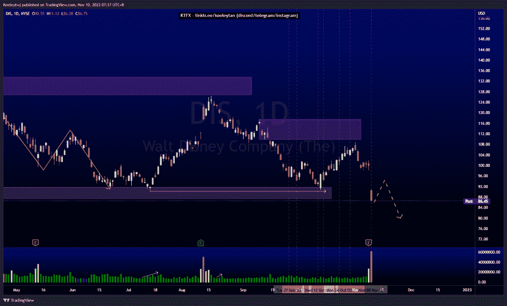
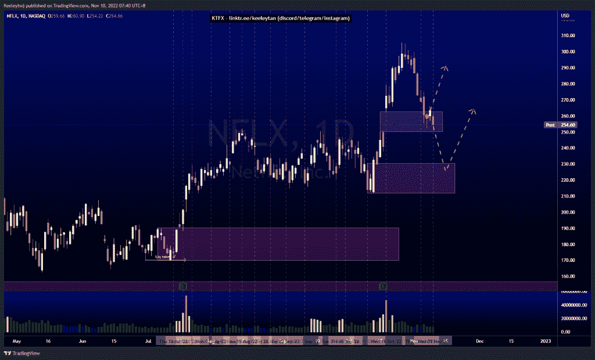
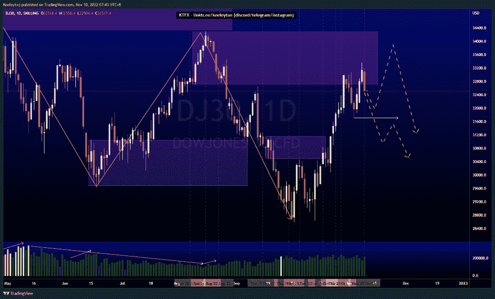

# 股票技术分析#DIS #NFLX #DJ30

> 原文：<https://medium.com/coinmonks/stocks-technical-analysis-dis-nflx-dj30-a77eccf9ef82?source=collection_archive---------46----------------------->

在这里了解更多关于我的信息(YouTube/insta gram/Telegram):[https://www.linktr.ee/keeleytan](https://www.linktr.ee/keeleytan)

如果你觉得我的帖子有帮助，如果你能在这个帖子上给我一个赞，并关注我以后的类似帖子，我将不胜感激。如果您有任何意见/反馈，请随时使用上面的谷歌表单链接。

不和谐的免费信号服务正式启动。如果有兴趣，请到我的不和谐来看看！

#DIS

根据我之前的分析，价格下跌，没有触及 109.88 的熊市点。现在，看涨点 90.23 被突破，价格向下突破市场结构。我预计在继续走低之前，会有一个看涨的回撤来填补公允价值缺口。

[https://www . trading view . com/chart/DIS/pblzisy 0-DIS-Analysis/](https://www.tradingview.com/chart/DIS/pblZiSY0-DIS-Analysis/)

#NFLX

价格表现良好，填补了 262.66 的公允价值缺口。上周我还在期待 FVG 的反弹。然而，鉴于目前的价格走势，我现在预计价格将下跌至 230.44 的看涨点。

[https://www . trading view . com/chart/NFLX/CXC sya 6j-NFLX-Analysis/](https://www.tradingview.com/chart/NFLX/CXcSyA6J-NFLX-Analysis/)

#DJ30

价格对上周 32713.6 点的看跌点做出反应，并进一步缓解。我预计价格不会进一步下跌。现在价格已经打破了次要的市场结构。在我们看到低点 31708.6 被打破之前，我们应该看到上行的延续，同时尊重当前的熊市。

[https://www . trading view . com/chart/DJ30/kmrdp 9 ig-DJ30-Analysis/](https://www.tradingview.com/chart/DJ30/KmRdp9iG-DJ30-Analysis/)

如果你持有这些公司中的任何一家，就可以点赞、分享和评论！

让我知道，如果你有任何你想让我分析的行情。

一定要在其他社交平台上看看我，我在交易、分析和心理学上发布内容。看看我这里:[https://www.linktr.ee/keeleytan](https://www.linktr.ee/keeleytan)

*原载于 2022 年 11 月 9 日 http://2minutesliteracy.wordpress.com***。**

> *交易新手？试试[加密交易机器人](/coinmonks/crypto-trading-bot-c2ffce8acb2a)或者[复制交易](/coinmonks/top-10-crypto-copy-trading-platforms-for-beginners-d0c37c7d698c)*