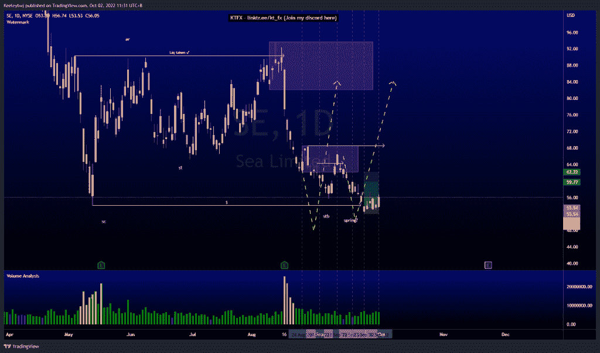

# 股票技术分析#迪斯# NFLX #硒

> 原文：<https://medium.com/coinmonks/stocks-technical-analysis-dis-nflx-se-cac82bf40a17?source=collection_archive---------20----------------------->

在这里找到更多关于我的信息(YouTube/Discord/Telegram):[https://www.linktr.ee/keeleytan](https://www.linktr.ee/keeleytan)

如果你觉得我的帖子有帮助，如果你能在这个帖子上给我一个赞，并关注我以后的类似帖子，我将不胜感激。如果您有任何意见/反馈，请随时使用上面的谷歌表单链接。

不和谐的免费信号服务正式启动。如果有兴趣，请到我的不和谐来看看！

#SE

根据上周的分析，价格正在上涨。我打的信号目前为止涨了 4.54%。看起来价格正在反弹，如果是这样的话，我们应该会看到价格从这里开始上涨。如果价格从这里向下突破 52.38 的市场结构，我们应该看到一个持续的下跌。

#NFLX

价格比我上次预期的要高。从这里，我预计价格将在 251.99 的高点，然后根据我之前的分析，继续下跌至 190.21 的看涨点。

#DIS

根据上周的分析，价格表现良好。我预计价格将继续走低，进入 91.80 的看涨点，并可能在我们看到看涨回撤之前走出 90.23 的低点。

如果你持有这些公司中的任何一家，就可以点赞、分享和评论！

让我知道，如果你有任何你想让我分析的行情。

一定要在其他社交平台上看看我，我在交易、分析和心理学上发布内容。看看我这里:【https://www.linktr.ee/keeleytan】T2

*原载于 2022 年 10 月 2 日***。**

> *交易新手？尝试[加密交易机器人](/coinmonks/crypto-trading-bot-c2ffce8acb2a)或[复制交易](/coinmonks/top-10-crypto-copy-trading-platforms-for-beginners-d0c37c7d698c)*