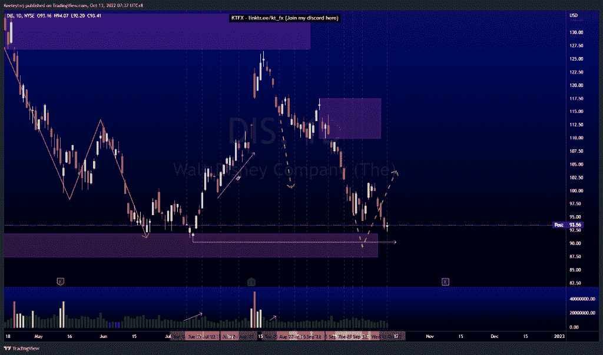
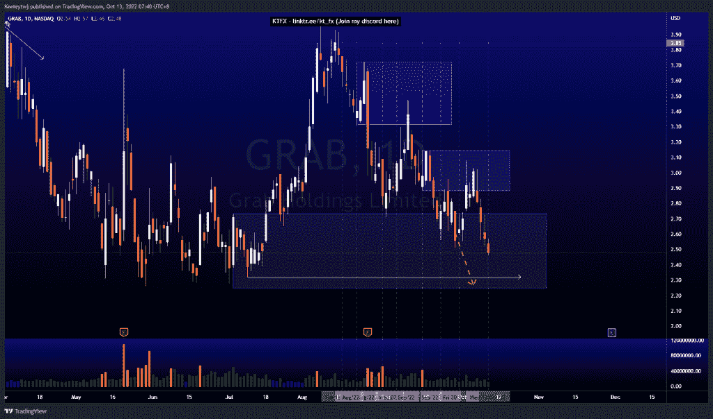
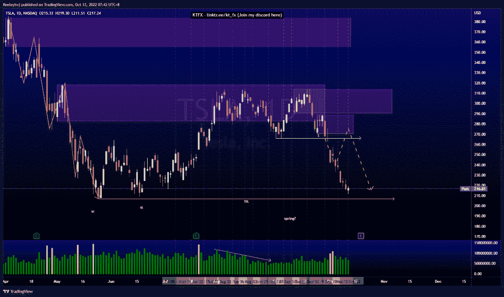

# 股票技术分析#迪斯# TSLA #抢

> 原文：<https://medium.com/coinmonks/stocks-technical-analysis-dis-tsla-grab-89a32dd1b95b?source=collection_archive---------41----------------------->

在这里了解更多关于我的信息(YouTube/insta gram/Telegram):[https://www.linktr.ee/keeleytan](https://www.linktr.ee/keeleytan)

如果你觉得我的帖子有帮助，如果你能在这个帖子上给我一个赞，并关注我以后的类似帖子，我将不胜感激。如果您有任何意见/反馈，请随时使用上面的谷歌表单链接。

不和谐的免费信号服务正式启动。如果有兴趣，请到我的不和谐来看看！

#DIS

根据我之前的分析，价格正在上涨。低点 90.23 可能是这次下跌的下一个目标。我的期望没有改变。

#抓取

普莱斯并没有像上周分析的那样发挥作用。我原本预计价格会跌至 2.32 的低点。相反，价格上涨，以减轻看跌点 2.88，然后下跌。我的预期保持不变，并预计低点 2.32 采取。

#TSLA

根据我上次的分析，价格运行良好。然而，我提到在价格走低之前，价格有可能在 289.00 做一个看涨回撤进入看跌点，但这并没有发生。现在，206.86 的低点处于危险之中，我预计它会被接受。

如果你持有这些公司中的任何一家，就可以点赞、分享和评论！

让我知道，如果你有任何你想让我分析的行情。

一定要在其他社交平台上看看我，我在交易、分析和心理学上发布内容。看看我这里:【https://www.linktr.ee/keeleytan】T2

*原载于 2022 年 10 月 12 日***。**

> *交易新手？尝试[加密交易机器人](/coinmonks/crypto-trading-bot-c2ffce8acb2a)或[复制交易](/coinmonks/top-10-crypto-copy-trading-platforms-for-beginners-d0c37c7d698c)*