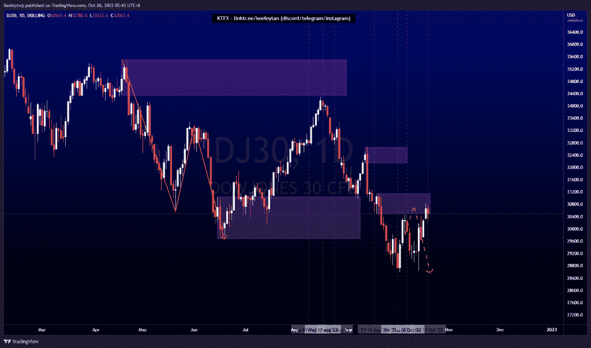
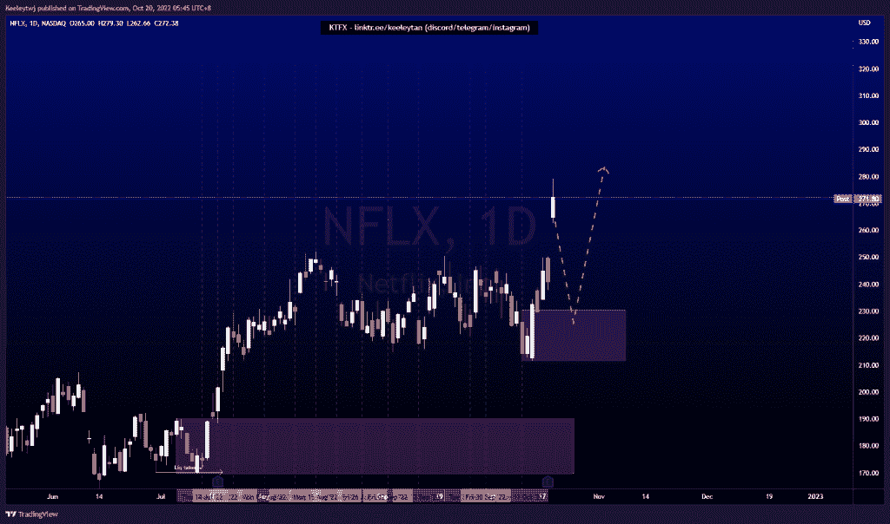
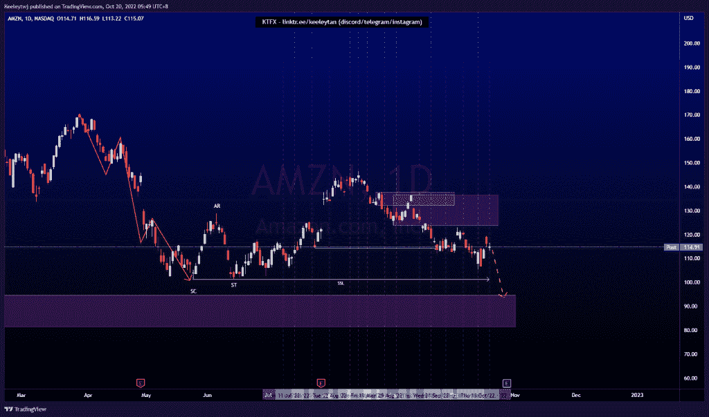

# 股票技术分析#DJ30 #NFLX #AMZN

> 原文：<https://medium.com/coinmonks/stocks-technical-analysis-dj30-nflx-amzn-4564436192ae?source=collection_archive---------8----------------------->

在这里了解更多关于我的信息(YouTube/insta gram/Telegram):[https://www.linktr.ee/keeleytan](https://www.linktr.ee/keeleytan)

如果你觉得我的帖子有帮助，如果你能在这个帖子上给我一个赞，并关注我以后的类似帖子，我将不胜感激。如果您有任何意见/反馈，请随时使用上面的谷歌表单链接。

不和谐的免费信号服务正式启动。如果有兴趣，请到我的不和谐来看看！

#DJ30

根据我以前的分析，价格会上涨。价格目前在 30485.6 减轻看跌点。我预计随着订单的增加，价格会继续走低。

#NFLX

价格没有按照我之前的分析发挥。价格已经填补了缺口，现在已经过度扩张。我预计在继续走高之前，价格会在 230.44 的看涨点做一个看跌回撤。

#AMZN

根据我之前的分析，价格有所巩固。我的预期保持不变，因为我预计 101.26 的低点将被消除，价格可能会缓解 94.71 的看涨点。

如果你持有这些公司中的任何一家，就可以点赞、分享和评论！

让我知道，如果你有任何你想让我分析的行情。

一定要在其他社交平台上看看我，我在交易、分析和心理学上发布内容。看看我这里:【https://www.linktr.ee/keeleytan】T2

*原载于 2022 年 10 月 19 日*[*http://2minutesliteracy.wordpress.com*](https://2minutesliteracy.wordpress.com/2022/10/20/stocks-technical-analysis-dj30-nflx-amzn/)*。*

> 交易新手？尝试[加密交易机器人](/coinmonks/crypto-trading-bot-c2ffce8acb2a)或[复制交易](/coinmonks/top-10-crypto-copy-trading-platforms-for-beginners-d0c37c7d698c)