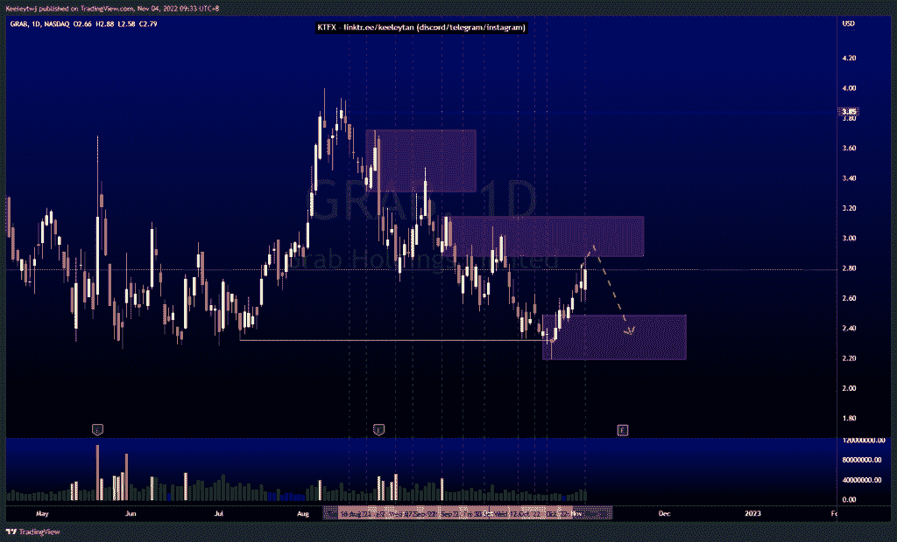
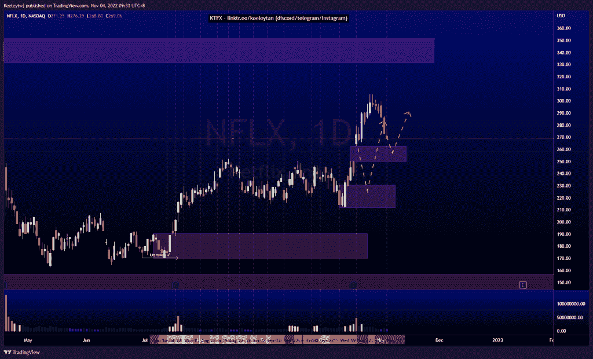
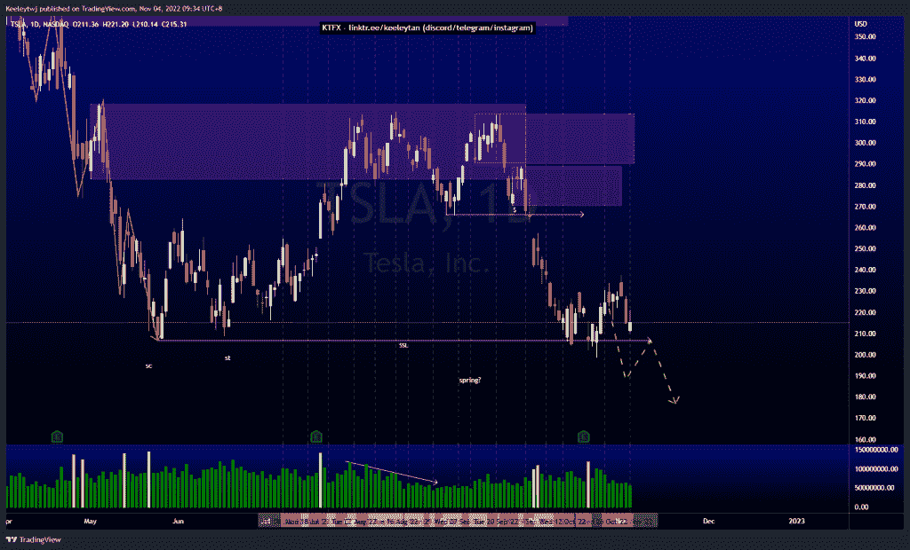

# 股票技术分析#抢#NFLX #TSLA

> 原文：<https://medium.com/coinmonks/stocks-technical-analysis-grab-nflx-tsla-5489b4095c3?source=collection_archive---------26----------------------->

在这里了解更多关于我的信息(YouTube/insta gram/Telegram):[https://www.linktr.ee/keeleytan](https://www.linktr.ee/keeleytan)

如果你觉得我的帖子有帮助，如果你能在这个帖子上给我一个赞，并关注我以后的类似帖子，我将不胜感激。如果您有任何意见/反馈，请随时使用上面的谷歌表单链接。

不和谐的免费信号服务正式启动。如果有兴趣，请到我的不和谐来看看！

#抓取

价格已经打破了市场结构的上升趋势。我们可能会看到 2.88 的上涨，以重新缓解看跌的兴趣点。从那里，我预计价格会在 2.49 做一个看跌回撤进入看涨 POI。

[https://www . trading view . com/chart/GRAB/2 hot NTD 9-GRAB-Analysis/](https://www.tradingview.com/chart/GRAB/2hoTnTD9-GRAB-Analysis/)

#NFLX

价格并没有像上周分析的那样发挥作用。我原本预计会出现熊市回撤，现在终于出现了。这一回撤的潜在目标是首先填补 262.66 的公允价值缺口，然后可能是 230.44 的看涨点

[https://www . trading view . com/chart/NFLX/stfxu2q 3-NFLX-分析/](https://www.tradingview.com/chart/NFLX/STFXU2Q3-NFLX-Analysis/)

#TSLA

自从我上次分析后，价格稳定了。价格无法维持市场结构向上突破，我预计价格将继续走低，以在上涨前获得更多流动性。

[https://www . trading view . com/chart/TSLA/DDL F8 sqo-TSLA-Analysis/](https://www.tradingview.com/chart/TSLA/DdlF8sqo-TSLA-Analysis/)

如果你持有这些公司中的任何一家，就可以点赞、分享和评论！

让我知道，如果你有任何你想让我分析的行情。

一定要在其他社交平台上看看我，我在交易、分析和心理学上发布内容。看看我这里:[https://www.linktr.ee/keeleytan](https://www.linktr.ee/keeleytan)

*原载于 2022 年 11 月 4 日 http://2minutesliteracy.wordpress.com***。**

> *交易新手？试试[加密交易机器人](/coinmonks/crypto-trading-bot-c2ffce8acb2a)或者[复制交易](/coinmonks/top-10-crypto-copy-trading-platforms-for-beginners-d0c37c7d698c)*