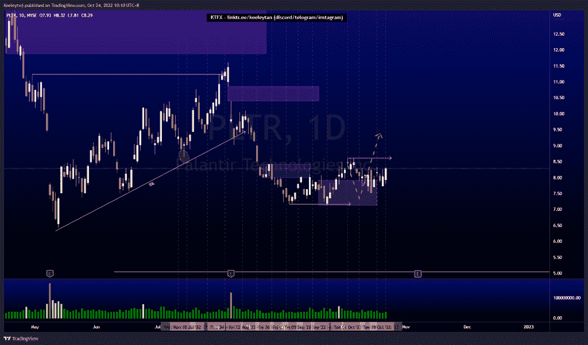

# 股票技术分析#GRAB #PLTR #AMD

> 原文：<https://medium.com/coinmonks/stocks-technical-analysis-grab-pltr-amd-ac4bd59c7cd3?source=collection_archive---------54----------------------->

在这里了解更多关于我的信息(YouTube/insta gram/Telegram):[https://www.linktr.ee/keeleytan](https://www.linktr.ee/keeleytan)

如果你觉得我的帖子有帮助，如果你能在这个帖子上给我一个赞，并关注我以后的类似帖子，我将不胜感激。如果您有任何意见/反馈，请随时使用上面的谷歌表单链接。

不和谐的免费信号服务正式启动。如果有兴趣，请到我的不和谐来看看！

#抓取

根据我以前的分析，价格会上涨。2.32 的低点已经被拿走了。目前，我预计价格将出现看涨回撤，并可能继续低于看跌点 2.63。

#PLTR

自从我上次分析后，价格在这个区域巩固。我的期望没有改变。我预计价格会对这一看涨点做出反应，目标高点为 8.61。

#AMD

在 54.74 缓和了看涨的 POI 后，价格巩固。我的期望也没有改变。我预计价格将在 64.61 处向看跌点进行看涨回撤。

如果你持有这些公司中的任何一家，就可以点赞、分享和评论！

让我知道，如果你有任何你想让我分析的行情。

一定要在其他社交平台上看看我，我在交易、分析和心理学上发布内容。看看我这里:【https://www.linktr.ee/keeleytan】T2

*原载于 2022 年 10 月 24 日***。**

> *交易新手？尝试[加密交易机器人](/coinmonks/crypto-trading-bot-c2ffce8acb2a)或[复制交易](/coinmonks/top-10-crypto-copy-trading-platforms-for-beginners-d0c37c7d698c)*