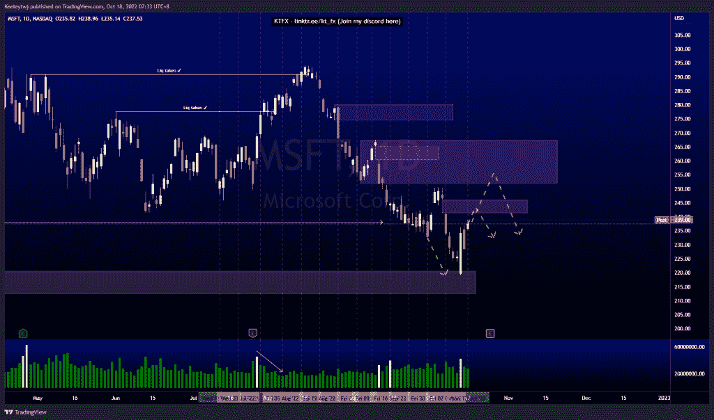
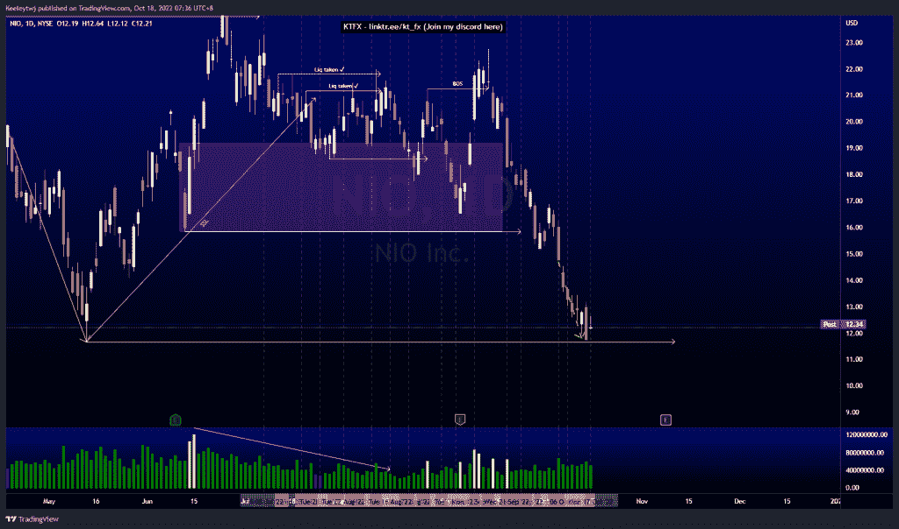
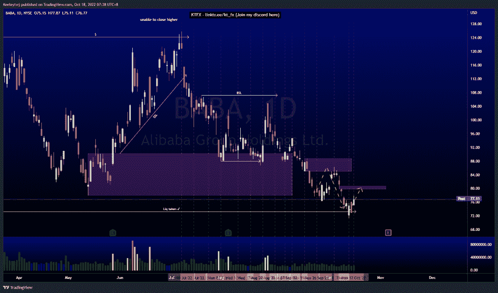

# 股票技术分析# MSFT # NIO #巴巴

> 原文：<https://medium.com/coinmonks/stocks-technical-analysis-msft-nio-baba-e581a411b601?source=collection_archive---------30----------------------->

在这里了解更多关于我的信息(YouTube/insta gram/Telegram):[https://www.linktr.ee/keeleytan](https://www.linktr.ee/keeleytan)

如果你觉得我的帖子有帮助，如果你能在这个帖子上给我一个赞，并关注我以后的类似帖子，我将不胜感激。如果您有任何意见/反馈，请随时使用上面的谷歌表单链接。

不和谐的免费信号服务正式启动。如果有兴趣，请到我的不和谐来看看！

#MSFT

价格正如我之前分析的那样。价格从 220.58 的看涨点反弹，现在正朝着填补 246.08 的公允价值缺口前进。我预计缺口将被填补，并可能在继续走低之前缓解 251.94 的看跌点。

#NIO

价格正如我之前分析的那样。我的预期不变，11.67 的低点可能会被接受。从那里我们将需要看到价格如何反应的水平。

#巴巴

根据我之前的分析，价格运行良好。流动性达到 73.28，价格从那里飙升。本周我的期望没有改变。我预计 79.79 的公允价值差距将被接受。

如果你持有这些公司中的任何一家，就可以点赞、分享和评论！

让我知道，如果你有任何你想让我分析的行情。

一定要在其他社交平台上看看我，我在交易、分析和心理学上发布内容。看看我这里:【https://www.linktr.ee/keeleytan】T2

*原载于 2022 年 10 月 17 日*[*http://2minutesliteracy.wordpress.com*](https://2minutesliteracy.wordpress.com/2022/10/18/stocks-technical-analysis-msft-nio-baba/)*。*

> 交易新手？尝试[加密交易机器人](/coinmonks/crypto-trading-bot-c2ffce8acb2a)或[复制交易](/coinmonks/top-10-crypto-copy-trading-platforms-for-beginners-d0c37c7d698c)