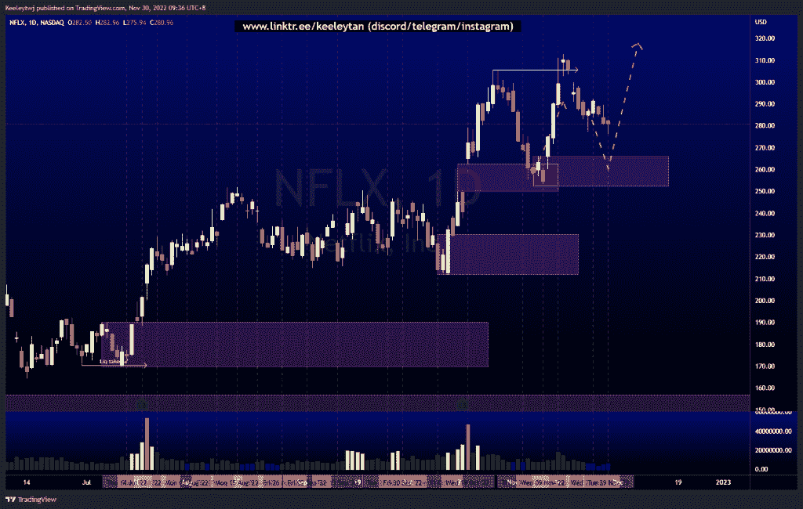
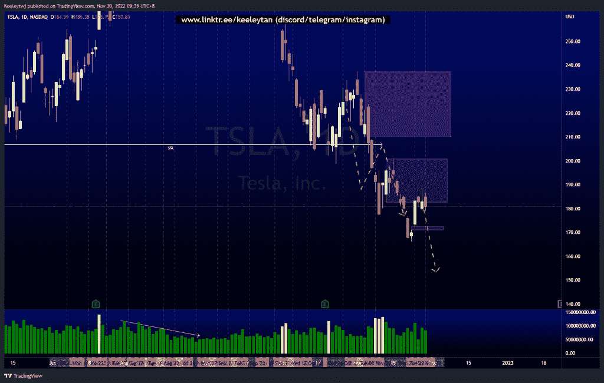
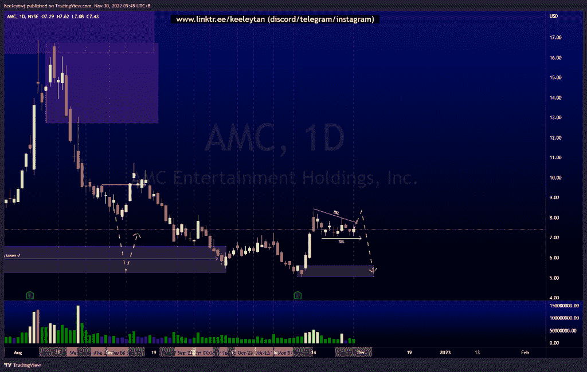

# 股票技术分析#NFLX #TSLA #AMC

> 原文：<https://medium.com/coinmonks/stocks-technical-analysis-nflx-tsla-amc-be622e381b76?source=collection_archive---------41----------------------->

在这里了解更多关于我的信息(YouTube/insta gram/Telegram):[https://www.linktr.ee/keeleytan](https://www.linktr.ee/keeleytan)

如果你觉得我的帖子有帮助，如果你能在这个帖子上给我一个赞，并关注我以后的类似帖子，我将不胜感激。如果您有任何意见/反馈，请随时使用上面的谷歌表单链接。

不和谐的免费信号服务正式启动。如果有兴趣，请到我的不和谐来看看！

#NFLX

根据上周的分析，价格正在上涨。我们确实看到在这次下跌的底部交易量有所增加。我的预期不变，预计价格在上涨前将在 266.08 缓解看涨的 POI。

[https://www . trading view . com/chart/NFLX/SMS ia 27 p-NFLX-Analysis/](https://www.tradingview.com/chart/NFLX/sMSiA27P-NFLX-Analysis/)

#TSLA

根据上周的分析，价格上涨了。价格目前在 182.59 缓解看跌点，未能在看跌点内收盘。在 172.5 也有一个微小的差距需要填补。我希望普莱斯能再降一级。

[https://www . trading view . com/chart/TSLA/HR v9 ywgz-TSLA-Analysis/](https://www.tradingview.com/chart/TSLA/HRv9ywgZ-TSLA-Analysis/)

#AMC

价格在这个狭窄的范围内盘整，形成了买方和卖方的流动性。我预计价格将采取买方流动性，并在下跌之前先困住买方，然后采取卖方流动性，并在 5.05 缓解看涨 POI。

[https://www . trading view . com/chart/AMC/AIG fwf 6 x-AMC-Analysis/](https://www.tradingview.com/chart/AMC/aIGfWf6X-AMC-Analysis/)

如果你持有这些公司中的任何一家，就可以点赞、分享和评论！

让我知道，如果你有任何你想让我分析的行情。

一定要在其他社交平台上看看我，我在交易、分析和心理学上发布内容。看看我这里:[https://www.linktr.ee/keeleytan](https://www.linktr.ee/keeleytan)

*原载于 2022 年 11 月 30 日 http://2minutesliteracy.wordpress.com***。**

> *交易新手？试试[加密交易机器人](/coinmonks/crypto-trading-bot-c2ffce8acb2a)或者[复制交易](/coinmonks/top-10-crypto-copy-trading-platforms-for-beginners-d0c37c7d698c)*