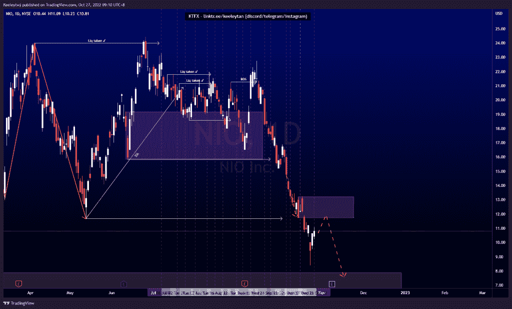
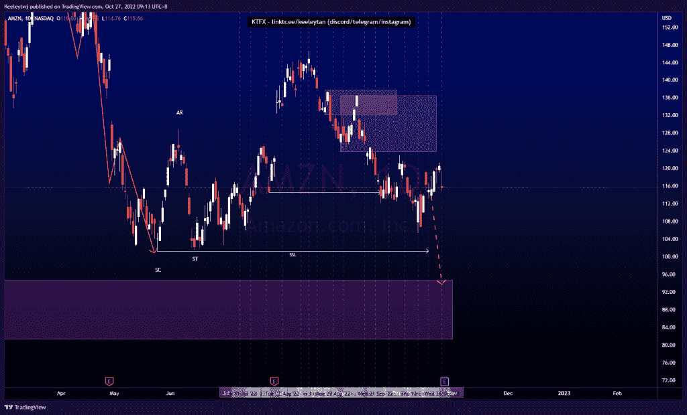
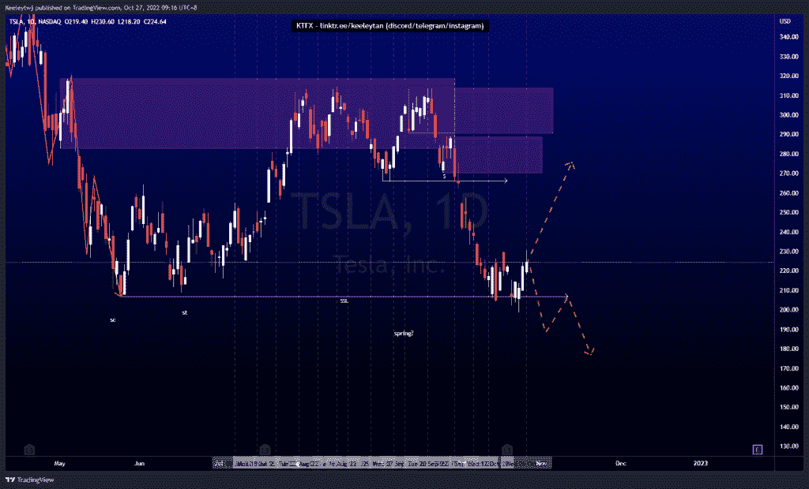

# 股票技术分析#NIO #AMZN #TSLA

> 原文：<https://medium.com/coinmonks/stocks-technical-analysis-nio-amzn-tsla-58a036132ef2?source=collection_archive---------17----------------------->

在这里了解更多关于我的信息(YouTube/insta gram/Telegram):[https://www.linktr.ee/keeleytan](https://www.linktr.ee/keeleytan)

如果你觉得我的帖子有帮助，如果你能在这个帖子上给我一个赞，并关注我以后的类似帖子，我将不胜感激。如果您有任何意见/反馈，请随时使用上面的谷歌表单链接。

#NIO

根据上周的分析，价格将流动性控制在 11.67，并继续走低。价格几乎缓解了 7.90 的看涨点，并反弹走高。我预计价格将走高，并在继续下跌前缓解 11.73 的看跌点。

[https://www . trading view . com/chart/NIO/OHtgbCRo-NIO-Analysis/](https://www.tradingview.com/chart/NIO/OHtgbCRo-NIO-Analysis/)

#AMZN

根据我上次的分析，价格得到了巩固。我预计价格将下跌至 94.71 的看涨点，并在看跌订单流后在 101.26 获得流动性。预期没有变化。

[https://www . trading view . com/chart/AMZN/piw lo 15n-AMZN-Analysis/](https://www.tradingview.com/chart/AMZN/PIWlo15n-AMZN-Analysis/)

#TSLA

根据上周的分析，价格上涨了。我原本预计价格会在 206.86 的水平消除流动性。现在，根据威科夫累积图，价格已经开始上涨。然而，在价格反弹更高之前，需要确认市场结构的打破，可能进入 289.00 的熊市点。如果没有确认，价格应该跟随看跌订单流走低。

[https://www . trading view . com/chart/TSLA/ygaqx5m 1-TSLA-Analysis/](https://www.tradingview.com/chart/TSLA/YGaQX5m1-TSLA-Analysis/)

不和谐的免费信号服务正式启动。如果有兴趣，请到我的不和谐来看看！

如果你持有这些公司中的任何一家，就可以点赞、分享和评论！

让我知道，如果你有任何你想让我分析的行情。

一定要在其他社交平台上看看我，我在交易、分析和心理学上发布内容。看看我这里:[https://www.linktr.ee/keeleytan](https://www.linktr.ee/keeleytan)

*原载于 2022 年 10 月 27 日 http://2minutesliteracy.wordpress.com***。**

> *交易新手？试试[加密交易机器人](/coinmonks/crypto-trading-bot-c2ffce8acb2a)或者[复制交易](/coinmonks/top-10-crypto-copy-trading-platforms-for-beginners-d0c37c7d698c)*