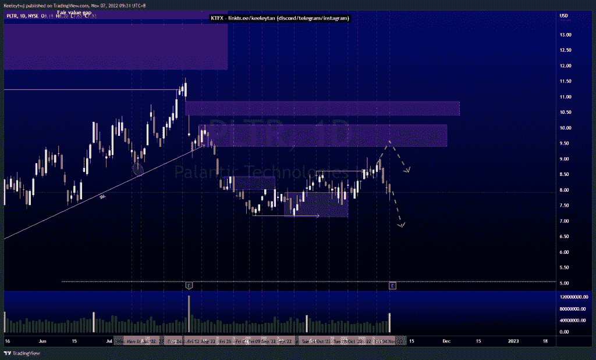

# 股票技术分析#NIO #PLTR #AAPL

> 原文：<https://medium.com/coinmonks/stocks-technical-analysis-nio-pltr-aapl-5eb4788dabce?source=collection_archive---------34----------------------->

在这里了解更多关于我的信息(YouTube/insta gram/电报):[https://www.linktr.ee/keeleytan](https://www.linktr.ee/keeleytan)

如果你觉得我的帖子很有帮助，如果你能在这个帖子里给我留下类似的内容，并在以后的帖子里关注我，我将不胜感激。如果您有任何评论/反馈，请使用上面的谷歌表格链接。

不和免费信号服务正式启动。如果有兴趣，去我的不和处看看吧！

#NIO

根据我最后的分析，价格表现得很好。价格几乎缓解了 11.73 点的看跌兴趣点，我预计价格会从那里走得更低，在 7.90 点走向看涨兴趣点。

[https://www . trading view . com/chart/NIO/2XRbE4oF-NIO-Analysis/](https://www.tradingview.com/chart/NIO/2XRbE4oF-NIO-Analysis/)

#PLTR

价格未能触及 10.10 点的看跌点，随后打破市场结构，跌入谷底。从现在开始，我预计随着 PLTR 今天的收益，价格会下降，可能会低于收益预期。

[https://www . trading view . com/chart/PLTR/NwrBp5eL-PLTR-Analysis/](https://www.tradingview.com/chart/PLTR/NwrBp5eL-PLTR-Analysis/)

#AAPL

价格并不是我最后的分析。价格在 134.37 点创造了同样的低点。我预计价格将继续下跌，有可能在接近 129.04 点时，在价格开始上涨之前抓住更多的流动性。

[https://www . trading view . com/chart/AAPL/8 nml 3we 0-AAPL-Analysis/](https://www.tradingview.com/chart/AAPL/8NMl3we0-AAPL-Analysis/)

如果您持有其中任何一家公司，请分享和评论！

如果您有任何需要我分析的问题，请告诉我。

一定要在其他社交平台上查看我，我会发布交易、分析和心理学方面的内容。在这里为我结账:[https://www.linktr.ee/keeleytan](https://www.linktr.ee/keeleytan)

*原为 2022 年 11 月 7 日在*[*http://2minutesliteracy.wordpress.com*](https://2minutesliteracy.wordpress.com/2022/11/07/stocks-technical-analysis-nio-pltr-aapl/)*发表。*

> 交易新手？试试[密码交易机器人](/coinmonks/crypto-trading-bot-c2ffce8acb2a)或者[拷贝交易](/coinmonks/top-10-crypto-copy-trading-platforms-for-beginners-d0c37c7d698c)