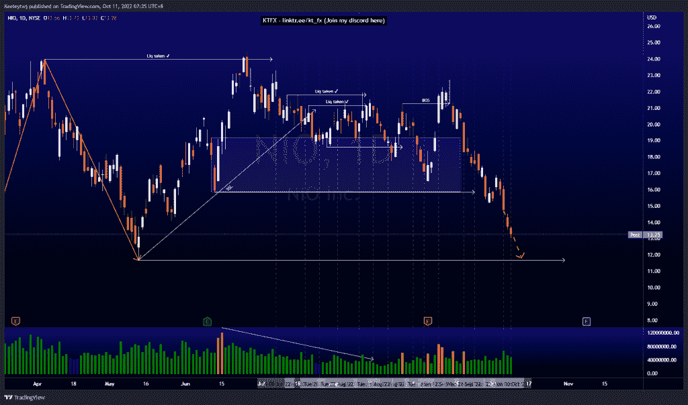
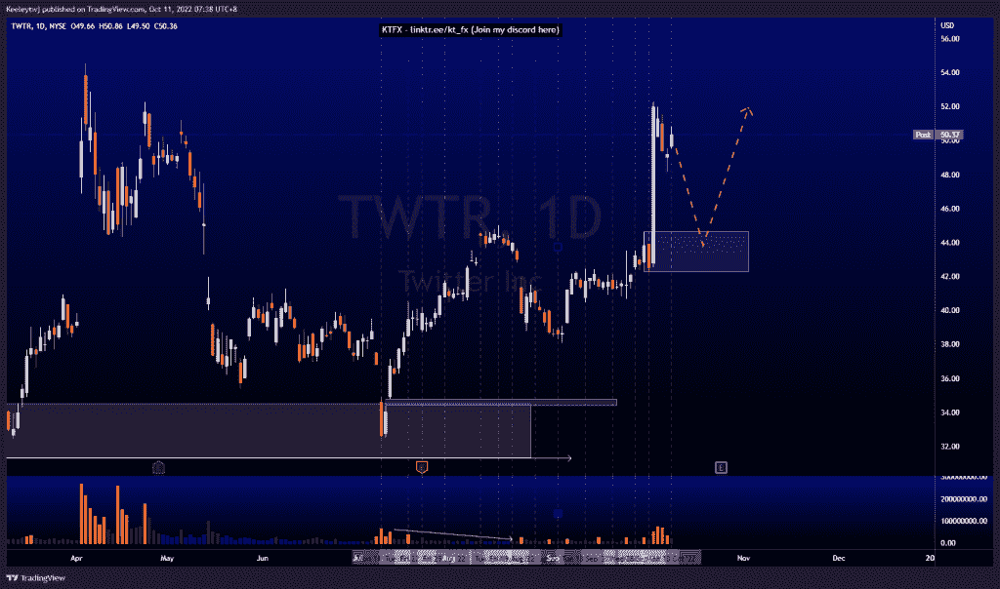
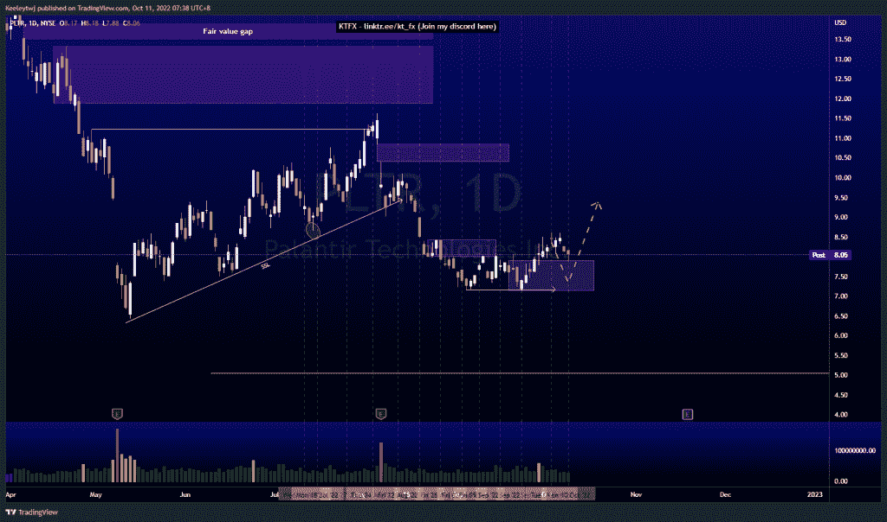

# 股票技术分析#NIO #TWTR #PLTR

> 原文：<https://medium.com/coinmonks/stocks-technical-analysis-nio-twtr-pltr-e38fadd0b992?source=collection_archive---------41----------------------->

在这里了解更多关于我的信息(YouTube/insta gram/Telegram):[https://www.linktr.ee/keeleytan](https://www.linktr.ee/keeleytan)

如果你觉得我的帖子有帮助，如果你能在这个帖子上给我一个赞，并关注我以后的类似帖子，我将不胜感激。如果您有任何意见/反馈，请随时使用上面的谷歌表单链接。

不和谐的免费信号服务正式启动。如果有兴趣，请到我的不和谐来看看！

#NIO

根据上周的分析，价格上涨了。我的预期没有改变，我预计价格会随着订单流继续走低。此次下跌的潜在目标是低点 11.67。

#TWTR

由于埃隆·马斯克的新闻，价格并没有像我上次分析的那样发挥作用。价格飙升，所有的看跌点都失效了。目前，价格过度延伸，将在 44.66 处形成熊市回撤至牛市点。

#PLTR

根据上周的分析，价格上涨了。我的预期不变，因为我预计价格将从 7.92 的看涨点反弹，潜在目标是 8.61 的同等高点。

如果你持有这些公司中的任何一家，就可以点赞、分享和评论！

让我知道，如果你有任何你想让我分析的行情。

一定要在其他社交平台上看看我，我在交易、分析和心理学上发布内容。看看我这里:【https://www.linktr.ee/keeleytan】T2

*原载于 2022 年 10 月 10 日*[*http://2minutesliteracy.wordpress.com*](https://2minutesliteracy.wordpress.com/2022/10/11/stocks-technical-analysis-nio-twtr-pltr/)*。*

> 交易新手？尝试[加密交易机器人](/coinmonks/crypto-trading-bot-c2ffce8acb2a)或[复制交易](/coinmonks/top-10-crypto-copy-trading-platforms-for-beginners-d0c37c7d698c)