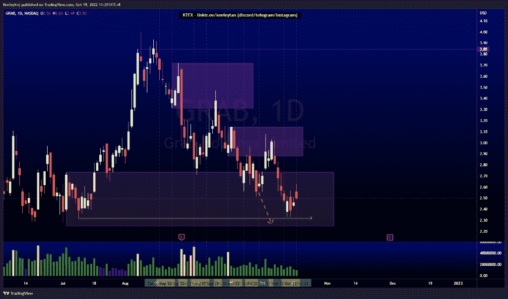
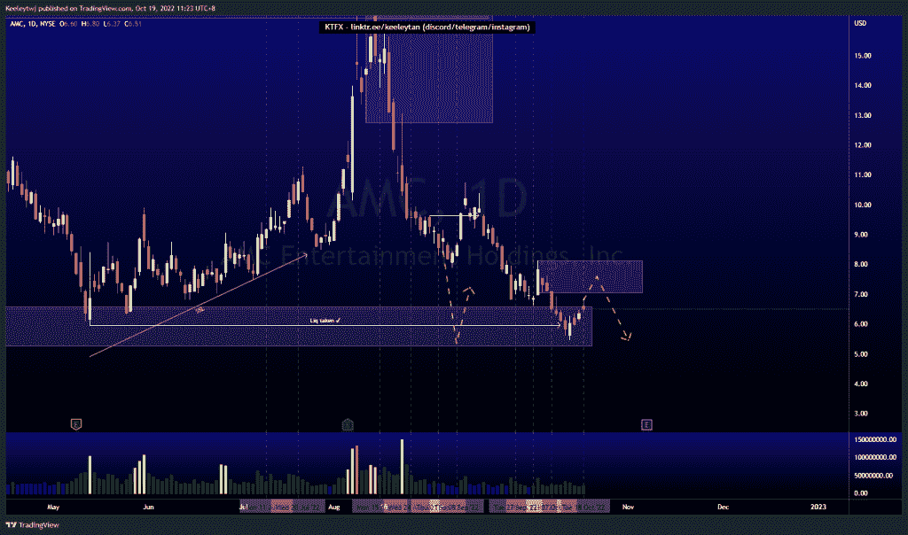
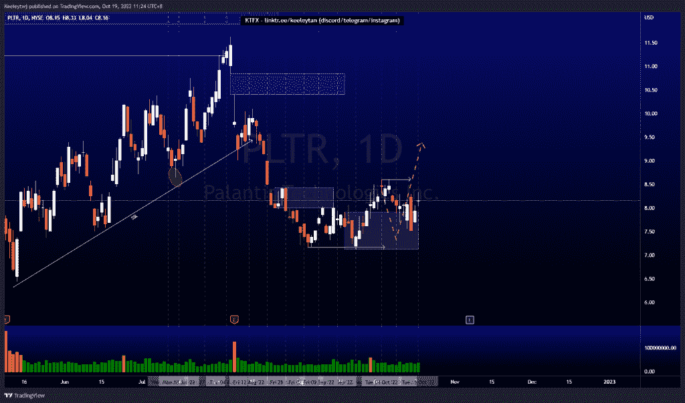

# 股票技术分析# PLTR # AMC #抓取

> 原文：<https://medium.com/coinmonks/stocks-technical-analysis-pltr-amc-grab-1618a3b8bbf0?source=collection_archive---------18----------------------->

在这里了解更多关于我的信息(YouTube/insta gram/Telegram):[https://www.linktr.ee/keeleytan](https://www.linktr.ee/keeleytan)

如果你觉得我的帖子有帮助，如果你能在这个帖子上给我一个赞，并关注我以后的类似帖子，我将不胜感激。如果您有任何意见/反馈，请随时使用上面的谷歌表单链接。

不和谐的免费信号服务正式启动。如果有兴趣，请到我的不和谐来看看！

#抓取

上周，我预计 2.32 的低点会被拿下。价格尊重低价，并通过推高价格做出反应。现在，如果价格想涨得更高，价格下跌到那个低点的可能性更大。

#AMC

根据我的分析，价格上周表现良好。价格已在 5.96 的低点，并对当前的看涨点作出反应。目前，我预计价格将在 8.13 点小幅反弹至看跌点，并随着订单流继续走低。

#PLTR

根据上周的分析，价格正在上涨。价格目前正在缓解这种乐观情绪。我的期望没有改变。这种反应的潜在目标是在 8.61 的同等高点。

如果你持有这些公司中的任何一家，就可以点赞、分享和评论！

让我知道，如果你有任何你想让我分析的行情。

一定要在其他社交平台上看看我，我在交易、分析和心理学上发布内容。看看我这里:【https://www.linktr.ee/keeleytan】T2

*原载于 2022 年 10 月 19 日*[*http://2minutesliteracy.wordpress.com*](https://2minutesliteracy.wordpress.com/2022/10/19/stocks-technical-analysis-pltr-amc-grab/)*。*

> 交易新手？尝试[加密交易机器人](/coinmonks/crypto-trading-bot-c2ffce8acb2a)或[复制交易](/coinmonks/top-10-crypto-copy-trading-platforms-for-beginners-d0c37c7d698c)