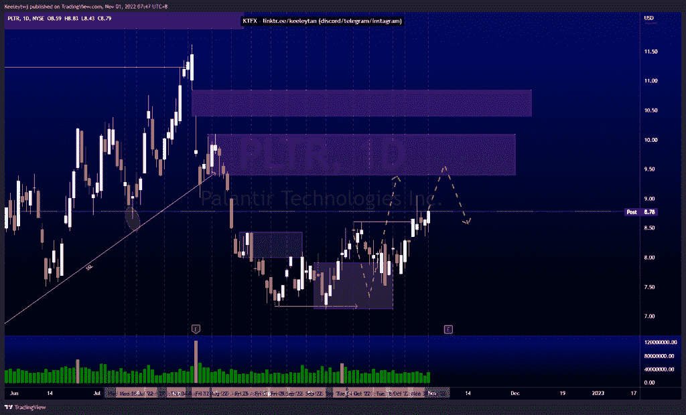
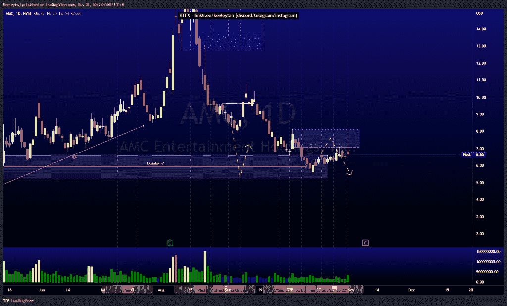
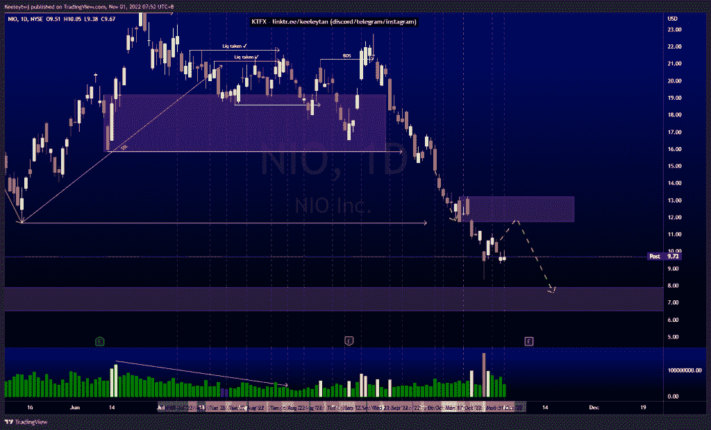

# 股票技术分析#PLTR #AMC #NIO

> 原文：<https://medium.com/coinmonks/stocks-technical-analysis-pltr-amc-nio-55c5d728c170?source=collection_archive---------41----------------------->

在这里了解更多关于我的信息(YouTube/insta gram/Telegram):[https://www.linktr.ee/keeleytan](https://www.linktr.ee/keeleytan)

如果你觉得我的帖子有帮助，如果你能在这个帖子上给我一个赞，并关注我以后的类似帖子，我将不胜感激。如果您有任何意见/反馈，请随时使用上面的谷歌表单链接。

#PLTR

价格与之前分析的完全一致。目前，我预计价格将跟随订单流走高，在走低之前缓解 10.10 的看跌情绪。

[https://www . trading view . com/chart/PLTR/krvmm 5 gg-PLTR-分析/](https://www.tradingview.com/chart/PLTR/kRvMm5gG-PLTR-Analysis/)

#AMC

根据我之前的分析，价格表现良好。价格目前正在缓解 8.13 的看跌点，我预计价格将从 8.13 进一步走低。看涨价格运动出现衰竭，价格可能会从这里走低。

[https://www . trading view . com/chart/AMC/4y 6 xzawc-AMC-Analysis/](https://www.tradingview.com/chart/AMC/4y6XzaWc-AMC-Analysis/)

#NIO

自从我上次分析后，价格有所巩固。我仍然预计价格将走高，并在 11.73 缓解看跌点，然后走低，以 7.90 缓解看涨点。

[https://www . trading view . com/chart/NIO/hbdPEeQC-NIO-Analysis/](https://www.tradingview.com/chart/NIO/hbdPEeQC-NIO-Analysis/)

不和谐的免费信号服务正式启动。如果有兴趣，请到我的不和谐来看看！

如果你持有这些公司中的任何一家，就可以点赞、分享和评论！

让我知道，如果你有任何你想让我分析的行情。

一定要在其他社交平台上看看我，我在交易、分析和心理学上发布内容。看看我这里:[https://www.linktr.ee/keeleytan](https://www.linktr.ee/keeleytan)

*原载于 2022 年 10 月 31 日 http://2minutesliteracy.wordpress.com***。**

> *交易新手？试试[加密交易机器人](/coinmonks/crypto-trading-bot-c2ffce8acb2a)或者[复制交易](/coinmonks/top-10-crypto-copy-trading-platforms-for-beginners-d0c37c7d698c)*