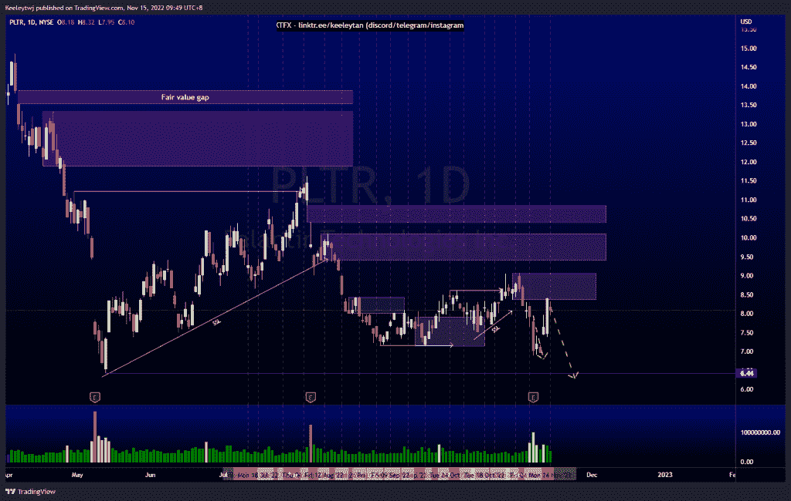
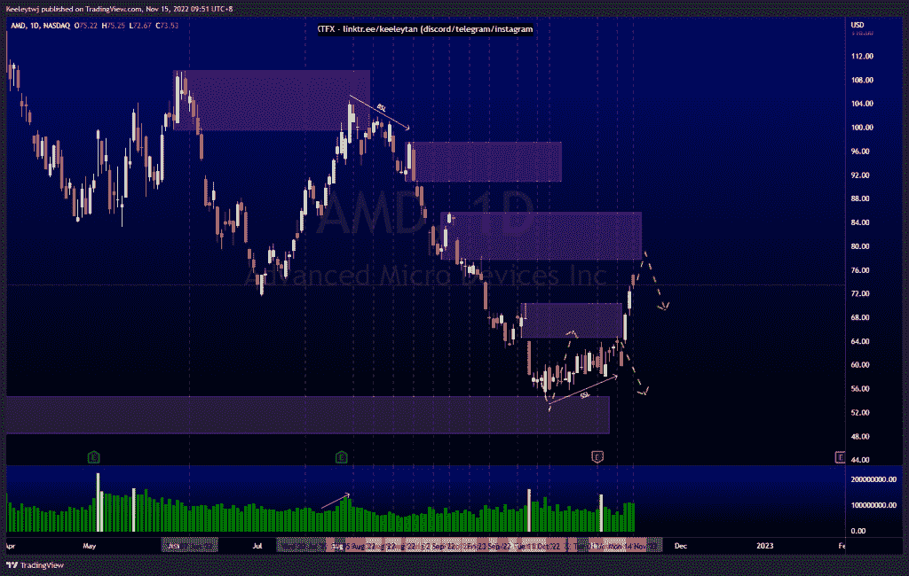
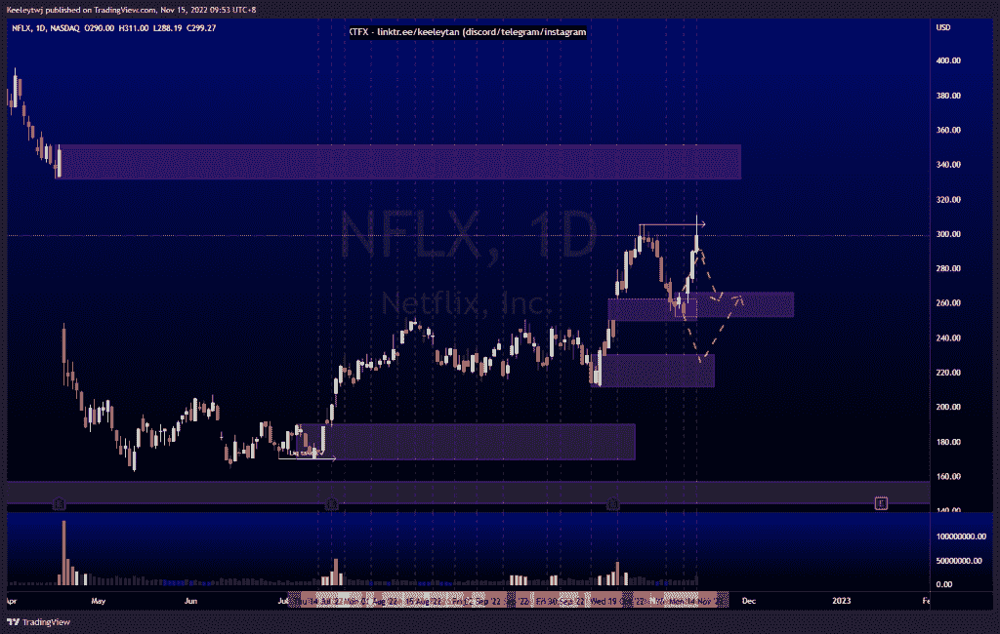

# 股票技术分析#PLTR #AMD #NFLX

> 原文：<https://medium.com/coinmonks/stocks-technical-analysis-pltr-amd-nflx-294d74eae1c1?source=collection_archive---------26----------------------->

在这里了解更多关于我的信息(YouTube/insta gram/Telegram):[https://www.linktr.ee/keeleytan](https://www.linktr.ee/keeleytan)

如果你觉得我的帖子有帮助，如果你能在这个帖子上给我一个赞，并关注我以后的类似帖子，我将不胜感激。如果您有任何意见/反馈，请随时使用上面的谷歌表单链接。

#PLTR

价格如上周分析的那样，但未能摆脱历史低点。随着市场反弹，价格回撤至 9.06 的熊市点。我预计，在反弹走高之前，下行趋势将持续下去，导致流动性紧张。

[https://www . trading view . com/chart/PLTR/yngzwq 32-PLTR-分析/](https://www.tradingview.com/chart/PLTR/yNgzWq32-PLTR-Analysis/)

#AMD

由于上周的新闻，价格没有像预期的那样发挥作用。我预计在 64.61 的看跌点缓解后，下行趋势将继续。价格向上突破了市场结构，这种向上移动的潜在目标是在 85.68 缓解熊市。

[https://www . trading view . com/chart/AMD/0 ihdwajb-AMD-Analysis/](https://www.tradingview.com/chart/AMD/0iHDwAJB-AMD-Analysis/)

#NFLX

价格运行良好，正如我最后的分析，反弹公平价值差距在 262.66。价格在 305.63 点获得了流动性，无法收于该水平之上。我预计将在 266.08 再次出现熊市回撤至牛市点。

[https://www . trading view . com/chart/NFLX/msbg 7 AVC-NFLX-Analysis/](https://www.tradingview.com/chart/NFLX/mSbg7aVC-NFLX-Analysis/)

不和谐的免费信号服务正式启动。如果有兴趣，请到我的不和谐来看看！

如果你持有这些公司中的任何一家，就可以点赞、分享和评论！

让我知道，如果你有任何你想让我分析的行情。

一定要在其他社交平台上看看我，我在交易、分析和心理学上发布内容。看看我这里:[https://www.linktr.ee/keeleytan](https://www.linktr.ee/keeleytan)

*原载于 2022 年 11 月 15 日 http://2minutesliteracy.wordpress.com***。**

> *交易新手？试试[加密交易机器人](/coinmonks/crypto-trading-bot-c2ffce8acb2a)或者[复制交易](/coinmonks/top-10-crypto-copy-trading-platforms-for-beginners-d0c37c7d698c)*