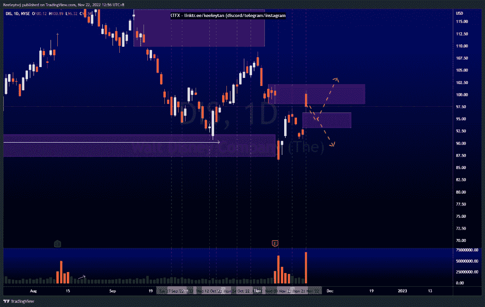

# 股票技术分析#PLTR #NIO #DIS

> 原文：<https://medium.com/coinmonks/stocks-technical-analysis-pltr-nio-dis-2ef417a70f80?source=collection_archive---------11----------------------->

在这里了解更多关于我的信息(YouTube/insta gram/Telegram):[https://www.linktr.ee/keeleytan](https://www.linktr.ee/keeleytan)

如果你觉得我的帖子有帮助，如果你能在这个帖子上给我一个赞，并关注我以后的类似帖子，我将不胜感激。如果您有任何意见/反馈，请随时使用上面的谷歌表单链接。

不和谐的免费信号服务正式启动。如果有兴趣，请到我的不和谐来看看！

#PLTR

根据上周的分析，价格表现良好，从 9.06 的熊市水平直接下跌。我对这次下跌的预期保持不变，目标是 6.44 的历史低点。

[https://www . trading view . com/chart/PLTR/ss 61 hw3l-PLTR-分析/](https://www.tradingview.com/chart/PLTR/ss61Hw3l-PLTR-Analysis/)

#NIO

根据我之前的分析，价格表现良好。价格仍然尊重看跌点 11.73，价格作出反应，推动其下跌。然而，我们确实看到了枯竭的迹象，交易量略有上升。价格也在增加卖方流动性。我预计价格将走低，消除卖方流动性，并在我们看到反弹之前缓解 7.90 的看涨点。

[https://www . trading view . com/chart/NIO/hwo v2 tfw-NIO-Analysis/](https://www.tradingview.com/chart/NIO/hwOv2tfW-NIO-Analysis/)

#DIS

价格尊重 98.11 的看跌点，尽管成交量很大，但未能收于开盘价以上。我预计价格会走低，并在我们看到价格将从那里走向何方之前，填补 96.32 的公允价值缺口。

[https://www . trading view . com/chart/DIS/iadx 670k-DIS-Analysis/](https://www.tradingview.com/chart/DIS/Iadx670k-DIS-Analysis/)

如果你持有这些公司中的任何一家，就可以点赞、分享和评论！

让我知道，如果你有任何你想让我分析的行情。

一定要在其他社交平台上看看我，我在交易、分析和心理学上发布内容。看看我这里:[https://www.linktr.ee/keeleytan](https://www.linktr.ee/keeleytan)

*原载于 2022 年 11 月 22 日 http://2minutesliteracy.wordpress.com***。**

> *交易新手？试试[加密交易机器人](/coinmonks/crypto-trading-bot-c2ffce8acb2a)或者[复制交易](/coinmonks/top-10-crypto-copy-trading-platforms-for-beginners-d0c37c7d698c)*