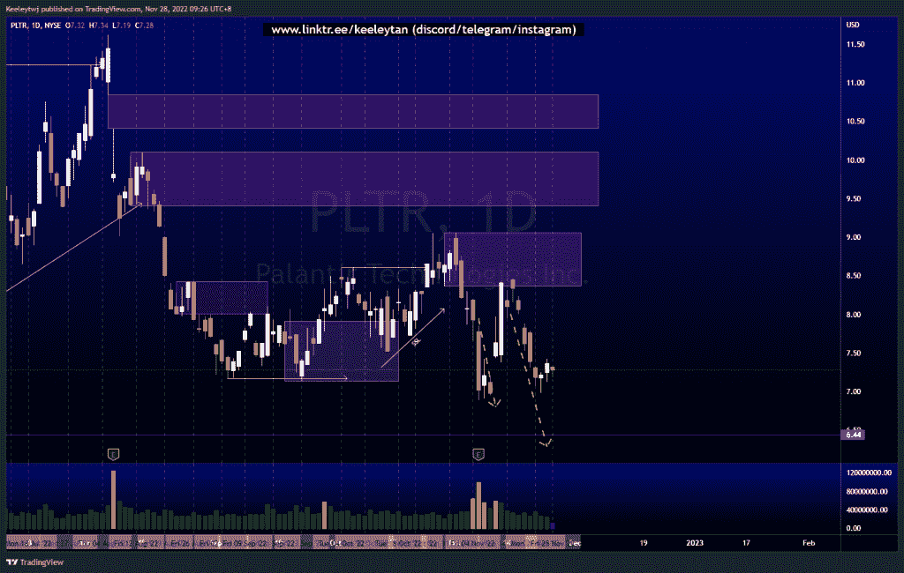
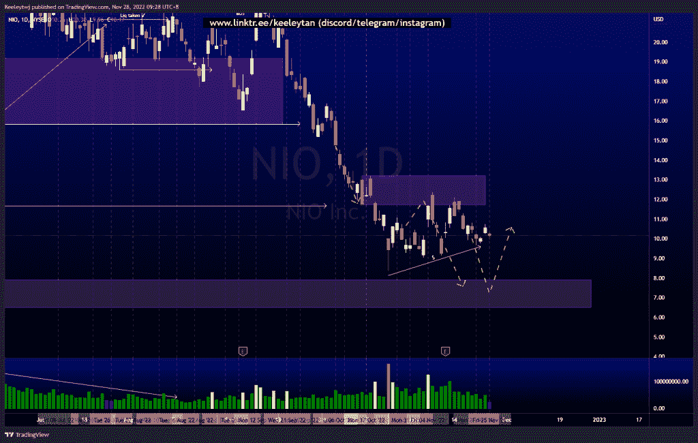
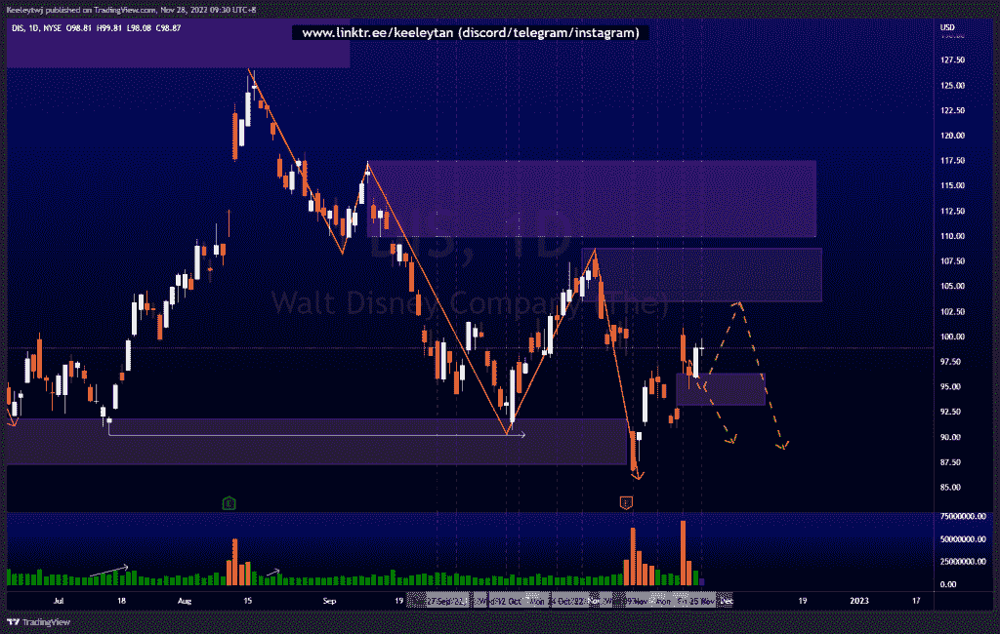

# 股票技术分析#PLTR #NIO #DIS

> 原文：<https://medium.com/coinmonks/stocks-technical-analysis-pltr-nio-dis-5fe0e5d74d6b?source=collection_archive---------28----------------------->

在这里了解更多关于我的信息(YouTube/insta gram/Telegram):[https://www.linktr.ee/keeleytan](https://www.linktr.ee/keeleytan)

如果你觉得我的帖子有帮助，如果你能在这个帖子上给我一个赞，并关注我以后的类似帖子，我将不胜感激。如果您有任何意见/反馈，请随时使用上面的谷歌表单链接。

不和谐的免费信号服务正式启动。如果有兴趣，请到我的不和谐来看看！

#PLTR

自从我上次分析后，价格稳定了。在这个小的看涨回撤中，我们看到交易量在减少。我的预期不变，预计价格将向 6.44 的历史低点进发。

[https://www . trading view . com/chart/PLTR/jaoi oong-PLTR-分析/](https://www.tradingview.com/chart/PLTR/JAoIoONG-PLTR-Analysis/)

#NIO

自从我上次分析后，价格稳定了。价格从短期“趋势线”反弹，流动性增加。我预计价格将继续走低，消除卖方流动性，并缓解 7.90 的看涨点。

[https://www . trading view . com/chart/NIO/tRSWxTDK-NIO-Analysis/](https://www.tradingview.com/chart/NIO/tRSWxTDK-NIO-Analysis/)

#DIS

根据上周的分析，价格表现良好。价格填补了 96.32 的公允价值缺口，并反弹。从这里开始，我预计价格将继续走高，以缓解这条腿的最后一个看跌点 108.84，然后继续走低。

[https://www . trading view . com/chart/DIS/TG 6 un jes-DIS-Analysis/](https://www.tradingview.com/chart/DIS/TG6UNjes-DIS-Analysis/)

如果你持有这些公司中的任何一家，就可以点赞、分享和评论！

让我知道，如果你有任何你想让我分析的行情。

一定要在其他社交平台上看看我，我在交易、分析和心理学上发布内容。看看我这里:[https://www.linktr.ee/keeleytan](https://www.linktr.ee/keeleytan)

*原载于 2022 年 11 月 28 日 http://2minutesliteracy.wordpress.com***。**

> *交易新手？试试[加密交易机器人](/coinmonks/crypto-trading-bot-c2ffce8acb2a)或者[复制交易](/coinmonks/top-10-crypto-copy-trading-platforms-for-beginners-d0c37c7d698c)*