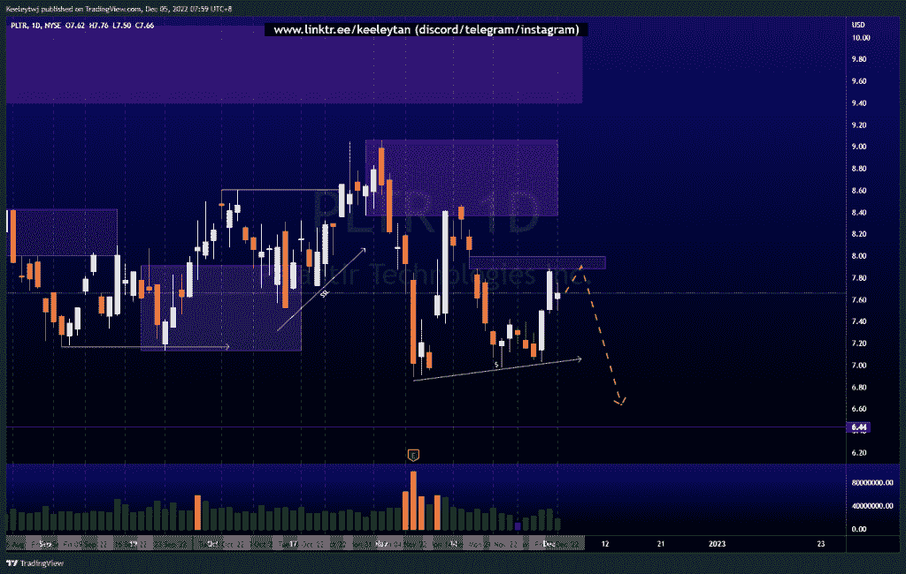
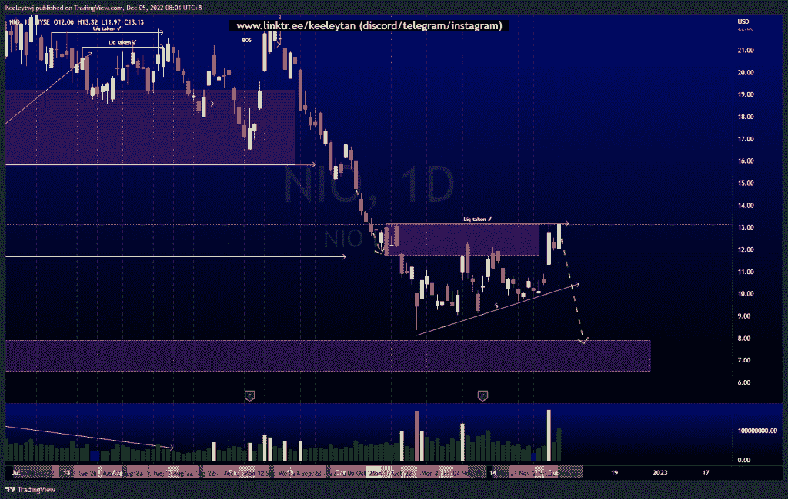
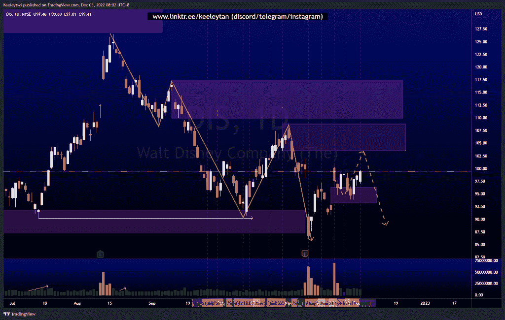

# 股票技术分析#PLTR #NIO #DIS

> 原文：<https://medium.com/coinmonks/stocks-technical-analysis-pltr-nio-dis-964075382175?source=collection_archive---------47----------------------->

在这里了解更多关于我的信息(YouTube/insta gram/Telegram):[https://www.linktr.ee/keeleytan](https://www.linktr.ee/keeleytan)

如果你觉得我的帖子有帮助，如果你能在这个帖子上给我一个赞，并关注我以后的类似帖子，我将不胜感激。如果您有任何意见/反馈，请随时使用上面的谷歌表单链接。

不和谐的免费信号服务正式启动。如果有兴趣，请到我的不和谐来看看！

#PLTR

价格并没有像上周分析的那样发挥作用。价格回升，几乎填补了 8.00 的公允价值缺口。价格也创造了卖方流动性，这可能是在不久的将来。我预计价格在下跌之前至少会填补公允价值的缺口。

[https://www . trading view . com/chart/PLTR/ctwjek 0m-PLTR-Analysis/](https://www.tradingview.com/chart/PLTR/CtWJEK0M-PLTR-Analysis/)

#NIO

价格在 11.73 使看跌的 POI 无效，并采取了以上的流动性。几周以来，价格一直在建立卖方流动性，在突破上述关口后，价格可能会下跌，接受卖方流动性。

[https://www . trading view . com/chart/NIO/quq 8 brhf-NIO-Analysis/](https://www.tradingview.com/chart/NIO/QUq8brHF-NIO-Analysis/)

#DIS

根据上周的分析，价格正在上涨。价格从 96.32 的公允价值缺口反弹，现在，价格似乎将走向 108.84 的熊市。

[https://www . trading view . com/chart/DIS/1 dexv 5g-DIS-Analysis/](https://www.tradingview.com/chart/DIS/1dheXV5G-DIS-Analysis/)

如果你持有这些公司中的任何一家，就可以点赞、分享和评论！

让我知道，如果你有任何你想让我分析的行情。

一定要在其他社交平台上看看我，我在交易、分析和心理学上发布内容。看看我这里:[https://www.linktr.ee/keeleytan](https://www.linktr.ee/keeleytan)

*原载于 2022 年 12 月 5 日 http://2minutesliteracy.wordpress.com***。**

> *交易新手？试试[加密交易机器人](/coinmonks/crypto-trading-bot-c2ffce8acb2a)或者[复制交易](/coinmonks/top-10-crypto-copy-trading-platforms-for-beginners-d0c37c7d698c)*