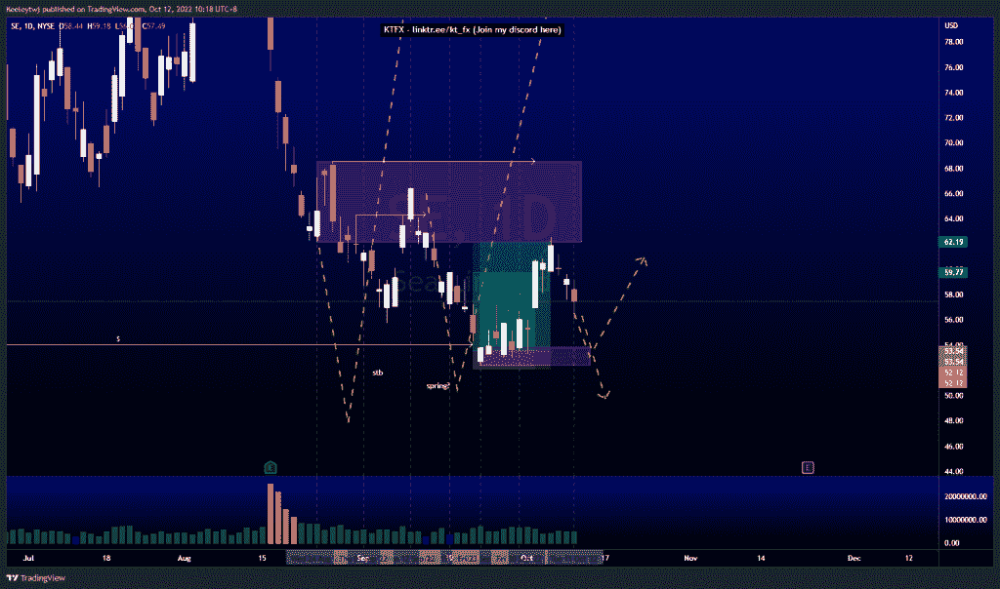
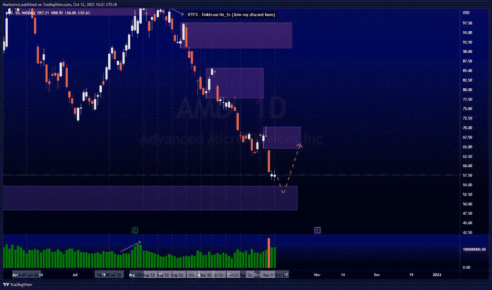
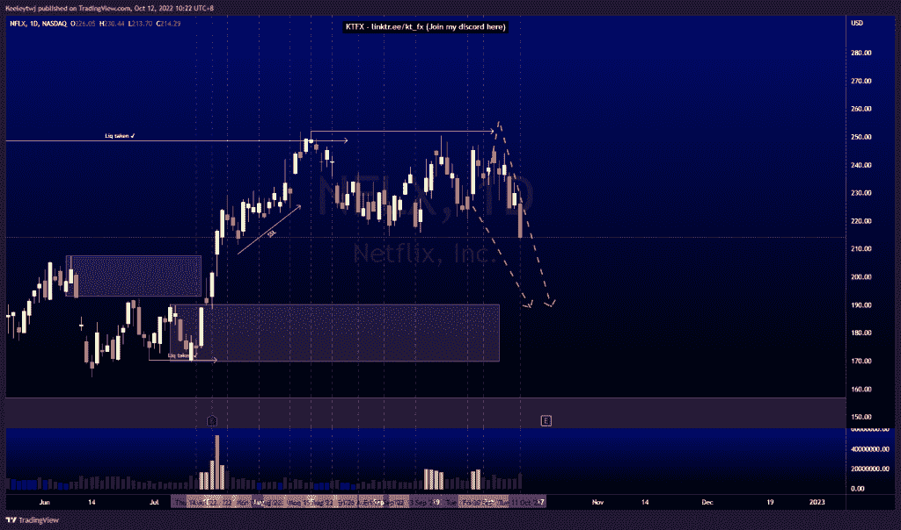

# 股票技术分析#SE #AMD #NFLX

> 原文：<https://medium.com/coinmonks/stocks-technical-analysis-se-amd-nflx-2805a20db104?source=collection_archive---------19----------------------->

在这里了解更多关于我的信息(YouTube/insta gram/Telegram):[https://www.linktr.ee/keeleytan](https://www.linktr.ee/keeleytan)

如果你觉得我的帖子有帮助，如果你能在这个帖子上给我一个赞，并关注我以后的类似帖子，我将不胜感激。如果您有任何意见/反馈，请随时使用上面的谷歌表单链接。

不和谐的免费信号服务正式启动。如果有兴趣，请到我的不和谐来看看！

#SE

价格的走势与上周的分析完全一致。在我的不和谐中给出的自由信号，最终在 62.19 获得利润(+16.16%或+6.09RR)，缓解了 62.15 的看跌点，价格反应强烈，并从那里下跌。这次下跌的下一个目标是 53.85。如果 53.85 处的看涨点保持住，并再次打破市场结构向上，那么我们就有了一个向上移动的确定的春天。如果看涨 POI 被违反，我们应该看到下行的延续。

#AMD

根据我上次的分析，价格并没有像预期的那样发挥作用。我预计价格将在 64.05 填补公允价值缺口，并在下跌前在 85.68 缓解看跌情绪。尽管如此，价格还是下跌了，并朝着 54.74 的看涨点前进。我预计在触及 54.74 的看涨 POI 后会出现看涨回撤，有可能填补 64.52 的公允价值缺口/看跌 POI。

#NFLX

过去几周的价格走势分析。价格没有达到 251.99 的高点，并打破了向下的市场结构。我预计在我们看到任何看涨回撤之前，价格可能会将看涨点锁定在 190.21。

如果你持有这些公司中的任何一家，就可以点赞、分享和评论！

让我知道，如果你有任何你想让我分析的行情。

一定要在其他社交平台上看看我，我在交易、分析和心理学上发布内容。看看我这里:【https://www.linktr.ee/keeleytan】T2

*原载于 2022 年 10 月 12 日***。**

> *交易新手？尝试[加密交易机器人](/coinmonks/crypto-trading-bot-c2ffce8acb2a)或[复制交易](/coinmonks/top-10-crypto-copy-trading-platforms-for-beginners-d0c37c7d698c)*