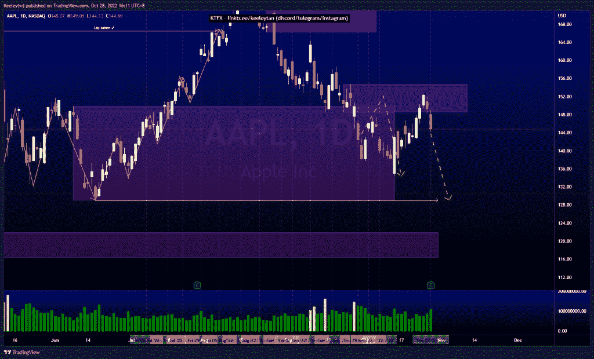
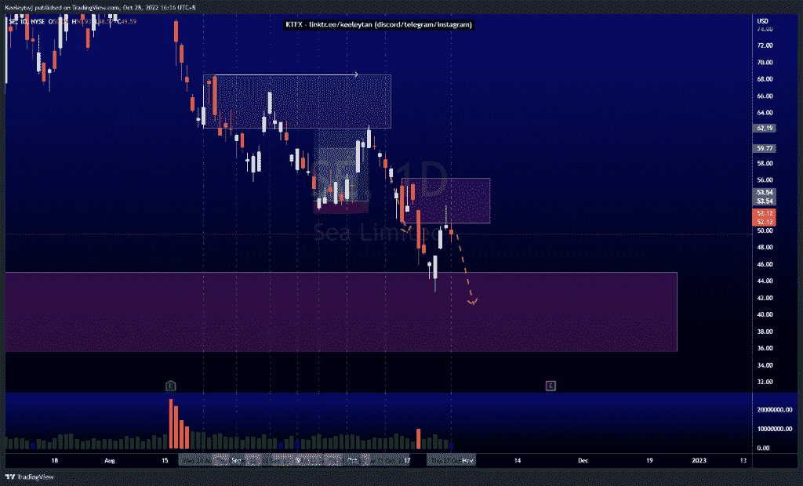
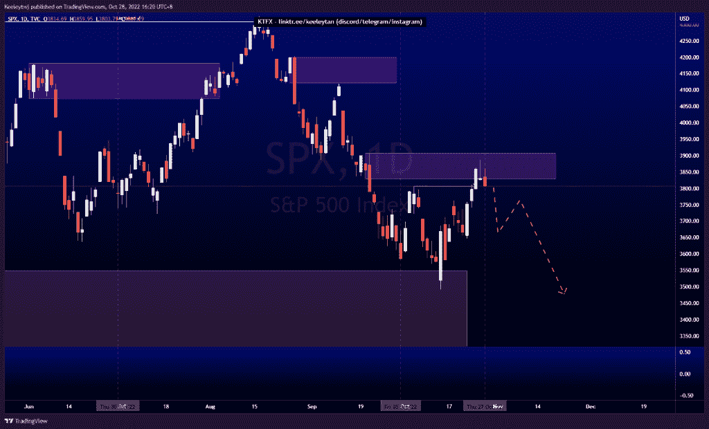

# 股票技术分析#SPX #AAPL #SE

> 原文：<https://medium.com/coinmonks/stocks-technical-analysis-spx-aapl-se-793d0b5f551c?source=collection_archive---------40----------------------->

在这里了解更多关于我的信息(YouTube/insta gram/Telegram):[https://www.linktr.ee/keeleytan](https://www.linktr.ee/keeleytan)

如果你觉得我的帖子有帮助，如果你能在这个帖子上给我一个赞，并关注我以后的类似帖子，我将不胜感激。如果您有任何意见/反馈，请随时使用上面的谷歌表单链接。

不和谐的免费信号服务正式启动。如果有兴趣，请到我的不和谐来看看！

#AAPL

价格完全符合我上次的分析。价格在 148.56 缓解了看跌点并做出反应。目前，我预计价格将继续走低，可能会接近 129.04 的低点。

[https://www . trading view . com/chart/AAPL/Xi 6 D2 ldi-AAPL-Analysis/](https://www.tradingview.com/chart/AAPL/XI6D2Ldi-AAPL-Analysis/)

#SE

价格与我先前的分析相符。价格已经在 45.0 处缓和了旧的看涨点，并做出了反应。价格目前处于熊市点 50.79。我预计价格会随着看跌订单流继续走低。

【https://www.tradingview.com/chart/SE/QoVqwhrV-SE-Analysis/ 

#SPX

价格并没有按照我之前的分析发挥作用。我预计看跌点 3736.74 将保持不变，价格将随着看跌订单流继续走低。然而，价格从 3549.85 的看涨点反弹并回升。目前在 3907.07 减轻看跌点。我预计从这里开始会有一个熊市回撤。如果价格向下突破市场结构，我们可能会看到空头订单流的延续。

[https://www . trading view . com/chart/SPX/w6 lpn 7 cv-SPX-Analysis/](https://www.tradingview.com/chart/SPX/W6Lpn7CV-SPX-Analysis/)

如果你持有这些公司中的任何一家，就可以点赞、分享和评论！

让我知道，如果你有任何你想让我分析的行情。

一定要在其他社交平台上看看我，我在交易、分析和心理学上发布内容。看看我这里:[https://www.linktr.ee/keeleytan](https://www.linktr.ee/keeleytan)

*原载于 2022 年 10 月 28 日 http://2minutesliteracy.wordpress.com***。**

> *交易新手？试试[加密交易机器人](/coinmonks/crypto-trading-bot-c2ffce8acb2a)或者[复制交易](/coinmonks/top-10-crypto-copy-trading-platforms-for-beginners-d0c37c7d698c)*