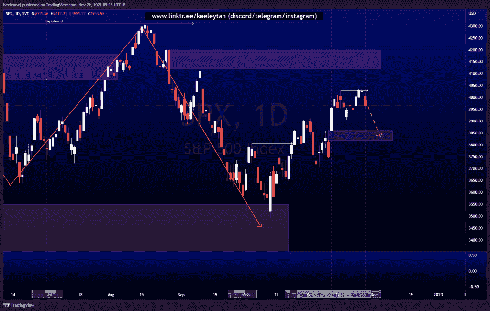
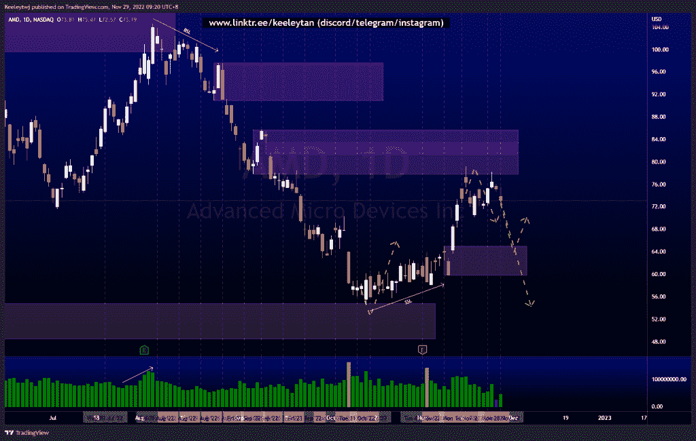
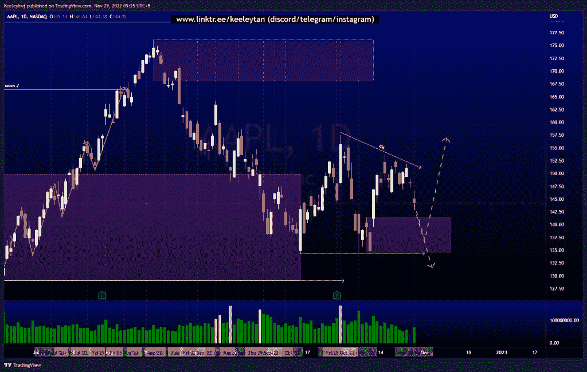

# 股票技术分析#SPX #AMD #AAPL

> 原文：<https://medium.com/coinmonks/stocks-technical-analysis-spx-amd-aapl-5c64646d110d?source=collection_archive---------11----------------------->

在这里了解更多关于我的信息(YouTube/insta gram/Telegram):[https://www.linktr.ee/keeleytan](https://www.linktr.ee/keeleytan)

如果你觉得我的帖子有帮助，如果你能在这个帖子上给我一个赞，并关注我以后的类似帖子，我将不胜感激。如果您有任何意见/反馈，请随时使用上面的谷歌表单链接。

不和谐的免费信号服务正式启动。如果有兴趣，请到我的不和谐来看看！

#SPX

自从我上次分析后，价格稳定了。价格最近在 4028.84 点创下新高，吸引买家同时大幅下跌。我预计价格将下跌，以填补下一个 3859.89 的公允价值缺口。

[https://www . trading view . com/chart/SPX/fgp 1 fowl-SPX-Analysis/](https://www.tradingview.com/chart/SPX/fgp1fOwl-SPX-Analysis/)

#AMD

价格在 85.68 重新缓和了看跌的 POI，并对下跌做出了强烈反应。从这里开始，我预计价格将走向 64.96 的看涨点，并有可能消除如下所示的卖方流动性。

[https://www . trading view . com/chart/AMD/91 uny n3u-AMD-Analysis/](https://www.tradingview.com/chart/AMD/91UnYn3U-AMD-Analysis/)

#AAPL

价格在 157.50 和 134.37 之间运行，创造了买方和卖方的流动性。我们可能会看到价格在 141.43 缓解看涨的 POI，然后走高以消除买方流动性，或者直接消除卖方流动性。

[https://www . trading view . com/chart/AAPL/izcjfgm 2-AAPL-Analysis/](https://www.tradingview.com/chart/AAPL/IzcjFgM2-AAPL-Analysis/)

如果你持有这些公司中的任何一家，就可以点赞、分享和评论！

让我知道，如果你有任何你想让我分析的行情。

一定要在其他社交平台上看看我，我在交易、分析和心理学上发布内容。看看我这里:[https://www.linktr.ee/keeleytan](https://www.linktr.ee/keeleytan)

*原载于 2022 年 11 月 29 日 http://2minutesliteracy.wordpress.com***。**

> *交易新手？试试[加密交易机器人](/coinmonks/crypto-trading-bot-c2ffce8acb2a)或者[复制交易](/coinmonks/top-10-crypto-copy-trading-platforms-for-beginners-d0c37c7d698c)*