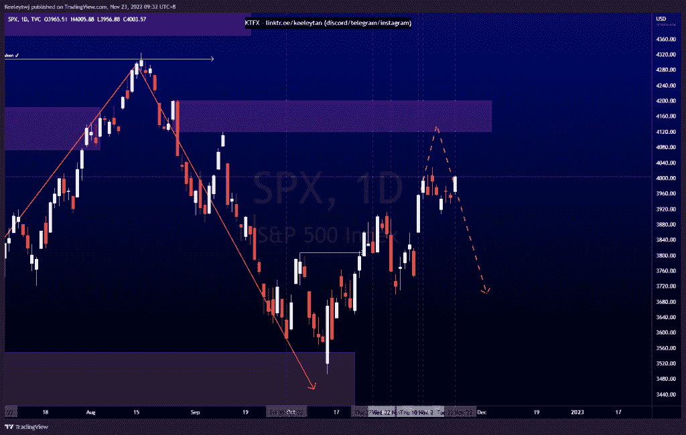
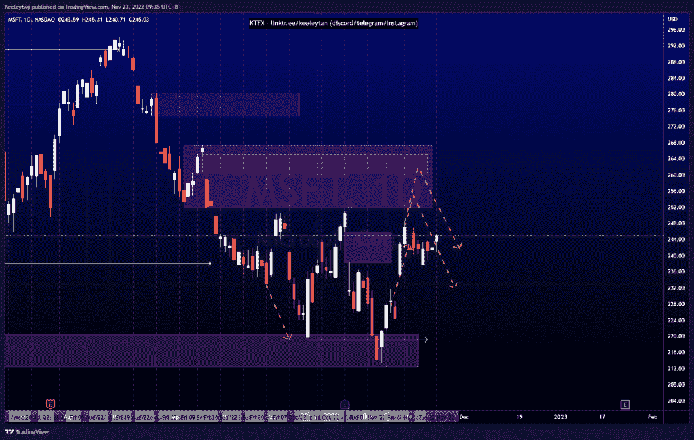
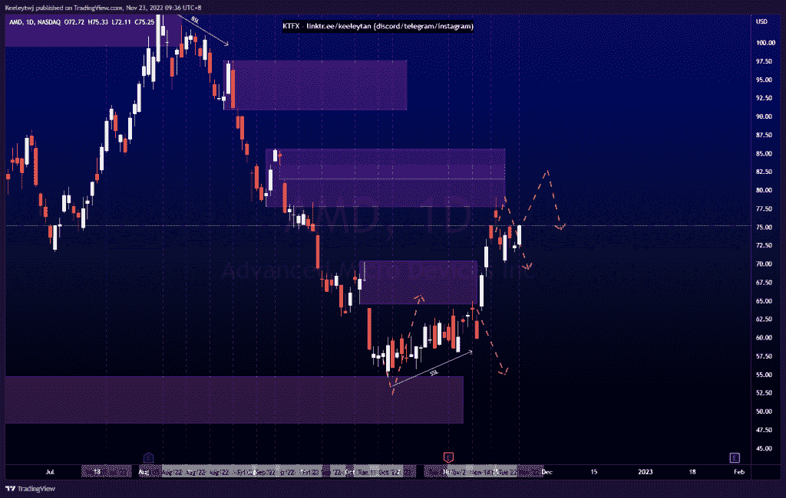

# 股票技术分析#SPX #MSFT #AMD

> 原文：<https://medium.com/coinmonks/stocks-technical-analysis-spx-msft-amd-719ed4b843f1?source=collection_archive---------14----------------------->

在这里了解更多关于我的信息(YouTube/insta gram/Telegram):[https://www.linktr.ee/keeleytan](https://www.linktr.ee/keeleytan)

如果你觉得我的帖子有帮助，如果你能在这个帖子上给我一个赞，并关注我以后的类似帖子，我将不胜感激。如果您有任何意见/反馈，请随时使用上面的谷歌表单链接。

不和谐的免费信号服务正式启动。如果有兴趣，请到我的不和谐来看看！

#SPX

根据我上次的分析，价格得到了巩固。我预计价格将上涨，并在 4119.97 点缓解最后一个看跌点，然后在更高的时间框架内再次下跌。

[https://www . trading view . com/chart/SPX/xnoggr 0 w-SPX-Analysis/](https://www.tradingview.com/chart/SPX/xNoGgR0w-SPX-Analysis/)

#MSFT

根据我上次的分析，价格得到了巩固。我的预期不变，预计价格将上涨以缓解 251.94 的看跌点，并有可能填补 260.40 的公允价值缺口。

[https://www . trading view . com/chart/MSFT/ixgm 9 SPT-MSFT-Analysis/](https://www.tradingview.com/chart/MSFT/Ixgm9spT-MSFT-Analysis/)

#AMD

根据我上周的分析，价格已经上涨。价格已经达到 85.68 的目标，以减轻看跌点。在我们看到任何反应之前，价格可能会继续上涨，以填补 83.46 的公允价值缺口。

[https://www . trading view . com/chart/AMD/9 puoavv 7-AMD-Analysis/](https://www.tradingview.com/chart/AMD/9pUOAVv7-AMD-Analysis/)

如果你持有这些公司中的任何一家，就可以点赞、分享和评论！

让我知道，如果你有任何你想让我分析的行情。

一定要在其他社交平台上看看我，我在交易、分析和心理学上发布内容。看看我这里:[https://www.linktr.ee/keeleytan](https://www.linktr.ee/keeleytan)

*原载于 2022 年 11 月 23 日 http://2minutesliteracy.wordpress.com***。**

> *交易新手？试试[加密交易机器人](/coinmonks/crypto-trading-bot-c2ffce8acb2a)或者[复制交易](/coinmonks/top-10-crypto-copy-trading-platforms-for-beginners-d0c37c7d698c)*