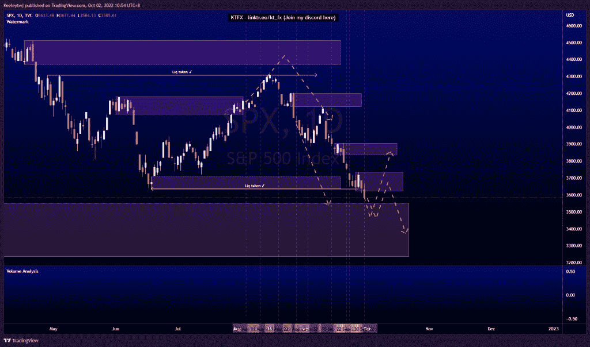
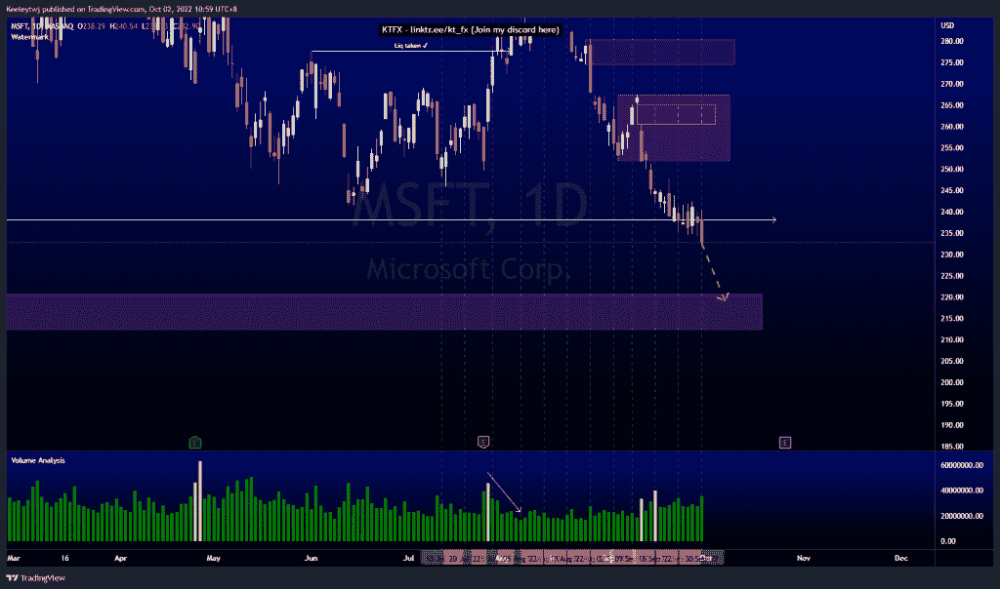
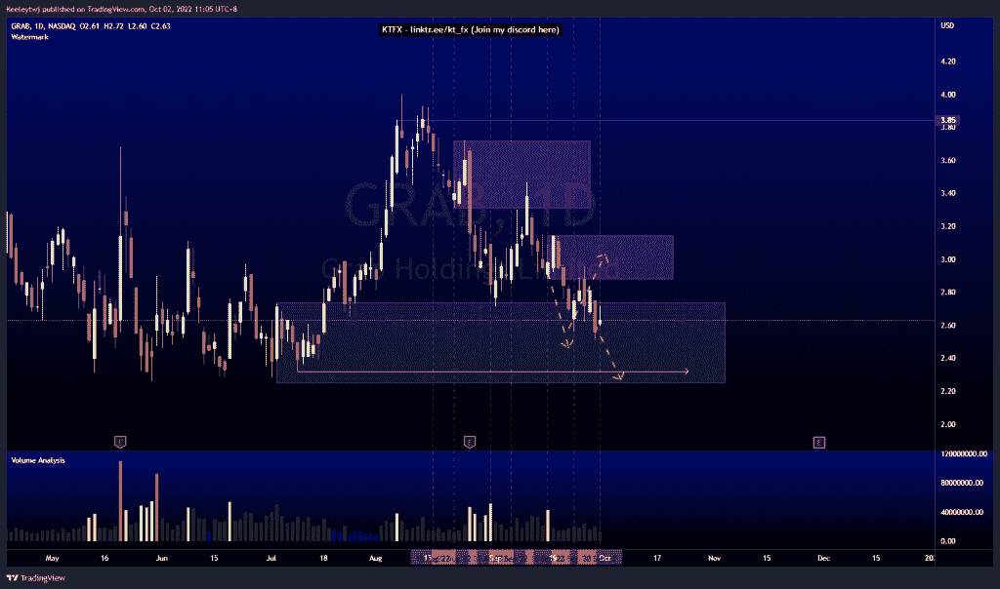

# 股票技术分析# SPX # MSFT #抓取

> 原文：<https://medium.com/coinmonks/stocks-technical-analysis-spx-msft-grab-684b664c6a97?source=collection_archive---------15----------------------->

在这里找到更多关于我的信息(YouTube/Discord/Telegram):[https://www.linktr.ee/keeleytan](https://www.linktr.ee/keeleytan)

如果你觉得我的帖子有帮助，如果你能在这个帖子上给我一个赞，并关注我以后的类似帖子，我将不胜感激。如果您有任何意见/反馈，请随时使用上面的谷歌表单链接。

不和谐的免费信号服务正式启动。如果有兴趣，请到我的不和谐来看看！

#SPX

价格按照两个月前的预期运行。价格正朝着 3549.85 的看涨点前进。低点 3636.87 被占领，但价格无法推高至 3837.08 的熊市点。我预计，在我们看到 3837.08 的看涨回撤至看跌点之前，价格将首先缓解看涨点。还有一种可能性是，价格可能会从 3736.74 的看跌点反弹，并在 3837.08 的看跌点没有缓解的情况下继续走低。

#MSFT

价格没有达到预期。我预计价格在走低之前会朝着看跌点 251.94 的方向上涨。现在，即使在 238.07 点抓住低点后，似乎也没有足够的流动性来推动价格上涨。价格可能会朝着 220.58 的看涨点下跌。

#抓取

价格一如预期，在 2.88 处缓解了看跌情绪，并继续走低。现在，我预计价格会走低，在我们看到看涨回撤之前，可能会触及 2.32 的低点。

如果你持有这些公司中的任何一家，就可以点赞、分享和评论！

让我知道，如果你有任何你想让我分析的行情。

一定要在其他社交平台上看看我，我在交易、分析和心理学上发布内容。看看我这里:【https://www.linktr.ee/keeleytan】T2

*原载于 2022 年 10 月 2 日***。**

> *交易新手？尝试[加密交易机器人](/coinmonks/crypto-trading-bot-c2ffce8acb2a)或[复制交易](/coinmonks/top-10-crypto-copy-trading-platforms-for-beginners-d0c37c7d698c)*