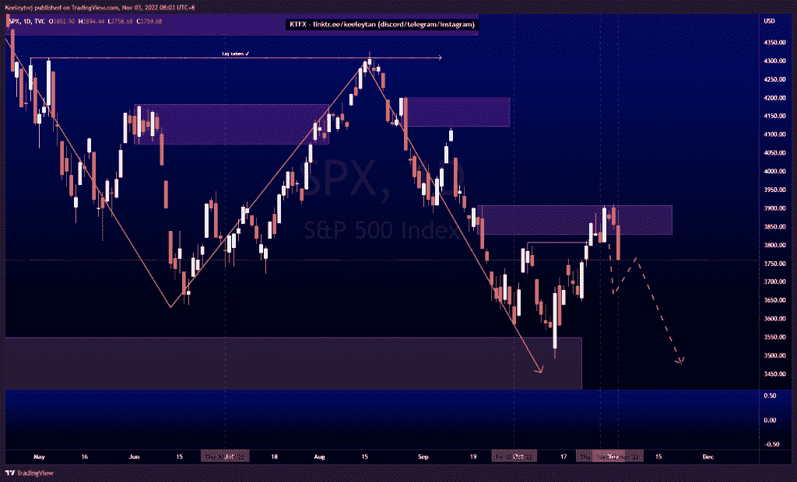
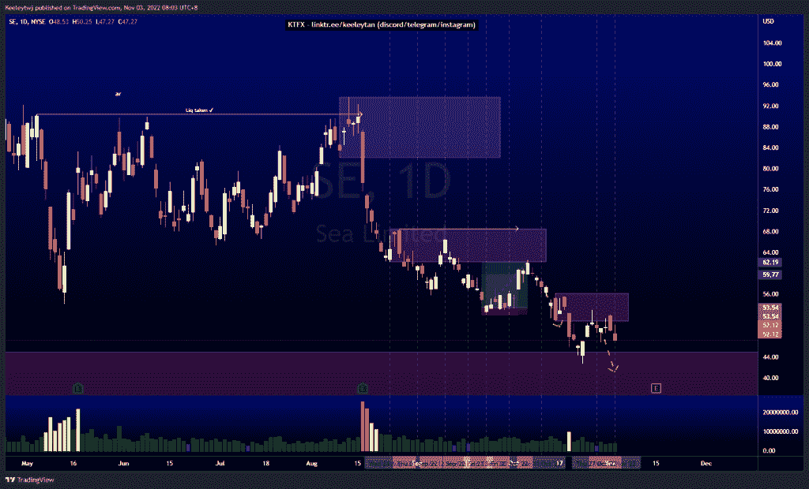
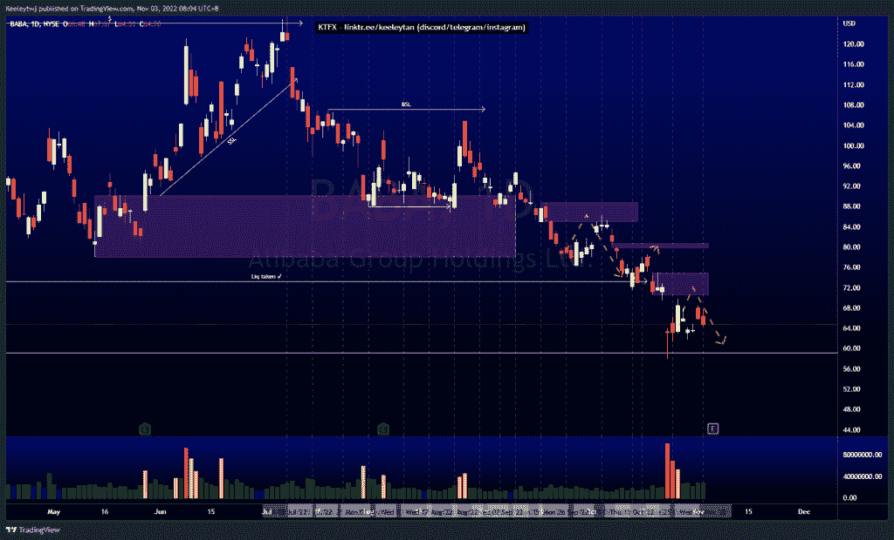

# 股票技术分析#SPX #SE #BABA

> 原文：<https://medium.com/coinmonks/stocks-technical-analysis-spx-se-baba-7b147c0c6910?source=collection_archive---------18----------------------->

在这里了解更多关于我的信息(YouTube/insta gram/Telegram):[https://www.linktr.ee/keeleytan](https://www.linktr.ee/keeleytan)

如果你觉得我的帖子有帮助，如果你能在这个帖子上给我一个赞，并关注我以后的类似帖子，我将不胜感激。如果您有任何意见/反馈，请随时使用上面的谷歌表单链接。

#SPX

根据我上周的分析，价格已经上涨。价格没有收于 3907.07 的熊市点之上，并从这里走低。我预计随着订单量的增加，价格会继续走低。

[https://www . trading view . com/chart/SPX/wqivzuz 9-SPX-Analysis/](https://www.tradingview.com/chart/SPX/wqIvzUZ9-SPX-Analysis/)

#SE

上周价格巩固，同时缓解了 50.79 的看跌点。我的预期不变，预计价格会走低，进一步缓解 45.00 的看涨情绪

【https://www.tradingview.com/chart/SE/f1jPKIvY-SE-Analysis/ 

#巴巴

上周这一地区的价格巩固了。我的预期不变，预计价格将在继续走低之前在 70.52 缓解看跌情绪。

[https://www . trading view . com/chart/BABA/El 1 ntq 38-BABA-Analysis/](https://www.tradingview.com/chart/BABA/EL1NTq38-BABA-Analysis/)

不和谐的免费信号服务正式启动。如果有兴趣，请到我的不和谐来看看！

如果你持有这些公司中的任何一家，就可以点赞、分享和评论！

让我知道，如果你有任何你想让我分析的行情。

一定要在其他社交平台上看看我，我在交易、分析和心理学上发布内容。看看我这里:[https://www.linktr.ee/keeleytan](https://www.linktr.ee/keeleytan)

*原载于 2022 年 11 月 3 日 http://2minutesliteracy.wordpress.com***。**

> *交易新手？试试[加密交易机器人](/coinmonks/crypto-trading-bot-c2ffce8acb2a)或者[复制交易](/coinmonks/top-10-crypto-copy-trading-platforms-for-beginners-d0c37c7d698c)*