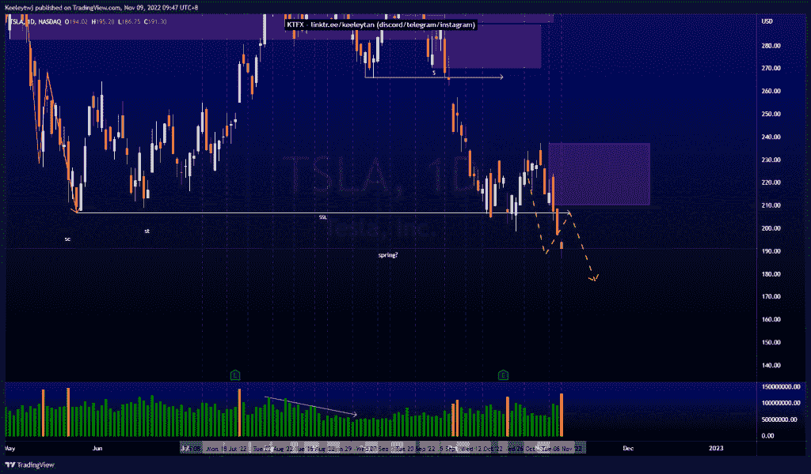

# 股票技术分析# BABA #巴巴#AMD

> 原文：<https://medium.com/coinmonks/stocks-technical-analysis-tsla-baba-amd-cfdde85cb938?source=collection_archive---------58----------------------->

在这里了解更多关于我的信息(YouTube/insta gram/Telegram):[https://www.linktr.ee/keeleytan](https://www.linktr.ee/keeleytan)

如果你觉得我的帖子有帮助，如果你能在这个帖子上给我一个赞，并关注我以后的类似帖子，我将不胜感激。如果您有任何意见/反馈，请随时使用上面的谷歌表单链接。

不和谐的免费信号服务正式启动。如果有兴趣，请到我的不和谐来看看！

#AMD

价格最终达到了 64.61 的目标。我们看到交易量在上升，价格在建立卖方流动性。我预计价格将从这里走低，消除卖方流动性，并进一步缓解 54.74 的看涨点。

[https://www . trading view . com/chart/AMD/wZzzYtqG-AMD-Analysis/](https://www.tradingview.com/chart/AMD/wZzzYtqG-AMD-Analysis/)

#巴巴

价格与上周的分析完全一致。价格在 70.52 缓解了看跌点，并对下跌做出了反应。从这里开始，我预计会继续走低，可能会在 58.01 的低点以及沿途的卖出-滑动流动性。

[https://www . trading view . com/chart/BABA/EFBkqyPx-BABA-Analysis/](https://www.tradingview.com/chart/BABA/EFBkqyPx-BABA-Analysis/)

#TSLA

根据上周的分析，价格正在上涨。价格突破了 200 美元的心理关口，目前正在下跌。似乎有一个很大的拒绝从这里与数量增加，但价格无法推动进一步下降。从这里开始，我预计在价格决定何去何从之前，短期内会回撤至 210.14 的熊市点。

[https://www . trading view . com/chart/TSLA/hx 1 khyxw-TSLA-分析/](https://www.tradingview.com/chart/TSLA/hX1Khyxw-TSLA-Analysis/)

如果你持有这些公司中的任何一家，就可以点赞、分享和评论！

让我知道，如果你有任何你想让我分析的行情。

一定要在其他社交平台上看看我，我在交易、分析和心理学上发布内容。看看我这里:[https://www.linktr.ee/keeleytan](https://www.linktr.ee/keeleytan)

*原载于 2022 年 11 月 9 日 http://2minutesliteracy.wordpress.com***。**

> *交易新手？试试[加密交易机器人](/coinmonks/crypto-trading-bot-c2ffce8acb2a)或者[复制交易](/coinmonks/top-10-crypto-copy-trading-platforms-for-beginners-d0c37c7d698c)*