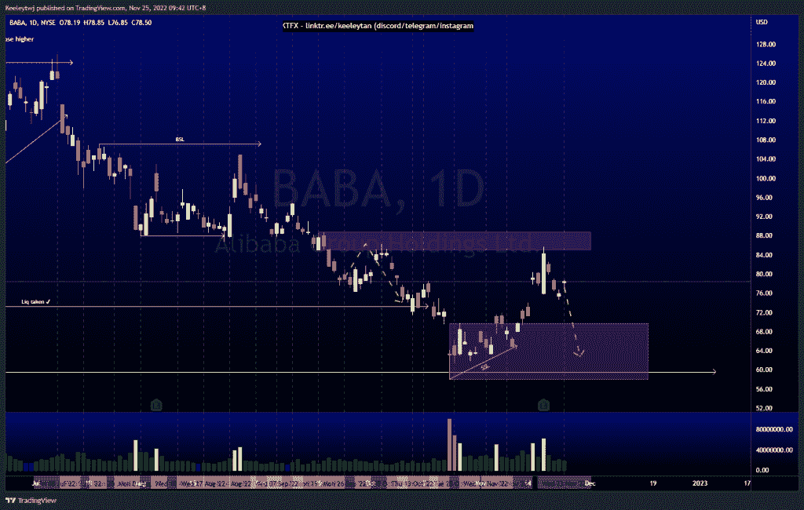
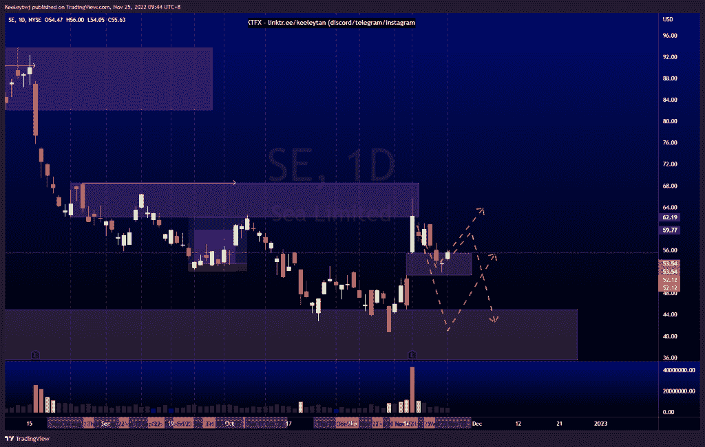
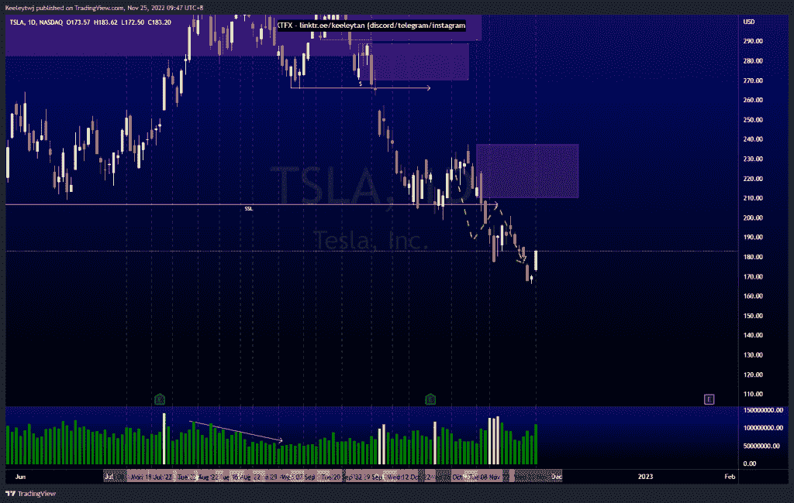

# 股票技术分析# TSLA # SE #巴巴

> 原文：<https://medium.com/coinmonks/stocks-technical-analysis-tsla-se-baba-1735598f6129?source=collection_archive---------11----------------------->

在这里了解更多关于我的信息(YouTube/insta gram/Telegram):[https://www.linktr.ee/keeleytan](https://www.linktr.ee/keeleytan)

如果你觉得我的帖子有帮助，如果你能在这个帖子上给我一个赞，并关注我以后的类似帖子，我将不胜感激。如果您有任何意见/反馈，请随时使用上面的谷歌表单链接。

不和谐的免费信号服务正式启动。如果有兴趣，请到我的不和谐来看看！

#巴巴

价格在 59.59 的低点后表现良好，并在收益期间向 85.00 的熊市反弹。从这里开始，我预计在 69.80 至少会有一个熊市回撤。

[https://www . trading view . com/chart/BABA/hvt DP 0 ca-BABA-Analysis/](https://www.tradingview.com/chart/BABA/Hvtdp0ca-BABA-Analysis/)

#SE

价格与上周的分析完全一致。价格目前正在填补 55.46 的公允价值缺口，并对其做出反应。从这里开始，我预计在下跌到主要看涨点 45.00 之前会有一些看涨的回撤。

【https://www.tradingview.com/chart/SE/152uDxON-SE-Analysis/ 

#TSLA

根据上周的分析，价格正在上涨。按照订单流程，我预计价格将继续下跌。价格仍有可能反弹，以减轻 210.14 的看跌点，然后走低。

[https://www . trading view . com/chart/TSLA/fcWUIJTz-TSLA-Analysis/](https://www.tradingview.com/chart/TSLA/fcWUIJTz-TSLA-Analysis/)

如果你持有这些公司中的任何一家，就可以点赞、分享和评论！

让我知道，如果你有任何你想让我分析的行情。

一定要在其他社交平台上看看我，我在交易、分析和心理学上发布内容。看看我这里:[https://www.linktr.ee/keeleytan](https://www.linktr.ee/keeleytan)

@ captain tiger @ tiger stars @ millionaire tiger

*原载于 2022 年 11 月 25 日 http://2minutesliteracy.wordpress.com***。**

> *交易新手？试试[加密交易机器人](/coinmonks/crypto-trading-bot-c2ffce8acb2a)或者[复制交易](/coinmonks/top-10-crypto-copy-trading-platforms-for-beginners-d0c37c7d698c)*