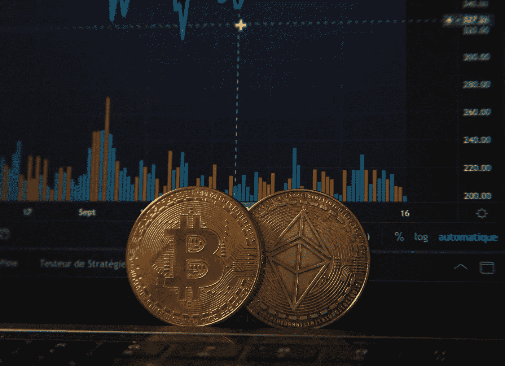

# 不要看着价格暴跌而不采取任何行动

> 原文：<https://medium.com/coinmonks/stop-watching-prices-tank-without-taking-any-action-43025536b533?source=collection_archive---------43----------------------->

## 这 5 个密码交易所将允许在下跌时兑现，如果其中一个足够好，甚至可以成倍增加利润

如果不熟悉**期货合约**，简单来说就是允许**密码资产**在未来某个日期基于预设的**期货价格**进行**交易**的合约，故名“**期货**”，至于**永久合约**则是没有**到期日**的**期货合约**，可以在**永久持有或交易**，因此 与常规期货一样，它们允许价格双向交易，并提供高杠杆机会，允许交易者增加利润**以及增加损失**，例如，一个人可以拥有 **100 美元**并使用**10 倍杠杆**开立 **1000 美元**头寸， 因此，如果价格朝着预期的方向上涨 5%，他们会赚 50 美元而不是 5 美元，但如果价格朝着相反的方向上涨，他们也会损失 50 美元而不是 5 美元，这是一个高风险高回报的操作。****

****最后一件事，永久价格通过[融资利率](https://defirate.com/funding/perpetual-contracts)与现货价格挂钩，确保其稳定性。****

# ****交易永久期货合约的五大交易所****

****以下交易所根据它们提供的不同硬币和代币的永久期货合约数量按降序排列****

## ****为什么要这样排名？****

****因为实现利润最大化的最有效方式是，当一项资产大幅上涨或下跌时，总是在人们希望交易的地方。****

******注:**大部分永久合约都是美元对，因此损益将以**美元、USDT、USDC、BUSD** 或任何其他与美元挂钩的稳定货币计算。****

****各交易所提供的永续合约数量来源于 [**Coingecko**](https://www.coingecko.com/en/exchanges/derivatives) 。****

## ****1) Gate.io****

*   ****提供的永久合同: 301 对****
*   ******庄家(**限价单**)/收单人费用(**市价单 **):** 0.015% /(0.04%-0.06%取决于点数余额)****
*   ******最大杠杆:**高达 100 倍****
*   ******存款&取款:**仅支持加密货币存款和取款，不支持菲亚特。取款费因主网络和令牌而异，更多详情[此处](https://www.gate.io/fee)。****

## ****2) MEXC Global****

*   ******提供的永久合同:** 229 对****
*   ******制造商/收款人费用:** 0.02% / 0.06%****
*   ******杠杆:**高达 125 倍****
*   ******存款&提现:**提现费用因网络状态和令牌而异，更多详情[此处](https://www.mexc.com/fee)。****

## ****3)币安全球****

*   ******提供的永久合同:** 224 对****
*   ******造/取费:**USDT 对 0.02% / 0.4%，BUSD 对 0.012%/0.03%+(使用 BNB 支付时打九折)，详情[此处](https://www.binance.com/en/fee/futureFee)。****
*   ******杠杆:**高达 100 倍****
*   ******存款&取款:**根据使用的方法，一些费用可能适用于法定存款，至于取款，费用适用于大多数基于令牌和网络的加密，同样的事情适用于法定取款，取决于方法+提供多种法定货币，更多详情[此处](https://www.binance.com/en/fee/cryptoFee)。****

## ****4)火币****

*   ****提供的永久合同:197 对****
*   ******造者/受者费用:**0.02%/0.05%+**+(用 HT token 支付费用打八五折)，更多详情[此处](https://www.huobi.com/en-us/fee/)。******
*   ******杠杆:**高达 200 倍****
*   ******存款&提现:**提现费用因网络和令牌而异，并且最低限额为 1000 美元****

## ****5) FTX****

*   ****提供的永久合同: 196 对****
*   ******造/收手续费:****0.02%/0.07%**+FTT 持有者手续费优惠，详情[此处](https://help.ftx.com/hc/en-us/articles/360024479432-Fees)。****
*   ******杠杆:**高达 20 倍****
*   ******存款&取款:**除了 ETH、ERC-20 代币或小额 BTC 取款外，加密存款和取款都不收费。
    FTX 用户将支付所有 ETH、ERC20 代币的区块链费用，除非他们有 FTT 赌注，详情[此处](https://help.ftx.com/hc/en-us/articles/360034865571-Blockchain-Deposits-and-Withdrawals)。至于菲亚特，存款费用没有说明，它们将在存款指令中显示，并且不支持各种货币，菲亚特取款费用对于交易几百美元的人来说太贵了，更详细的信息[在此](https://help.ftx.com/hc/en-us/articles/360043023772-Depositing-Withdrawing-Fiat)。****

******最后说明:**我个人使用**币安环球**已经快一年了，在存取款时都没有遇到任何问题，只是有时我找不到我想要的硬币或代币的永久合同，所以我只能放弃它。****

****然而，这不是一个人必须研究并根据它作出决定的建议或推荐，他们独自对他们的行动和决定的后果负责。****

****人们一定不要忘记，加密货币**非常不稳定**并且交易它们仍然**不受监管**这使得它**有风险**并且使用杠杆甚至**风险更大**，所以人们**必须小心**。****

********** 这篇博文只是一种观点，这不是一个财务建议或任何类型的建议，所有使用的信息都是在互联网上公开找到的！****

> ****交易新手？尝试[加密交易机器人](/coinmonks/crypto-trading-bot-c2ffce8acb2a)或[复制交易](/coinmonks/top-10-crypto-copy-trading-platforms-for-beginners-d0c37c7d698c)****