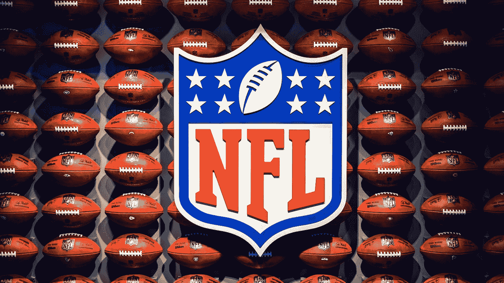

# 用 NFT 强化你的品牌

> 原文：<https://medium.com/coinmonks/strengthen-your-brand-with-nft-e60bf0c5210?source=collection_archive---------37----------------------->

Photo by [Andrey Metelev](https://unsplash.com/@metelevan?utm_source=medium&utm_medium=referral) on [Unsplash](https://unsplash.com?utm_source=medium&utm_medium=referral)

你是否曾经不得不保存你最喜欢的艺术家的演唱会或大型体育比赛的门票，作为未来的美好回忆？然而，有了今天的 [NFT](https://prominentcrypto.com/nft/) ，它不仅可以数字化地存储在钱包里，而且即使出票人倒闭，NFT 仍将存储在[区块链](https://prominentcrypto.com/blockchain/)上，永远不会消失。

Photo by [Adrian Curiel](https://unsplash.com/@hencetheboom?utm_source=medium&utm_medium=referral) on [Unsplash](https://unsplash.com?utm_source=medium&utm_medium=referral)

例如，像 NFL 这样的足球联盟已经与 Ticketmaster 合作，向在 2022 赛季观看了 100 多场比赛的足球迷发放 NFT 门票，作为独家赠品。

# **利用 NFT 进行营销时需要考虑什么**

以下是企业主为其品牌实施 NFT 需要采取的步骤:

## 1.定义目标受众

Photo by [Nicholas Green](https://unsplash.com/@nickxshotz?utm_source=medium&utm_medium=referral) on [Unsplash](https://unsplash.com?utm_source=medium&utm_medium=referral)

可能对 NFTs 感兴趣的客户可分为三个主要目标群体:

**a)收藏者**:这个群体经常购买收藏，以个人品味为目的，可能会长期保存 NFT，而不会转售或转售的概率极低。他们倾向于通过 Bitkub NFT、OpenSea、Looksrare 等平台购买感兴趣的 NFT。

**b)创作者:**因为这个群体也是创作者或者艺术家，他们可能想买 NFT 的作品来建立人脉，而且他们通常有支持的粉丝群，所以这也是他们帮忙的机会。提高 NFT 的品牌知名度。

**c)投资者:**该群体可能代表大多数目标受众，因为该群体寻求对短期和长期收益进行投机。但是，购买力也会从低到高变化。

## 2.沟通渠道

Photo by [Aman Pal](https://unsplash.com/@paman0744?utm_source=medium&utm_medium=referral) on [Unsplash](https://unsplash.com?utm_source=medium&utm_medium=referral)

如今，品牌向目标受众推广其 NFT 存在的最佳方式不可避免地是通过各种社交媒体平台，每个平台都有自己的优势和独特的目标受众。感兴趣的平台如下:

a) **脸书:**在接触大众观众方面，脸书仍然拥有庞大的粉丝群。此外，脸书还有几个与 NFT 相关的粉丝页面和群组。

b) **Instagram:** IG 之所以脱颖而出，是因为它专注于通过照片或艺术作品来呈现内容，这使得它非常适合推广 NFT，即艺术作品。

c) **Twitter:** Twitter 是一个快速传播消息的完美渠道。通过使用#NFT、#OpenSea、#nftart 等标签，你可以更好地锁定可能对 NFT 感兴趣的人。

d)**Discord/Reddit/Telegram:**这些平台类似于 web boards，用户可以在这里开设论坛讨论自己感兴趣的话题，也有专属于有共同兴趣的人的房间或群组，如 Reddit 有相关的 Subreddit 如 r /NFT、r/NFTExchange 等。

## 3.内容创作

Photo by [Hal Gatewood](https://unsplash.com/@halacious?utm_source=medium&utm_medium=referral) on [Unsplash](https://unsplash.com?utm_source=medium&utm_medium=referral)

一旦您确定了目标受众并选择了传播渠道，下一步就是从认知阶段到购买后阶段创建内容来推广您品牌的 NFT，如下所示:

**a)触发和认知:**最初，目标受众还不熟悉品牌的 NFT，因此适当的内容将首先建立对 NFT 的理解和认知，例如它是什么以及如何营销。

**b)考虑:**一旦客户了解了 NFT，下一步就是开始创作与某个品牌的 NFT 相关的内容。这可以是一个社交媒体帖子，概述您的 NFT 的优势和独特之处。

**c)转化:**一旦顾客意识到该品牌的 NFT 产品，下一步就是鼓励他们做出购买决定。该品牌可以创建内容，将他们的 NFT 与其他公司的 NFT 进行比较，或者组织一次 AMA，以便仍有问题的客户可以直接向专家提问，等等。

**d)愉悦和认知:**一旦顾客决定购买 NFT，品牌应考虑向顾客表达谢意。这可以是一封感谢邮件，也应该考虑售后服务，例如为 NFT 持有者组织特别活动，让他们觉得购买 NFT 是值得的。

## 摘要

NFT 仍处于起步阶段，正吸引着世界各地希望将其应用于自己品牌的企业家的注意力。NFTs 可以为品牌带来一个数字收藏品的好处，让粉丝作为一个好的纪念品，也可以提升品牌形象，在新一代的眼中显得更加现代。

然而，在为他们的品牌实施 NFT 之前，企业家必须对前者有一个很好的了解，以及一个合适的营销策略，以充分利用 NFT 的潜力。

> 交易新手？尝试[加密交易机器人](/coinmonks/crypto-trading-bot-c2ffce8acb2a)或[复制交易](/coinmonks/top-10-crypto-copy-trading-platforms-for-beginners-d0c37c7d698c)