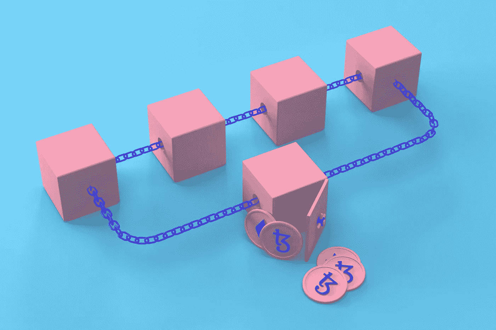

# 被困在区块链的兔子洞里？？以下是你如何在区块链成就一番事业的方法(简单解释)

> 原文：<https://medium.com/coinmonks/stuck-down-a-blockchain-rabbit-hole-637db728c496?source=collection_archive---------52----------------------->

关于如何成为一名区块链开发者，你们中的大多数人可能和我一样陷入了同样的困境，并且已经经历了无数关于如何从零开始成为一名区块链开发者的路线图。事不宜迟，这将是迄今为止“最简单的解释”,真正从零开始成为区块链开发者的一步一步的解释，不会让你的大脑塞满无用的课程和链接…

所以让我们从…

## 第一步:学习一门编程语言

到目前为止，如果你想进入 web3 领域，这是最基本的事情，我的建议是掌握 javascript 和 SOLIDITY 语言，现在解释一下为什么是 JAVASCRIPT？因此，最合乎逻辑的原因是，大多数 web3 和区块链库都是用 js 编写的，与 C 或 java 等其他语言相比，它们与 js 更相似。关于可靠性，它是为以太坊区块链开发智能合约并轻松部署它们的最流行的语言。你不需要学习数十种语言和框架来开始开发你自己的区块链，你只需要掌握这两种语言和框架就可以开始你的区块链之旅。

## **第二步:理解区块链的工作原理**

既然你已经掌握了编码的艺术，我们需要深入研究区块链的机制，俗话说，不了解你的车，你就不可能成为一个好司机，这同样适用于你想掌握的任何领域。有数百个免费和付费的课程可以了解区块链背后的技术，但这对初学者来说太难了，可能会让你陷入更深的困境。因此，我们再次坚持基础，我们这样做的方式是从源头学习，这里是中本聪的比特币白皮书，它首先导致整个市场的课程和解释。这是我发现的学习任何技术的最好方法，只需查看源代码并理解创造者自己写的向世界解释技术的白皮书。

现在，请记住，您不会通过阅读白皮书一次就获得完整的概念，这个过程可能需要时间，我自己会在需要时继续阅读白皮书。无论是区块链、算法、工作证明还是任何其他概念，白皮书都应该是您理解区块链概念的首选参考。论文本身的目的是以最简洁的方式解释这个概念，而不是像其他课程和 youtube 视频那样从中获利(有一些好的 youtube 视频例外！！).所以我推荐阅读类似比特币白皮书、以太坊白皮书等论文。最大程度地理解潜在的技术。

> 交易新手？试试[加密交易机器人](/coinmonks/crypto-trading-bot-c2ffce8acb2a)或者[复制交易](/coinmonks/top-10-crypto-copy-trading-platforms-for-beginners-d0c37c7d698c)

## **第三步:学习密码学**

现在我们已经学习了编码部分，并且对区块链的工作原理有了基本的技术理解，我们需要学习密码学。密码学是数学的一个分支，处理一般消息的加密和解密，区块链的大部分都在移动、存储和检索数据，而不允许有人在中间破坏数据，因此这里密码学介入并帮助链保持其完整性。有太多的资源可以学习密码学，但是我建议从实体书上学习，避免大量的混乱。我发现一本对学习密码学很有帮助的好书是 Stallings William 写的《密码学与网络安全——原理与实践》。他从基础开始，用简单的语言和例子解释复杂的加密算法，使它成为一个很好的学习资源。你可以从零先决条件开始阅读这本书。

## **第四步:开始构建**

你掌握任何领域的唯一方法不是狼吞虎咽地读几百本书或者看大量的内容，而是去做。理论只能带你到这里。所以，现在我们已经学会了编码语言、区块链的工作方式以及对网络的加密理解，剩下要做的就是将它们结合起来，在实践中实现区块链。在这一步中，你可以参考一些博客或 youtube 视频来开始构建你自己的第一个区块链，但我建议使用实体书，或者即使你参考的是视频或博客，至少也要并排编写代码来真正理解它，而不是仅仅看视频或阅读博客。如果你选择参考一本书，我会推荐 Imran Bashir 的《掌握区块链》。这本书将带你踏上一段旅程，从构建你自己的区块链和智能触点到在测试网或主网中部署它。

这篇文章到此结束，希望你学到了一些不同的东西，如果任何人需要帮助，有疑问，请留下评论，我将非常乐意帮助。

***前路漫漫……***