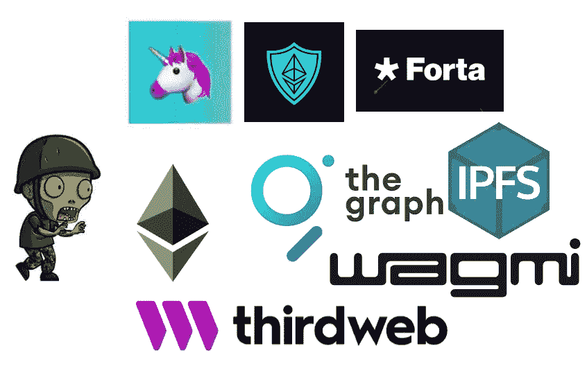

# 开发人员成为全栈 Dapp 开发人员的学习计划

> 原文：<https://medium.com/coinmonks/study-plan-for-developers-to-be-a-full-stack-dapp-developer-e416794932be?source=collection_archive---------11----------------------->

我为任何软件工程师或开发人员创建了这个学习计划，以学习与区块链和去中心化应用程序相关的一切。做完这个计划，你就可以开始找初级全栈 Dapp 开发者的工作了。我看到很多教程说完成这个路线图，项目，文档，你就大四了，我不信。要成为一名大四学生，你需要 mainnet(生产)方面的实际专业知识和与开发团队合作的经验，而不仅仅是做辅助项目和独立学习。

# 先决条件

*   任何面向对象编程语言的基础。
*   Nodejs 和 Npm。
*   前端基础。如果你有兴趣做一个全栈去中心化的应用，而不仅仅是智能合约。

# 议程

*   分散技术和区块链
*   以太坊
*   固态
*   框架和工具包
*   审计
*   使用图形协议和 Forta 进行监控
*   前端集成

# 分散技术和区块链

了解基础知识会帮助你更快。很多人一头扎进编码，做一个简单的 app 就花了他们一辈子的时间。如果你知道基础知识，你会有更好的调试方法。而且你会成为一个更好的开发者，因为好的开发者有很强的基础。

1.  了解分散式、分布式和集中式系统之间的区别。
2.  搜索所有区块链用例。
3.  对称和非对称加密
    -哈希函数。
    -数字签名区块链账户。(公共和私有地址)
4.  区块链账户。(公共和私有地址)
5.  共识机制
    -工作证明。
    -股权证明
    -认证证明
    -历史证明
6.  允许和不允许的区块链。
7.  【任务】:
    提交五个项目创意:
    其中三个需要区块链，两个不需要。
8.  【外部资源】:
    [比特币白皮书练习](https://github.com/cooganb/bitcoin-whitepaper-exercises) [加密练习](https://cryptohack.org/)
    [自学加密](https://teachyourselfcrypto.com/)

# 以太坊

我向所有从区块链开始的人推荐以太坊。因为它是第一个支持智能合约的区块链，学习以太坊区块链将有助于你与所有 EVM 兼容的区块链。

1.  以太坊虚拟机
2.  以太坊中的街区
3.  账户类型。
    -外部自有账户(EOA)。
    -智能合约账户
4.  以太坊 2.0。
5.  智能合同。
6.  稳健和稳健。
7.  【任务】:
    [阅读以太坊 101](https://secureum.substack.com/p/ethereum-101)
    在 [eth.build](https://eth.build/) 上做一些挑战
8.  【外部资源】:
    ——[以太坊白名单](https://ethereum.org/en/whitepaper/)——[以太坊书籍](https://github.com/ethereumbook/ethereumbook)

# 固态

对于已经懂 OOP 的人来说，你从扎实开始会很容易。只是语法问题。但是我不建议这样。Solidity 有不同的编译版本、独特的模式和安全实践；在看语法之前，如果你有以太坊虚拟机基础和坚固性基础，你就会明白它们了。

1.  智能合同结构。
2.  ABI。
3.  编译器。
4.  重新混合并运行您的第一个智能合约应用程序。
5.  变量类型。
6.  存储和记忆。
7.  事件。
8.  功能。
9.  映射。
10.  修饰符。
11.  继承和接口
12.  [Assignment]:
    创建适用于所有 CRUD 流程的待办事项智能合同。
13.  呼叫、委托呼叫和呼叫代码之间的区别。
14.  【外部资源】:

    [隐型僵尸](https://cryptozombies.io/)
    [BuildSpace](https://buildspace.so/builds/solidity)

## 框架和工具包

1.  [Foundry](https://getfoundry.sh/) :以太坊应用开发工具包。
2.  【参考文献】:
    [铸造书籍](https://book.getfoundry.sh/)
3.  如何为你的智能契约使用单元测试用例？
4.  什么是代币，它们的不同标准是什么？
    —ERC 20
    —ERC 721
    —ERC 1155
    —ERC 777
    —ERC 4626
5.  Openzepplin 库。(所有权、角色、访问和令牌)
6.  [Assignment]:
    使用 Openzepplin 库部署你的第一个带有 100K 可燃烧特性的令牌。
7.  仅使用 Openzepplin 库部署你的 NFT。
8.  使用 Ganache 或 hardhat 节点部署远程节点。
9.  测试网。
10.  与[铸造厂](https://github.com/foundry-rs/foundry-toolchain)持续整合。
11.  智能合同验证。
12.  如何升级您的智能合约并使用代理。
13.  【任务】:
    解决[极速跑以太坊](https://speedrunethereum.com/)上的一些挑战

## 审计

1.  智能合约安全实践:
    a)重复攻击
    b)拒绝服务攻击
    c)溢出/下溢
    e)锁定以太网
2.  [模糊测试](https://book.getfoundry.sh/forge/fuzz-testing)。
3.  Slither 进行安全测试。
4.  [任务]:
    创建一个包含候选人和投票人的投票应用:

*   候选人应支付投票 erc20 代币作为候选人参与。
*   智能合同所有者应该添加投票人进行投票。
*   选民收到 NFT 作为投票的奖励。
*   候选人不能投票。
*   单元测试用例应该覆盖测试文件上的所有事务。
*   应该有 CI 进行单元测试。
*   我们应该至少在本地部署智能合同。
    【奖金】:
*   在 Testnet 上部署您的智能合约。
*   验证您的智能合同，并从区块链浏览器与其进行交互。
*   使用代理智能合约升级您的智能合约。

【外部资源】:
[Secureum](https://secureum.substack.com/)
捕捉以太
[以太](https://capturetheether.com/)
Openzeppelin[Youtube 播放列表](https://www.youtube.com/playlist?list=PLdJRkA9gCKOONBSlcifqLig_ZTyG_YLqz)

## 使用图形协议和 Forta 进行监控

图协议:从智能契约中查询数据从前端来看计算量很大，并且对于复杂的查询来说不可伸缩。graph 协议解决了这个问题，并提供了一种从智能合约中读取 ipfs 哈希的简单方法。

Forta Bots:部署智能合约后，您需要发布一些警报。为了安全起见，如果有任何问题，您会立即得到通知。例如，在我们的投票应用程序中，如果一个投票者投了两次票，或者候选人获得的票数比预期的多，就创建一个警报。

1.  了解福塔。
2.  什么是图形协议，为什么使用它？
3.  使用 Apollo 客户端连接子图。
4.  [作业]:

*   在 subgraph studio 上检查 [Uniswap 子图](https://thegraph.com/hosted-service/subgraph/uniswap/uniswap-v2)
*   通过符号查询所有可用的交换对。
*   获得此帐户的所有铸币 0x7a 250d 5630 B4 cf 539739 df 2c 5 DAC B4 c 659 f 2488d
*   在浏览器控制台上执行相同的查询。

5.【外部资源】:
[福塔连锁文章](https://chainstack.com/forta-for-realtime-monitoring-and-security-of-your-smart-contract/)
[图学院](https://thegraph.academy/)

# 前端

如何从 React 应用程序与智能合约交互，并使用 IPFS 等第三方。

1.  与 web3.js/ether.js 的钱包联系
2.  与 React 的钱包连接。
3.  【分配】
    创建一个导航栏来显示用户当前的以太坊余额和地址(前四个字符)。
4.  JSON-RPC 调用。
5.  你应该先了解基本知识，并实现连接广告智能合同查询和提交只使用 ether.js/web3js。然后学完之后，就可以开始用其中一个新的包了。比如 [Wagami React Hooks](https://wagmi.sh/) ，或者尝试使用 [Thirdweb](https://portal.thirdweb.com/sdk/set-up-the-sdk/frontend) 。Thirdweb 构建在 Wagami 之上，带有一些额外的 react 组件来与不同的令牌和 DAO 进行交互。
6.  【分配】
    查看每个候选人的投票结果，并在前端实现投票事务。
7.  IPFS 基础[原型学校](https://proto.school/)有非常好的课程。
8.  Ipfs 获取/上传数据。
9.  如何在智能合约中使用 Ipfs？
10.  [任务]:
    创建一个有两个网页的薄荷 NFT 网站，一个看到当前的非功能性测试，第二个创造一个新的。

[奖励]:在 IPFS 上部署所有静态网站页面

> 交易新手？尝试[加密交易机器人](/coinmonks/crypto-trading-bot-c2ffce8acb2a)或[复制交易](/coinmonks/top-10-crypto-copy-trading-platforms-for-beginners-d0c37c7d698c)