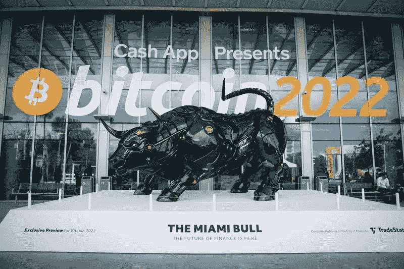

# 研究和投资加密货币的成功秘诀

> 原文：<https://medium.com/coinmonks/successful-tips-to-research-and-invest-in-cryptocurrency-96ab2e18d057?source=collection_archive---------39----------------------->

Image Source: Fashion Week Online

[加密货币](/coinmonks/simple-way-to-understand-cryptocurrency-by-day-to-day-examples-9f3bb62f7c9c)是一种另类金融投资，可以提供财务自由。一个了解加密货币利基的人成功地获得了巨额财富。

令人难以置信的是，我们见证了如此多的金融投资选择和方案的发展，并创造了战胜财富缩水的通胀压力和增加收入来源的潜在能力。

通过投资加密货币、共同基金和股票市场，实现财务稳定和[创造财富](/@barateprajwal25/the-reason-why-financial-planning-is-important-right-from-the-first-income-a7090afa3279)变得容易多了。你需要知道的就是学会掌握资本市场的投资和交易技术。

***加密货币获得良好收益的成功背后隐藏着什么？***

*我分享了我在加密货币投资和交易经验中的一些小技巧。*

## #1 -投资类似于股票市场:

Image Source: Coin Market Cap

尽管与股票市场相比，加密市场具有相对较高的价格波动，但观察显示，股票市场和加密货币在其价格趋势上具有坚定的一致性。

对 Nifty 50、SENSEX、标准普尔 500、纳斯达克和比特币等股市指数的预测几乎也有类似的趋势。唯一的例外是股票市场的基本比率，不适用于秘密市场的内在分析。

从这些指数中了解市场趋势，并将其与比特币价格相关联，有助于预测投资决策的整体看涨或看跌趋势。

## #2 -这完全取决于时机！

Photo by [Jaelynn Castillo](https://unsplash.com/@jaelynnalexis?utm_source=medium&utm_medium=referral) on [Unsplash](https://unsplash.com?utm_source=medium&utm_medium=referral)

加密货币在投资回报时具有波动性。从货币市场的角度来看，加密货币具有最高的波动性指数，增加了潜在损失和潜在回报利润的风险因素。

在做出任何买入或卖出决定时，查看不同交易所的股票市场的 24 小时市场周期和开市时间，价格的波动在某种程度上是可预测的。

例如，在印度标准时间(IST)，已经观察到在晚上 8:30、早上 5:00 和早上 10:30 左右，价格的波动性比其他时间高。

这样的观察有助于做出准确的决策。因此，作为投资者，注意密码市场的时机是一种自我提高的实践。

## #3 -了解最新的市场新闻:

Image Source: [The Economic Times](https://economictimes.indiatimes.com/printhome.cms)

投资者在做出投资决策时寻求确定性。当涉及的风险处于高端时，市场上的每一条消息都会显著影响比特币、以太坊和替代币的价格。

作为投资者，了解最新消息对于理解价格波动的根本原因至关重要。

在一些来自名人的推文和新闻矫揉造作中，一些加密资产大量增加或减少，在几个小时内为投资者带来利润或损失。

查看 Twitter 和其他社交平台以了解市场趋势可以降低未知不幸损失的风险。

为了防止这种预期即将到来的投资机会的意外，不断阅读和检查秘密新闻和经济市场新闻是至关重要的。

## #4 -了解图表

Photo by [regularguy.eth](https://unsplash.com/@moneyphotos?utm_source=medium&utm_medium=referral) on [Unsplash](https://unsplash.com?utm_source=medium&utm_medium=referral)

专业投资者与众不同的地方在于阅读图表和预测趋势的能力。图表阅读包括理解蜡烛线模式，图表指标，并了解不同的时间框架，以明确长期或短期的方法。

如果你掌握了图表阅读技巧，你可以在最好的时机和准确性下买卖单。因此，更好地了解关键图表模式，如头肩顶、杯柄、看涨/看跌吞没等。

## #5 -运用群体智慧技巧

Image Source: [Wordpress.com](https://norulesjustwords.wordpress.com/2015/03/31/crowdsourcing-and-co-creation-elements-applied-to-your-project/)

“群体智慧”技巧是关于通过观众投票了解整体市场情绪，以及大多数人对他们的行动下什么赌注。

比特币、以太坊和其他替代币的价格取决于市场的供求关系以及人们愿意支付或出售的东西。买家和卖家之间不断角力，要么抬高要么压低加密硬币的价格。

使用 Twitter 和社交媒体平台，真正的专家的建议和阅读图表有助于对获胜方(买方或卖方)在当前时刻的趋势进行估计。

然而，通过询问和参考少数人和消息来源来应用群体智慧可能不会 100%起作用，因为市场不是根据少数人的情绪而是根据全球人口的情绪运行的。

## 长期愿景:

Image Source: [Bloomberg](https://www.bloomberg.com/news/articles/2022-04-06/miami-gets-its-own-charging-bull-statue-for-crypto-week)

加密货币是一种新兴的金融资产类别，处于采用的初级阶段，并将以一种重新定义的方式影响传统金融系统的运作。

一些国家已经将加密货币作为买卖商品的货币合法化。另一方面，由于其未知的性质，很少有国家反对在严格限制下彻底禁止或监管加密货币。

> 作为投资者和交易者，重要的是了解技术和它的机制，用正确的方法去理解和学习成为一个成功的投资者。

加密货币本身就是一种消除传统金融漏洞的创新。随着技术的发展和采用，21 世纪将会看到每个人的日常财务健康发生巨大的变化。

> “谢谢你读我的文章。鼓掌、分享并关注我的[个人资料(点击此处)](/@barateprajwal25)了解更多更新和内容。”
> 
> 交易新手？试试[加密交易机器人](/coinmonks/crypto-trading-bot-c2ffce8acb2a)或者[复制交易](/coinmonks/top-10-crypto-copy-trading-platforms-for-beginners-d0c37c7d698c)