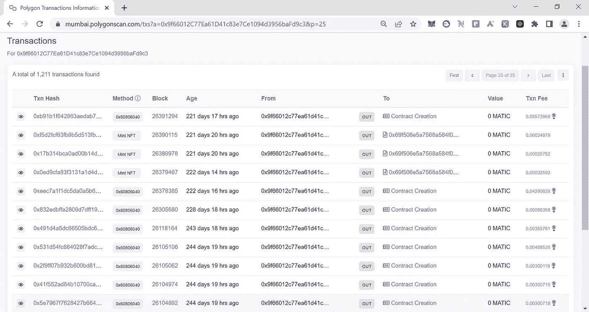

# 在不同的区块链网络上成功部署了 150 多个智能合同

> 原文：<https://medium.com/coinmonks/successfully-deployed-over-150-smart-contracts-on-different-blockchain-networks-27790983b9f2?source=collection_archive---------59----------------------->

我在 200 多天的 365 天区块链开发挑战中，成功地在不同的区块链网络上部署了超过 150+ [个智能合约](https://mumbai.polygonscan.com/address/0x9f66012c77ea61d41c83e7ce1094d3956bafd9c3)和 1000+笔交易。这项挑战包括承诺在一整年中每天学习和发展区块链技术。通过这次挑战，我对区块链技术有了深入的了解，并了解了如何在广泛的行业中使用它来创建创新的解决方案。

我了解了不同类型的区块链、用于区块链开发的各种编程语言和工具，以及这项技术在金融、供应链管理等领域的潜在应用。完成这个挑战是一次既有收获又有挑战的经历，作为一名区块链开发者，我很高兴能够继续学习和成长。

> 交易新手？在[最佳加密交易](/coinmonks/crypto-exchange-dd2f9d6f3769)上尝试[加密交易机器人](/coinmonks/crypto-trading-bot-c2ffce8acb2a)或[复制交易](/coinmonks/top-10-crypto-copy-trading-platforms-for-beginners-d0c37c7d698c)

我一直在寻找新的机会来使用我在智能合同开发方面的专业知识，并且很高兴看到这项技术将如何继续发展和改变世界。

## 在[***Linkedin***](https://in.linkedin.com/in/anfalhassan)上与我联系

区块链开发挑战钱包:-0x9f 66012 c 77 ea 61d 41 c 83 e 7 ce 1094d 3956 bafd 9 c 3

## **我**用于区块链开发的**工具**

Moralis Web3 是一个开发平台，它为在以太坊区块链上构建分散式应用程序(DApps)提供工具和服务。它包括用户友好界面、内置钱包和支持多种编程语言等功能。

Pinata 是一个基于云的星际文件系统(IPFS)存储平台，这是一个存储和共享文件的分散网络。Pinata 允许开发人员在 IPFS 网络上轻松上传和访问文件，使其成为构建需要存储的 DApps 的有用工具。

Infura 是一种提供以太坊和 IPFS 网络访问的服务，允许开发人员轻松地将他们的 DApps 连接到区块链，而无需运行完整的节点。Infura 还提供了监控和管理 DApps 的工具，使其成为维护和部署分散应用程序的有用工具。

Truffle 和 Hardhat 是在以太坊区块链建造 DApps 的开发框架。它们提供了一系列工具和特性，包括项目搭建工具、测试框架和对多种编程语言的支持。

Alchemy 是一个提供工具和服务的平台，用于在以太坊区块链上构建、管理和扩展 DApps。它包括实时分析仪表板、支持多种编程语言和内置钱包等功能。

QuickNode ⚡是一项提供以太坊区块链访问的服务，允许开发人员轻松地将他们的 dapps 连接到网络，而无需运行完整的节点。它提供了一系列的特性和工具，包括用户友好的界面，对多种编程语言的支持，以及内置的钱包。

OpenZeppelin 是以太坊区块链的一个可重用的安全智能合约模块库。它提供了一系列常用的契约模式和组件，使开发人员更容易构建 DApps，而不必从头开始编写一切。

Solidity 是一种面向对象的编程语言，用于在各种区块链平台上实现智能合约，最著名的是以太坊。

Remix IDE 是一个无需安装的工具，带有用于开发智能合同的 GUI。专家和初学者都使用，混音会让你加倍努力。Remix 与其他工具配合得很好，并允许您选择一个简单的链部署过程。Remix 以我们的可视化调试器而闻名。

MetaMask 是一款软件加密货币钱包，用于与以太坊区块链进行交互。它允许用户通过浏览器扩展或移动应用程序访问他们的以太坊钱包，然后可以用来与分散的应用程序进行交互。

js 是一个 JavaScript 库，用于与以太坊区块链进行交互。它允许开发人员轻松访问以太坊网络，从区块链中读取和写入数据，并从基于 web 的应用程序中与智能合同进行交互。

Ethers.js 是另一个用于与以太坊区块链交互的 JavaScript 库。它提供了一系列与 web3.js 相似的功能，但设计得更加用户友好和易于使用。

总的来说，这些工具对于任何希望在以太坊区块链上开发分散式应用程序的人来说都是有用的。它们提供了一系列的特性和服务，有助于使开发过程更加简单和高效。

## **区块链开发资源**

DeveloperDAO 是一个学习和分享区块链发展知识的社区平台。它提供了一系列资源，包括教程、代码示例和论坛，以帮助开发人员了解和使用区块链技术。

Alchemy University 是一个在以太坊区块链上为构建、管理和扩展分散式应用程序(DApps)提供工具和服务的平台。它包括实时分析仪表板、多种编程语言支持和内置钱包等资源。

LearnWeb3 DAO 是一个提供一系列教程、指南和资源来了解区块链发展的网站。它涵盖了一系列主题，包括区块链基础知识、智能合约开发和 DApp 部署。

Moralis Academy 是一个开发平台，为在以太坊区块链上构建 DApps 提供工具和服务。它包括用户友好界面、内置钱包和对多种编程语言的支持等资源。

CryptoZombies 是一门在线课程，教授 Solidity 的基础知识，Solidity 是一种用于在以太坊区块链上编写智能合同的编程语言。它提供了一种有趣的交互式方式来了解智能合约开发，重点是创建您自己的 DApps。

Ethereum.org 是以太坊基金会的官方网站，该组织是区块链以太坊的幕后组织。它为开发人员提供了一系列资源，包括文档、教程和代码示例。

cc 和 Ludu.co 是提供关于 web3 和区块链开发的在线课程和教程的网站。

FreeCodeCamp 是一个免费的在线学习平台，提供一系列编程主题的教程和课程，包括区块链开发。它涵盖了区块链基础知识、以太坊开发和构建 DApps 等主题，并提供了一系列资源来帮助开发人员学习和提高技能。

Buildspace 是一个在线社区，面向对在以太坊区块链上构建分散式应用程序(DApps)感兴趣的开发人员。它提供了一系列资源，包括教程、代码示例和论坛，以帮助开发人员学习和共享关于区块链开发的知识。

Dapp 大学是一个在线学习平台，提供在以太坊区块链上构建 dapp 的教程和课程。它涵盖了区块链基础知识、智能合约开发和前端开发等主题，并提供了一系列资源来帮助开发人员开始 DApp 开发。

Eat the Blocks 是一个提供教程、课程和其他学习区块链发展资源的网站。它涵盖了一系列主题，包括以太坊开发、智能合约开发和 DApp 部署，并提供了一系列资源来帮助开发人员开始区块链开发。

Nftschool.dev 是一个网站，提供教程、课程和其他资源，用于学习不可替换令牌(NFT)以及如何在以太坊区块链上创建它们。它涵盖了 NFT 基础知识、智能合约开发和前端开发等主题，并提供了一系列资源来帮助开发人员开始使用 NFT 创建。

Ankr.hashnode.dev 是一个博客和社区平台，面向对区块链技术和分散式应用程序(DApps)感兴趣的开发人员。它提供了一系列资源，包括教程、代码示例和论坛，以帮助开发人员学习和共享关于区块链开发的知识。

Dev.to 是一个受开发人员欢迎的在线社区，他们可以在这里分享文章、教程和其他与 web 开发和技术相关的内容。

Web3.university 是一个提供有关 Web3 和区块链开发的课程和教程的网站。

App.cadena.dev 是一个网站，为希望在 cadena 区块链上构建和测试 dApps 的开发人员提供工具和资源。

Useweb3 是一个为想要了解 web3 以及如何使用它来构建 dApps 的开发人员提供信息和资源的网站。

Docs.soliditylang.org 和 Docs.openzeppelin 分别是 Solidity 编程语言和 openzeppelin 库的官方文档网站。

这些资源对于希望了解更多这些技术以及如何使用它们来构建自己的 dApps 的开发人员来说非常有用。

总的来说，这些资源对于任何希望了解和使用区块链技术的人来说都是一个有价值的信息和支持来源。它们提供了一系列工具、教程和其他资源，可以帮助开发人员开始区块链开发，并在这个令人兴奋且快速发展的领域中培养他们的技能。

强烈推荐通过下面的 Polygon Testnet 链接来查看合同部署细节:-

[https://Mumbai . polygonscan . com/address/0x9f 66012 c 77 ea 61d 41 c 83 e 7 ce 1094d 3956 bafd 9 c 3](https://mumbai.polygonscan.com/address/0x9f66012C77Ea61D41c83e7Ce1094d3956baFd9c3)