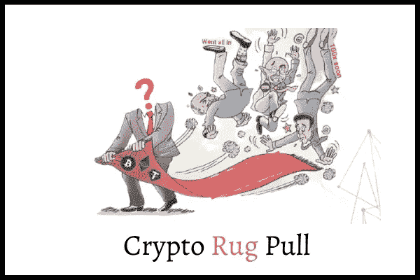
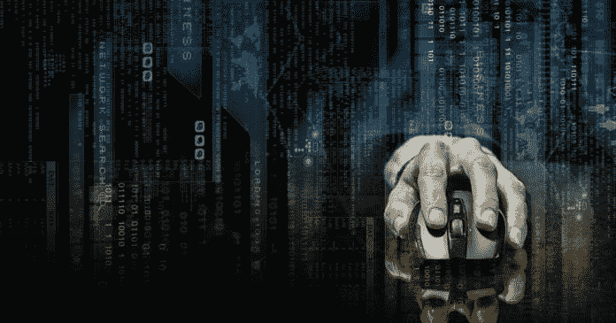
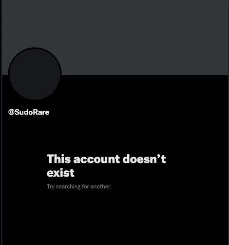

# SudoRare 崎岖不平，但我们还会感到惊讶吗？

> 原文：<https://medium.com/coinmonks/sudorare-rugged-but-are-we-surprised-anymore-c984a73984f0?source=collection_archive---------27----------------------->

聚集在孩子们周围，是时候在野生的、奇妙的密码世界里讲更多感人的故事了。

啊，又一个加密项目在它的用户面前变得强硬起来。

这一次，带着 519 ETH 或大约 815，000 美元逃走。

确实很痛苦。

但是几周以来，加密推特一直警告说 SudoRare 是一个骗局。

这个团队是匿名的。

他们拒绝强迫自己。

令牌组学毫无意义。

这些都是假信徒参加社交活动的谣言。

令牌组学可能会检验，也可能不会检验，但谁在密切关注它们？

Rugpulls 已经变得如此普遍，以至于我们甚至不再报告它了。

密码社区对这种诈骗和诈骗已经习以为常，我们都接受了。

就像当我们进入丛林时接受蚊子叮咬一样。

就像当我们花太多时间在游泳池嬉戏时接受晒伤一样。

我不会太深入细节，但这是一个典型的 rugpull 场景。

Be extra careful in the world of crypto.

新的项目出现了，承诺更好的效用，利用更成熟和知名的项目，即 SudoSwap 和 LooksRare。

SudoRare 承诺会有更好的收益，所以自然每个人都决定在那里下注。

在项目上线前，大量的炒作和取笑。

上线 6 小时后，窃贼将所有代币吸干，并将其交换至 ETH。

被盗的 ETH 被转移到 3 个不同的钱包中。

但是所有的钱包都已经被发现了，人们正在 24/7 的追踪他们。

罪犯怎么会认为他们能逃脱如此明目张胆的愚蠢行为呢？

他们是否计划用相当于现金的龙卷风来洗钱？

这么多钱他们可能用不上。

Running away and deleting everything is easy in when you have a cloak of anonymity.

无论如何，有人费心检查智能合同和代码吗？

难道没有办法防止整个流动性池在项目上线后的短时间内被耗尽吗？

找一个小组来验证智能合同的合法性。

似乎是一个非常简单的方法来清除系统中所有的坏演员。

一个新项目出现了？

很好。

建立一个分散的程序员团队，新项目将为他们支付费用，以检查和验证智能合同。

如果它检查出来，一个证书和报告将被铸造在区块链。

这样，它将是可验证的，不可改变的，并且可以被整个社区信任。

没有现金预付吗？

没问题，从项目中拿出一些代币、硬币或 NFT。

如果一个项目拒绝，你知道他们是可疑的。

好主意。

太棒了，如果你想出这个主意，给我一个大喊。

跟我来，获取更多我在淋浴时随机炮制的精彩密码和网络 3 创意。

=)

-

诈骗和诈骗会在很长一段时间内成为密码的一部分吗？

-

#初创公司#商业#初创公司#成长#成功#社交媒体#文化#创业#策略# eth # btc #加密# nft #元宇宙# rug draws #加固# sudorare #开发人员#黑客#诈骗#诈骗#sudoswap #looksrare

> 加入 Coinmonks [电报频道](https://t.me/coincodecap)和 [Youtube 频道](https://www.youtube.com/c/coinmonks/videos)了解加密交易和投资

# 另外，阅读

*   [折 App 回顾](https://coincodecap.com/fold-app-review) | [库币交易机器人](/coinmonks/kucoin-trading-bot-automate-your-trades-8cf0ca2138e0)
*   [如何匿名购买比特币](https://coincodecap.com/buy-bitcoin-anonymously) | [比特币现金钱包](https://coincodecap.com/bitcoin-cash-wallets)
*   [币安 vs FTX](https://coincodecap.com/binance-vs-ftx) | [最佳(SOL)索拉纳钱包](https://coincodecap.com/solana-wallets)
*   [比诺莫评论](https://coincodecap.com/binomo-review) | [斯多葛派 vs 3Commas vs TradeSanta](https://coincodecap.com/stoic-vs-3commas-vs-tradesanta)
*   [Capital.com 评论](https://coincodecap.com/capital-com-review) | [香港的加密借贷平台](https://coincodecap.com/crypto-lending-hong-kong)