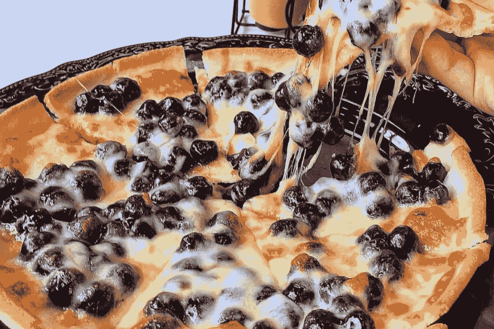
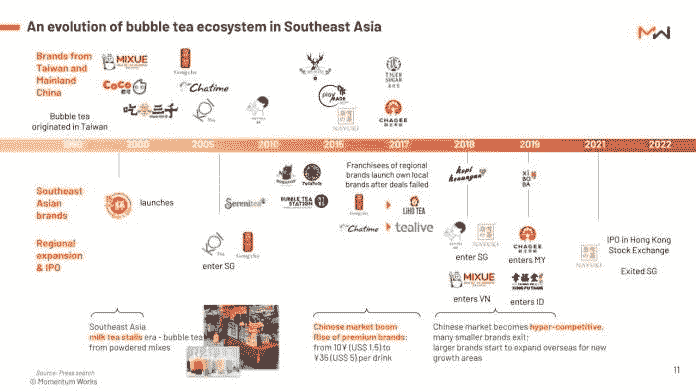
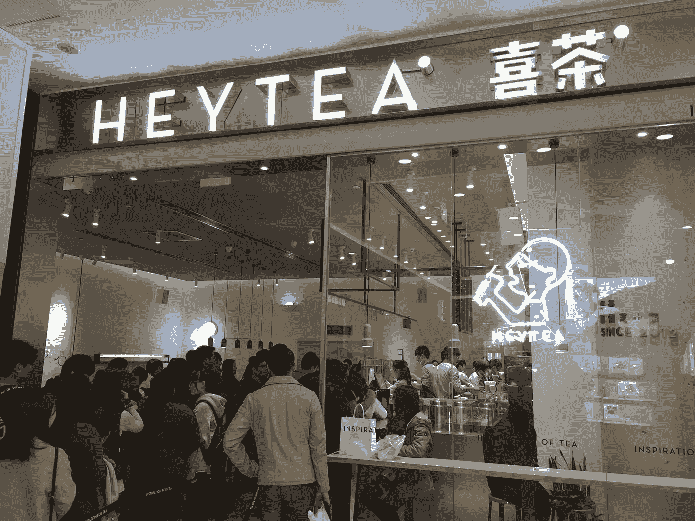
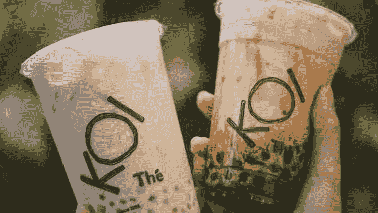
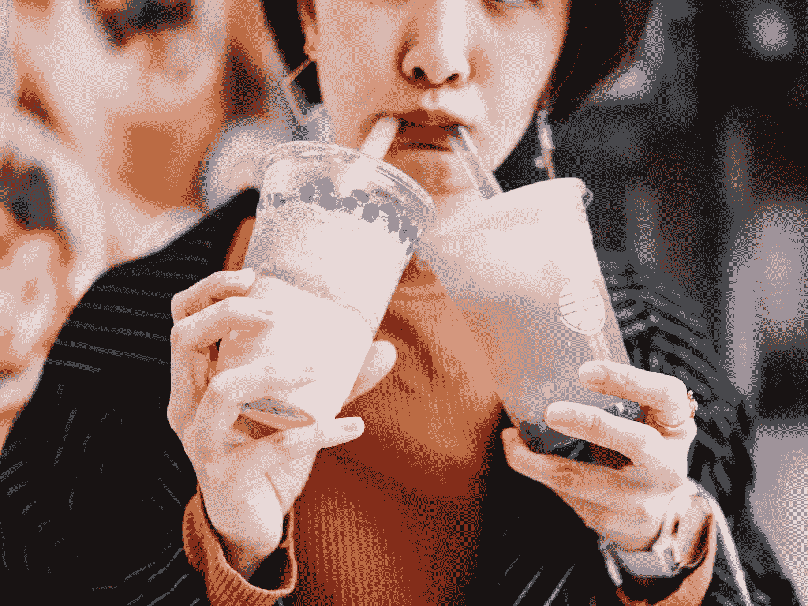

# 这是世界上最容易上瘾的毒品…

> 原文：<https://medium.com/coinmonks/sugar-is-the-most-addictive-drug-in-the-world-2d04e072a686?source=collection_archive---------26----------------------->

Apparently putting boba pearls on pizza is a thing now!

世界上最强大的毒品不是可卡因、冰毒、大麻或性。

是糖。

简单，甜蜜，满足。

我们每天都吃它。

我们甚至可能没有注意到它，但它就在那里。

人类的生物系统依赖糖提供能量。

对于我们来说，获取行动、说话、成长和生存所需的能量是至关重要的。

每个国家、城市和文化都有某种形式的碳水化合物主食。

美国人吃面包和汉堡。

欧洲人吃意大利面和羊角面包。

亚洲人吃米饭和面条。

现在，我们可以自豪地将气泡茶加入到混合物中。

Bottom line: Bubble Tea is a BOOMING business in Asia.

我知道泡泡茶有多好。

我一周喝几次。

不要妄加评论。

锦鲤大概一半的年收入都是我给的。

看到了最近海中泡茶市场的报道。

这是一个 36.6 亿美元的市场，竞争非常激烈。

品牌从大众市场(贡茶和每一杯)到奢侈品(锦鲤和 HeyTea)。

HeyTea 在中国有 781 家门店，在新加坡有 4 家，市值 90 亿美元。

HeyTea took China by storm and exploded to a $9B valuation in record time.

像加密货币一样，有一百万种不同的泡沫茶。

你有水果口味，奶茶，红糖，泰国茶，甚至咖啡。

你有各种配料，从耐嚼的波霸，超大的波霸，芋头球，甚至玉米。

我敢肯定，我们已经尝试了在一杯泡沫茶里放入什么的不同排列。

印度尼西亚是最大的市场，销售额为 16 亿美元，新加坡的平均订单最高(每杯 3.9 美元)。

与 200 亿美元的中国泡沫茶市场相比，这些根本不算什么。

基本上是整个海洋市场的 5X。

Koi Bubble tea is one of the more premium brands out there and it costs nearly 3X of other bubble tea brands.

开始一个泡沫茶生意可能看起来简单，但像任何生意一样，超越是困难的。

你必须考虑如何克服物流问题、人力问题，仔细制定差异化战略，并学会如何有效地扩大规模。

总的来说，如果你不准备坚持一段时间，这是一个竞争激烈、很难真正做好的行业。

泡沫茶在海上正蓬勃发展，因为它很热，相对便宜(除了在新加坡)，我们可以随时喝。

Like anything in life, moderation is key.

我记得我在海南喝了 4 杯泡沫茶，当时外面是 40 度，每杯美味只花了我 1 美元。

是的，对于那些摇头思考泡沫茶有多不健康以及我们为什么要这样做的人，我们知道。

我们知道一直喝泡沫茶是不明智的。

所以练习节制。

不要喝 100%的糖(我知道有些人这样做，这很可怕)，也不要每天都喝。

不管有没有泡过茶，我们都从根本上渴望吃糖。

如果你知道如何围绕这个问题创业，你也可以成功。

-

你喝泡沫茶吗？

-

# startups # business # startupx # growth # success # social media # culture # web 3 # strategy # bubble tea # koi # hey tea # China # sea # Asia #碳水化合物#糖#eth #btc #crypto

> 交易新手？试试[加密交易机器人](/coinmonks/crypto-trading-bot-c2ffce8acb2a)或者[复制交易](/coinmonks/top-10-crypto-copy-trading-platforms-for-beginners-d0c37c7d698c)