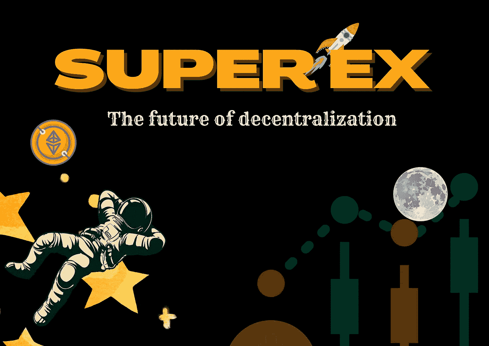

# SuperEx！分散式交易所的未来

> 原文：<https://medium.com/coinmonks/superex-the-future-of-decentralized-exchanges-e905c6dcf5e3?source=collection_archive---------6----------------------->

[SuperEx](https://medium.com/u/49ca48b8a419?source=post_page-----e905c6dcf5e3--------------------------------)

一般来说，区块链和密码学背后的整个思想是去中心化。从 Satoshi 的白皮书来看，区块链技术完全是关于建立一个非个人或团体操作的分散系统。

去中心化是一种新兴的金融技术，它消除了银行和机构对货币、金融产品和金融服务的控制。

在集中金融中，你的钱被银行和公司持有，他们的首要目标是赚钱。金融系统中充满了第三方，他们为各方之间的资金流动提供便利，每一方都因使用他们的服务而收取费用。
集中化不仅仅局限于银行和企业。它还延伸到加密货币交易所。其最高主张是推翻银行系统的控制。如今，由于对不安全感的恐惧，一个人无法在使用某些交换时感到安全。一个你不能完全拥有你的钥匙的系统是不完全分散的，

为了建立一个完全去中心化的交易所，SuperEx 诞生了。
作为全球首家 Web3.0 加密货币交易所，它正致力于打造全球最快、最安全的加密货币交易所。他们正在为每个人开发最友好的用户界面。

其使命是开发一个基于 Web 3.0 的业务概念，实现去中心化、DAO 管理、社区去中心化，并为数十亿用户提供对加密货币的实际访问。SuperEx 将允许真实和虚拟世界、元宇宙、宇宙以及每个星球之间的无缝互操作性。他们还在构建世界上最透明、最安全、最稳定、最分散的数字资产交易平台。

SuperEx 应用程序和网站将加密货币交易所的功能与下一代数字钱包相结合，为会员提供了一个集储蓄、投资、支付和生活福利于一体的平台。在这一点上，目标是通过尽可能无摩擦的用户体验向第一批 10 亿人介绍加密货币。自 2022 年 1 月推出其私人测试版以来，SuperEx 已迅速成为全球区块链空间中最重要的社区之一。

讨论 superEx 不能不提到它的主要力量，那就是创始团队。据他们说，团队成员都来自华尔街的顶级量化基金和 IT 公司，如贝宝、脸书、谷歌、贝莱德等。他们可以上升到顶端，因为团队有能力进入任何拥挤的市场，打破现状，让平台成为主导者。

尽管团队成员来自世界各地不同的国家和文化，但他们都相信区块链技术将带来光明的未来。SuperEx 团队受到了埃隆·马斯克殖民火星概念的极大启发，该项目打算利用其极具创新性的产品来帮助实现这一目标。凭借其集中交易和分散资产存储选项，SuperEx 可以解决其他数字资产交易平台上常见的数字资产交易和安全问题。SuperEx 的另一个奇妙的特性是用户能够创建一个分散的钱包，并将私钥直接存储在他们的终端设备上。该项目将很快超越目前使用的所有传统交易平台。

SuperEx 的最终目标是让创始团队将权力委托给 DAO，从而形成一个完全去中心化的平台，由社区自主管理。

在安全方面，该平台采用全面的网络安全方法，并不断努力管理和降低风险。SuperEx 用户层资产以集中交易+分散存储的模式存储，认识到安全对于数字资产的重要性。用户可以选择将令牌私钥直接存储在他们的用户终端设备上，他们的资产将不受任何平台问题的影响。对于中心节点钱包中的资产，平台采用基于多重签名、离线签名和分层框架的安全设计。冰冷的钱包将容纳超过 90%的数字资产。他们将定期进行外部审计。此外，他们还与行业领先的网络安全公司合作，以确保平台的顶级安全性。

# 你为什么要加入 superEx？

首先，它是第一个全 DAO 社区治理的去中心化加密货币交易所。它的交易区有数千个代币，允许用户进行从现货到杠杆和衍生品的各种交易。它的重点是没有 KYC 条款，对用户资产进行终极保护和严密防御，这使它不同于其他常规交易所。该交易所在开发其高清钱包方面取得了指数级进展，这确保了加密服务的便捷访问和分散安全性。超级链预计将于 2022 年第三季度推出，ET 令牌将迁移到其链中。Et 令牌具有很好的实用性和用例。

你现在仍然可以加入 superEx，并在它上市前免费收集足够的 ET 令牌

**SuperEx 页面**:【superex.com
T2**SuperEx 邮箱**:[business@superex.com](mailto:business@superex.com)
**官方推特**:[https://twitter.com/SuperExet](https://twitter.com/SuperExet)
**SuperEx 公告** : [公告— SuperEx](https://support.superex.com/hc/en-001/categories/4410470420249-Announcements-)
**SuperEx 官方(电报)**:[https://t.me/SuperExOfficial](https://t.me/SuperExOfficial)
**官方 insta gram**:

> 交易新手？试试[加密交易机器人](/coinmonks/crypto-trading-bot-c2ffce8acb2a)或[复制交易](/coinmonks/top-10-crypto-copy-trading-platforms-for-beginners-d0c37c7d698c)