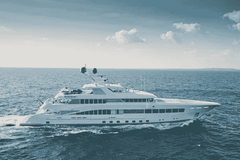

# 超级游艇、加密合并和千钧一发:瓶子里的消息回顾一周

> 原文：<https://medium.com/coinmonks/superyachts-crypto-mergers-close-calls-the-week-in-review-by-message-in-a-bottle-4ab0dd4a9a13?source=collection_archive---------30----------------------->

By [Holly Eimer](https://medium.com/u/e25f399c6d84?source=post_page-----4ab0dd4a9a13--------------------------------) for [Message in a Bottle Newsletter by Lazy 8ight YC](https://medium.com/u/6dcb932fb22b?source=post_page-----4ab0dd4a9a13--------------------------------)

在亚洲周三下午的交易中，几乎所有 10 大加密货币都出现了亏损，包括比特币和以太坊。主要硬币中跌幅最大的是索拉纳，在过去 48 小时内下跌 5.94%，至 39.82 美元。根据 CoinMarketCap 的数据，截至下午 4 点 30 分，比特币在香港的交易价格为 23，014 美元，比前三天下跌了 3.42%，而以太坊的交易价格为 1，691 美元，下跌了 4.7%。在发行方币安宣布将开始为其他硬币提供赌注服务后，BNB 近期上涨的收益被逆转。交易价格下跌 0.99%，至 320.82 美元。

随着“合并”的临近和加密货币矿工联合起来防止采矿的遗弃，最大的两家稳定币发行者泰瑟和 USDC 周二宣布，他们将支持以太坊的股权证明(PoS)链。在周二的声明中，泰瑟强调了防止以太坊生态系统“被武器化以在生态系统内造成误解和伤害”的重要性。据该公司称，“将按照官方时间表支持 PoS 以太坊。”为了保持 DeFi 和其他使用系绳令牌的生态系统的长期生存能力，系绳声明转移必须顺利进行。该公司宣布，合并后，股权证明链将获得 USDC 的全面和单独支持。

9 月 19 日，“合并”预计将发生，将以太坊区块链从目前的工作证明(PoW)共识模型改变为利益证明(PoS)模型。依赖于 PoW 共识模型的加密采矿可以通过合并有效地消除，这导致了矿工的不满和拆分以太坊区块链以维持采矿计划的提议。以太坊的开发者 Vitalik Buterin 上周表示，如果矿工的分裂变得显著，许多应用程序将不得不在两者之间做出选择。

根据一份新闻稿，韩国元宇宙平台 Zepeto 与 Solana 和 Web 3.0 创建者 Jump Crypto 合作创建了 ZepetoX，这是一个基于加密的元宇宙计划。在区块链技术的帮助下，ZepetoX 希望创建一个 3D 开放世界平台，用户和创作者可以在这个平台上建造、游戏和赚钱。“ZepetoX 是我们正式宣布进入区块链市场的产品。我们认为应该使用加密策略来增强 Web3 的潜力，”Zepeto 运营公司 Naver Z 的首席执行官 Kim Dae-wook 说。该平台将使用 NFTs 提供各种层次的娱乐和个性，允许用户通过数字资产所有权和社交互动将他们在网站上的活动货币化。在索拉纳区块链，为了在接下来的几个月里启动其在 NFT 的首次土地销售，Zepeto 将在索拉纳区块链建造平台。今年年初，由韩国互联网巨头 Naver 创建的 Zepeto 元宇宙平均每月吸引了 2000 万用户。

本周早些时候，海岸警卫队试图打捞一艘在大火后沉没的豪华运动游艇。在一年中有相当数量的娱乐船只在水上的时候，总有可能发生事故，造成悲惨的后果。幸运的是，在这种情况下每个人都没事，但游艇就没那么幸运了。十名芬兰乘客正在欣赏爱沙尼亚塔林湾的迷人景色，这时一个系统错误很快发展成一场重大火灾。这件事发生在周末，天气一点也不好。除了夜晚的黑暗之外，公海和强烈的阵风是爱沙尼亚边防警卫和警察必须应对的额外挑战。

所有船上的人都被警察和边防警卫队(PPA)成功营救，然而这艘游艇的命运就没那么幸运了。由意大利造船厂 Canados 于 2008 年建造的豪华游艇“流氓号”(原名 J&Li)，由于恶劣的天气条件，无法从波罗的海打捞上来。这艘 90 英尺(27.5 米)的时尚现代运动帆船是加拿大开放 90 的模型。它的两个 MTU 发动机使它能够以舒适的 38 节(43.7 英里/小时/70.3 公里/小时)巡航，同时达到 47 节(54 英里/小时/87 公里/小时)的最高速度。“小流氓”的船主身份不明，而且这艘船当时似乎并没有被用作租赁游艇。

当你的个人水上玩具是一艘价值 6600 万美元的壮观超级游艇时，你必须炫耀。吉米·约翰·里奥特似乎正在这么做。最近，亿万富翁吉米·约翰·里奥特展示了他的超级游艇，名为“岩石”，价值 6600 万美元，停泊在法国里维埃拉的勒林斯群岛。

尽管在 2014 年首次亮相，Rock 仍然是由著名的 Feadship 生产的最壮观的定制游艇之一。据负责该项目的 Sinot 独家游艇设计团队称，这艘 200 英尺(60.4 米)长的船被设计成“外表快速，内部舒适”。据估计，他从快餐连锁店吉米·约翰那里获得了 17 亿美元的财富，是福布斯全球最富有的人之一。

奢华的摩纳哥游艇展是业界最期待的活动之一。幸运的与会者将有机会在 9 月底的这次活动中近距离观看今年最精美的新作品。卢西恩是最大和最令人印象深刻的。

今年年初，世界上最好的豪华造船厂之一向船主交付了一艘全新的超级游艇。店主是一位皇室成员，也是世界上最富有的人之一。Heesen 因生产了亿万富翁拥有的一些最华丽的游艇而闻名，其遗产经久不衰。它最近的成就还没有被广泛宣传，所以在即将到来的摩纳哥游艇展上的大揭幕被热切期待。今年首次亮相展会的最大豪华游艇之一是 Lusine。这种巨大的钢铁之美体积达 1，060 GT，高 196 英尺(60 米)，即使是最有经验的工程师也会面临挑战。

除了另外五个可以容纳 11 位客人的特等舱之外，酋长套房实际上将成为船尾舰桥甲板上的公寓。由著名的 Sinot Yacht Architecture and Design 开发的内饰据说是 Heesen 有史以来最复杂的内饰之一。到目前为止，Lusine 的内部照片还没有公开，但正如人们所料，它是用非常昂贵的材料制作的，如稀有的皮革和昂贵的木材。

由于 L8YC 与现实世界中的企业有着密切的联系，因此它能够在定制活动中为其会员节省大量费用。豪华酒店和 NFT 公司为 NFT 社区、Web2 公司、有影响力的人甚至个人组织活动。每个活动都是个性化的，以满足 L8YC 客户的特定需求。L8YC 与 luxury partners 合作，为 Lazy 8ight 社区开发独一无二的体验。Lazy 8ight 利用的一些合作伙伴关系示例如下:游艇和别墅上的活动、有组织的直升机旅行或贵宾豪华轿车护送、融入 CBD/TBH 的豪华餐饮、定制运动鞋设计、安保服务、名人露面，当然，还有我们的媒体团队为社交媒体渠道创建资产。

世界上第一个区块链游艇租赁服务于 2022 年 6 月 11 日起航，史无前例地将 50%的利润分配给 L8YC NFT 持有者。到目前为止，只有少数精英才能享受游艇运动。凭借 L8YC 会员资格，其 8，888 名持卡人可享受全球最奢华度假方式的专属折扣。无需提前太多通知就可以预订日租，因为 L8YC 在几个地方都有随时可以出航的游艇。对于 L8YC NFT 持有者，这些包机的价格通常在每天 1，500 美元到 6，500 美元之间，最高可节省 80%。Lazy 8ight 能够在美国大陆的大多数州以及巴哈马和多米尼加共和国提供日间包机服务。传统的特许经营是完全可定制的体验，可以为全球的客户进行协调。这些包机可以预订一天，也可以预订几个月。L8YC 在世界各地与 NFT 项目共同举办活动。联合主办点每个项目、每个活动的起价为 1 万美元，根据地点和活动细节而有所不同。这些活动是有益的，因为项目分担成本，允许公司相互合作和联网，同时让 L8YC 负责其他一切。此外，所有活动还可获得 L8YC 社区折扣。通过 Lazy 8ight 的奢侈品合作伙伴网络，私人奢侈品活动是可能的，为客户及其社区汇集了奢侈品活动的每个细节。对于豪华活动来说，天空是真正的极限……如果你能梦想到，Lazy 8ight 可以让它实现。

请务必访问位于[http://www.l8yachtclub.com](http://www.l8yachtclub.com)的 Lazy 8ight Yacht Club 网站，了解最新信息和可用的豪华服务，或者通过 Twitter、Discord、Instagram 和 Medium 访问社交媒体。

> 加入 Coinmonks [电报频道](https://t.me/coincodecap)和 [Youtube 频道](https://www.youtube.com/c/coinmonks/videos)了解加密交易和投资

# 另外，阅读

*   [加拿大最佳加密交易机器人](https://coincodecap.com/5-best-crypto-trading-bots-in-canada) | [KuCoin 评论](https://coincodecap.com/kucoin-review)
*   [火币加密交易信号](https://coincodecap.com/huobi-crypto-trading-signals) | [HitBTC 审核](/coinmonks/hitbtc-review-c5143c5d53c2)
*   [TraderWagon 回顾](https://coincodecap.com/traderwagon-review) | [北海巨妖 vs 双子星 vs BitYard](https://coincodecap.com/kraken-vs-gemini-vs-bityard)
*   [如何在 FTX 交易所交易期货](https://coincodecap.com/ftx-futures-trading)
*   [OKEx vs KuCoin](https://coincodecap.com/okex-kucoin) | [摄氏替代品](https://coincodecap.com/celsius-alternatives) | [如何购买 VeChain](https://coincodecap.com/buy-vechain)