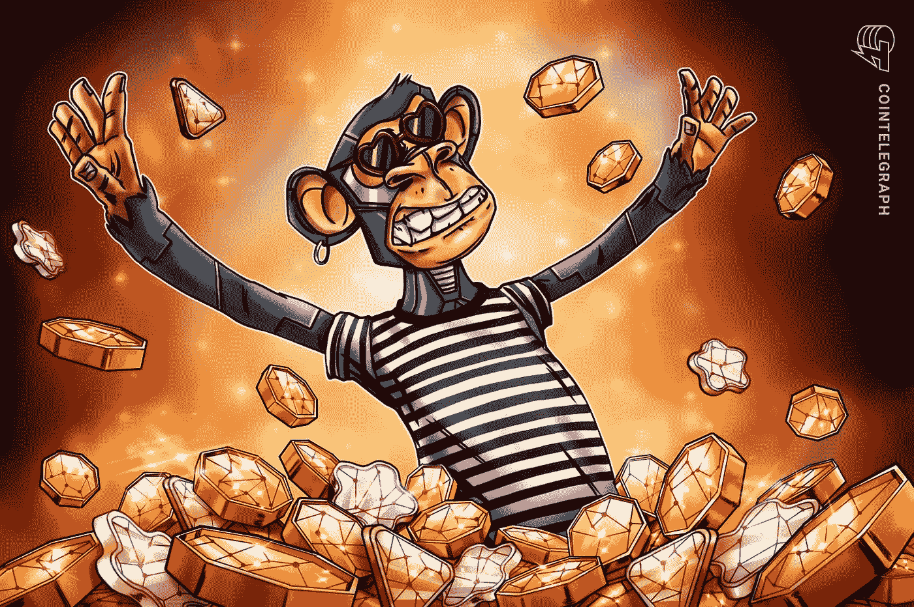
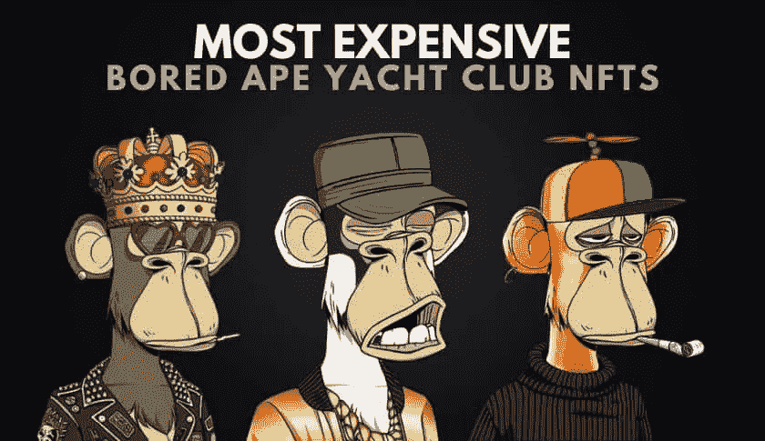
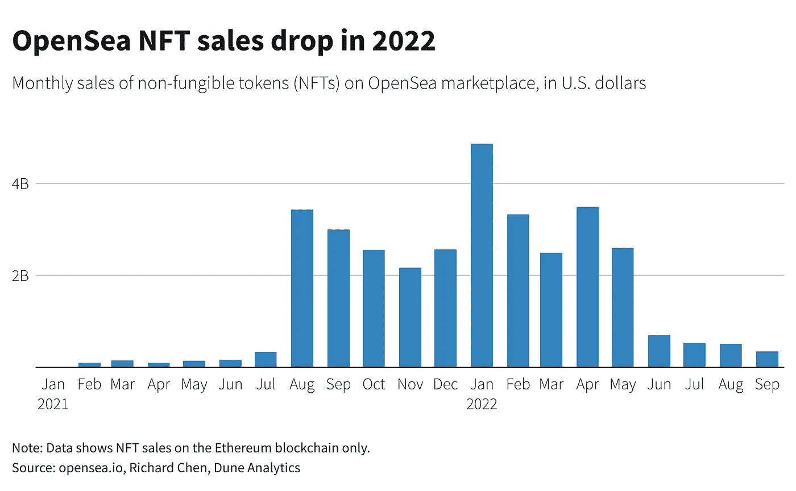

# 惊喜:你实际上并不拥有你所购买的 NFT 的所有权

> 原文：<https://medium.com/coinmonks/surprise-you-dont-actually-have-any-ownership-of-the-nfts-you-bought-dc5e7f33aeb4?source=collection_archive---------20----------------------->

Seriously, you may not even have true ownership of your very expensive, very precious, very rare NFT!

NFT 的所有权很复杂。

我读过一篇报道，讲的是即使买了 NFT，你也不拥有它。

这是一个令人痛心的现实。

银河数码的研究主管 Alex Thorn 研究了 NFT 的项目，看看他们是否真的将知识产权和 NFT 转让给了买家。

结果是，没有。

几乎所有的 NFT 项目都没有给所有者提供基本的 NFT 内容，并且实际上没有任何所有权被转移。

所以当你购买 NFT 时，你实际上是从发行者那里购买了许可证。

你实际上得不到 NFT 的内容，不管它是什么，视频、jpeg 还是 url。

在银河数码公司评估的 NFT 前 25 个项目中，该公司发现只有一个项目《女人的世界》(WoW)，“甚至试图将潜在艺术品的真正所有权”给代币持有者。但是，根据该报告，尚不清楚 WoW NFT 的原始发行者是否需要将 IP 地址转让给第二个买家，如果他们要在另一个市场，如 OpenSea 上销售的话。”

An NFT just sold for $69 million, making Beeple the ‘third most valuable living artist’

所以技术上来说，你买了 NFT 的使用权。

现在，如何使用 NFT 由发行人或 NFT 项目所有者决定。

作为许可证的发行者，他们可以随时以任何方式更改该许可证的权限和权利。

有时，甚至不通知许可证持有者。

因此，要真正“拥有”一只 NFT，你不仅需要有许可证，还需要以某种方式获得基础 NFT 资产本身。

但是 NFT 所有权到底是由什么构成的呢？

这本身就很难定义。

指向 NFT 所在的区块链部分的 url？

如果它存储在多个区块链上呢？

真实的原始 jpeg？

如果创建者在不同的服务器上制作副本作为备份会怎么样？

停下停下。

我的头在旋转。

Bored Ape #8817 is one of the most expensive BAYC NFT to ever be sold, a whopping $3.4 Million!

好了。

太可怕了。

我以为我们生活在这样一个世界里，如果你为某样东西付钱，你实际上就拥有了它，而不仅仅是拥有它的权利。

所以当我买了一个无聊的猿或朋克，我没有在我的保管下的艺术品？

呀。

你是在告诉我宇迦实验室(无聊猿的所有者)可以在任何时候改变、撤销、重置和终止拥有无聊猿的权利？

太棒了。

那么我付出那么多是为了什么？

当他们告诉我们 NFT 是独一无二的，在区块链，安全，有保障，我们可以拥有它。

我们到底“拥有”了什么？

Has the NFT bubble burst? Was it all one big hype?

因此，对于那些计划建立长期品牌、业务和扩展你的 NFTs 概念的人来说，这仍然有意义吗？

cc0 NFTs 呢？

比方说，我买了一辆 cc0 NFT，围绕它开展业务，并花钱开发这个品牌。

然后，cc0 项目的原所有者决定撤销该知识产权，它不再是“**无版权保留”。**

现在发生了什么？

天哪，接下来的几年在 crypto 将会是一个没有安全带的过山车。

去打几个鸡蛋。

-

NFT 所有权复杂吗？

-

# startups # business # startupx # growth # success # social media # culture # entrepreneurs # strategy # eth # coin # BTC # games # crypto # bear market # crypto currency # cc0 # copyright # IP # NFT # boredape # crypto punks

> 交易新手？试试[加密交易机器人](/coinmonks/crypto-trading-bot-c2ffce8acb2a)或者[复制交易](/coinmonks/top-10-crypto-copy-trading-platforms-for-beginners-d0c37c7d698c)