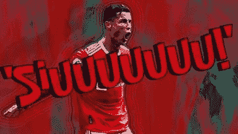

# 生存斗争:第 1 层版。

> 原文：<https://medium.com/coinmonks/survival-struggle-layer-1-edition-84b106c2439d?source=collection_archive---------46----------------------->

Aptos 以每秒不到 10 个事务的速度推出。嗯，这离承诺的每秒 160，000 次交易还有一段距离。每个一级区块链都是“游戏规则改变者”，至少在他们开始变热之前是这样。

不知何故，以太坊仍然是无数“以太坊杀手”中最好的一级区块链之一。我知道这在一个刚刚收到 700 架 Aptos 并以每架 7 美元的价格出售的随机空投猎人的耳朵里听起来是不同的。那是，无论如何，一些损失，一点点等待会增加更多的钱。不过顺便说一下，这是免费的。对我所见证的最严酷的冬季的一个很好的补偿。

隋区块链正在路上，克里斯蒂亚诺罗纳尔多将感到自豪。听说他和币安在 NFT 有交易。如果他在隋区块链推出自己的“稀有”系列，这将是一个很好的巧合。

Siuuu！你可以从体育场的每个角落或者推特上听到这种声音。

Aptos 不知何故不再是游戏规则的改变者，它只是在几周前才推出的！我们终于让“以太坊黑仔”这句话寿终正寝了。空间已经向前移动；从坚固和生锈到“移动”

两家移动区块链与超级富豪风投在同一年推出。即使这些链条最终没有带来任何好处，它们肯定会增加一些人的收入。我们可以认为这是一场胜利。

2021 年泵青睐交叉链和他们重新设计的 UniSwap DEX 的副本。即使是 2017 年的死亡项目也可以更名为“互换”后缀，启动流动性挖掘项目，并在回到之前的位置之前获得约 10 倍的分数。反正都不错，加密影响者在那里有一些不错的发挥。

我可能会在这之后，但在那之前多放几段；你最喜欢的第一层区块链是什么？快速猜测；能看到空投的那个。空投搜寻过去是关于社交媒体任务，现在是关于测试网。升级，真的。即使是网络游戏新手也可以运行一些 testnet 节点，赚一些快钱；上市时抛售，然后去寻找下一个游戏规则改变者。

成吨的第一层区块链，但该空间仍在寻找智能合同区块链的下一个大事情。加文·伍德接近波尔卡多特。萨姆和索拉纳团队的其他成员对索拉纳·区块链做了一项看似合理的工作。酷区块链！你可能想检查他们的时间表，这样你就可以在一天关闭之前有一个感觉。十天上班，四天休息，平衡的两周花名册。

一语双关…不知道会不会有人笑。

如果我们可以认真一秒钟，也许我们可以有一个闪回，并检查每天创建的新的第 1 层到底有多创新。一份写得很好的白皮书和官方网站上的一些“gamey”UI 设计。然后，通过 ico 和 ieo 筹集了几百万。就像网络泡沫一样，区块链的开发者是亿万富翁的下一代……也是影响迷因币的人。

只需要几个月,“游戏规则改变者”就会被迷因币和可疑的“超凡脱俗”的非物质文化遗产弄得千疮百孔。几个剥削和退出骗局。

我们肯定会谈到风险投资者向这些项目投入了数百万美元。但那是我从最后一杯咖啡中清醒过来的时候。反正不要指望 SEC 的调查报告。我只想知道我的写作生涯如何得到资助。也许一把刀就可以了。或者第一层书写平台。完美！当我起草我的演讲和白皮书时，获得大量资金支持的第一层努力留在以太坊杀手的讨论中。

还不确定谁会胜出。
我们迟早会知道的，在那之前，我真的想说，再次在这个平台上写作的感觉真好！

[跟进加密货币脚本](https://linktr.ee/cryptoscripts)通过全面的文章和重要提示来了解加密领域的最新动态。

> 交易新手？试试[密码交易机器人](/coinmonks/crypto-trading-bot-c2ffce8acb2a)或[复制交易](/coinmonks/top-10-crypto-copy-trading-platforms-for-beginners-d0c37c7d698c)