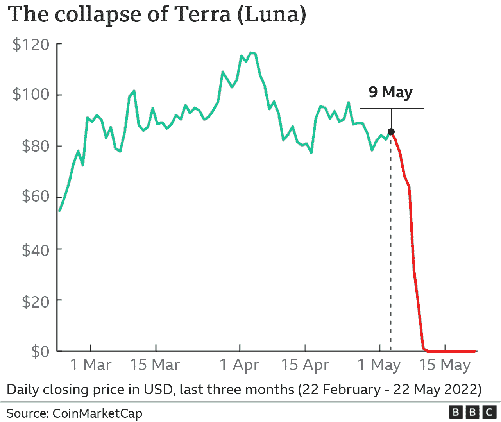
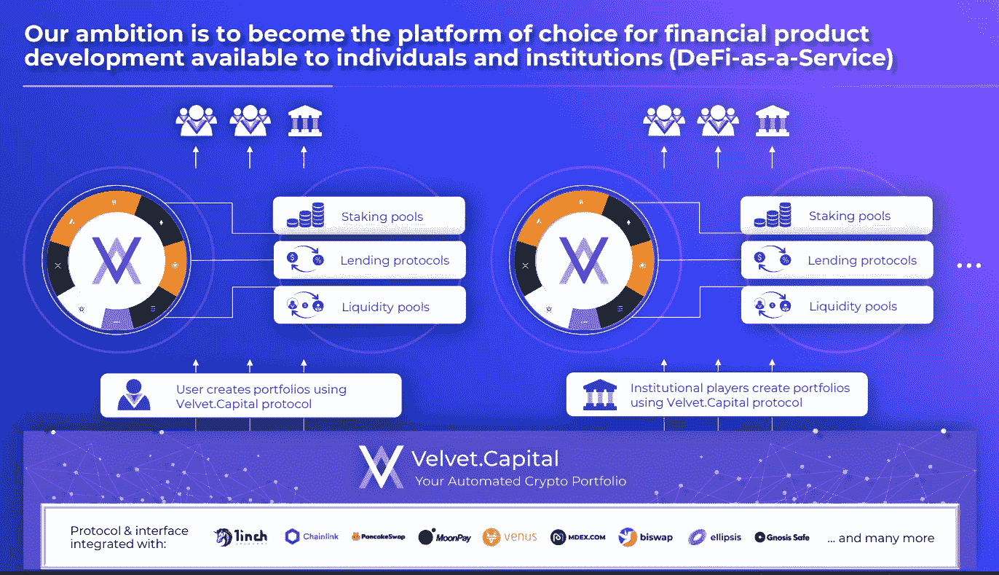
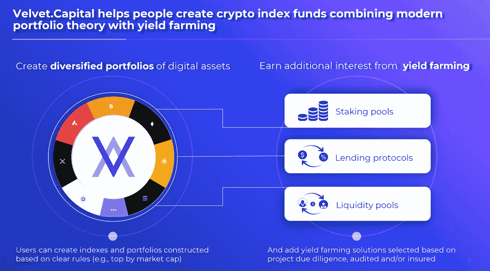
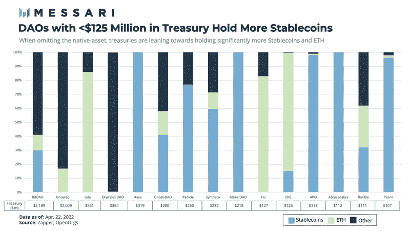

# 度过加密寒冬&为未来做好准备

> 原文：<https://medium.com/coinmonks/surviving-the-crypto-winter-positioning-yourself-for-the-future-54b5d4deadc0?source=collection_archive---------14----------------------->

# [天鹅绒。资本](https://velvet.capital/)使命&愿景

在天鹅绒。资本我们正在建立一个跨链的 DeFi 资产管理协议，帮助人们和机构创建令牌化指数基金+其他具有额外收益的金融产品。我们的使命是**为下一个十亿密码用户**带来财务独立——没有中介和中央集权的政党**。我们的愿景是**成为管理数字资产的头号多链平台**。查看我们的[白皮书，深入了解 DeFi](https://www.notion.so/velvetcapital/Velvet-Capital-Home-ac7c8b9f1ef2443eb378511946c0d522) 领域的下一件大事。**

# 加密冬天和单令牌风险

冬天来了。它终于来了。这里很冷。现在连阿多也救不了我们了。事实上，这并不是世界末日，尽管感觉上是这样。未来仍然是光明的，建设者将继续建设&越来越多的人将加入加密的未来。但是在我们展望未来之前，明智的做法是回顾过去并学习，这样我们才能在未来做出更明智的决定。

过去几个月对许多人来说是痛苦的，因为市场试图建立底部。许多硬币处于多年低点，大规模下降给整个生态系统带来了巨大压力。类似太空的 3AC 中一些以前的“全明星”出现了违约和清算的杂音(截至本周，英国法官已下令清算；据报道为 16 亿美元至 2 万美元)、Celsius、BlockFi 等。我们不能不提到多米诺骨牌掀起了整个解体-月神经典。

在 2022 年 4 月期间，Terra Luna Classic 仍然被视为宠儿；一种你可以永久 HODL 的股票，以获得你一生中最安全、最丰厚的回报。人们对这一信念如此坚定，以至于他们在投资中孤注一掷。不可避免的是，就像生活中的大多数事情一样，那些听起来好得不像真的事情最终往往就是真的。LUNA 的价格在 5 月份以历史性的方式暴跌。在我写这篇文章的时候，它的交易价格只有几分之一便士，从 119.18 美元的历史高点急剧下跌。你不必是一个数学天才，也能意识到这不是你想要的投资回报。

# 要吸取的教训

Pondering HODL’er

> “我们如何确保在最大化回报的同时最小化风险？我可以很容易地通过购买大量硬币来分散投资，但我怎么知道哪种硬币最好，每种硬币该持有多少呢？”-思考 HODL

过去的结果不代表未来的结果。一次又一次，投资者试图预测未来，但几乎总是失败。Crypto 也不例外。没有什么是直上月球的——总有高峰和低谷。许多人陷入对一个或几个项目的迷恋，然后全力以赴，认为美好的时光总会到来。这不是个好主意。所有新兴行业都会经历牛市和熊市周期。如果你在分配资本时不能自律和负责任，你将会引火烧身(这条规则超越了一般人，包括 3AC、BlockFi、Celsius、Luna 等大型组织)。人就是人，他们都会犯同样的精神错误。

关键是定位自己，收获公牛的回报，并以最小的损失从熊手中幸存下来。你可以在市场顶部和底部练习自律，这说起来容易做起来难。在 tradfi 市场，专业投资者通过创建跨部门和资产类别的平衡投资组合来实现这一点。然而，在 crypto 中并没有很多好的解决方案。现在，有很多 DeFi poser(cede fi)支持 DeFi 的原则，但实际上是中央集权的——比如 Celscius。

直到现在。你再也不用担心把握市场时机了。用天鹅绒。资本你可以享受真正的 DeFi 的好处。用天鹅绒。capital regular people & institutions(DeFi-As-A-Service)只需简单点击几下，就可以创建专业级投资组合和 crypto 最佳项目的索引。您将能够在未来 10 年跨多个链和生态系统的增长中获得最大利益，而不必担心可能会让您损失所有血汗钱的单个象征性风险。它是完全透明的、不可信的、非托管的——所以没有你的资产被扣押的风险(我们正看着你比特币基地&摄氏度)。

# 天鹅绒。首都秘制酱

# 多元化:现代投资组合理论

这是一个可靠的风险管理策略，通常是人们在投资中首先学习的东西之一，也应该应用于加密领域。一篮子经过充分研究的高质量项目是一种很好的方式，可以确保你获得未来十年 crypto 领域的巨大增长，同时也限制了你只投资少数几家公司的个人风险。你想乘风破浪，而不是被卷入其中。

Power of Portfolio Theory

每种加密货币都存在系统性风险(即市场、政府政策等的变化)。)但任何投资都是如此。诀窍是创建一个足够多样化的投资组合，以避免单一令牌或高度相关的令牌风险。通过我们的 DeFi 资产管理协议，您可以获得跨链、生态系统和层面的信息。只需简单点击几下，您就能像专业人士一样定位。

# 扩大你的收益

我们不仅仅停留在现代投资组合理论上，天鹅绒。资本更进了一步。我们利用高度审查的产量农业为您的投资组合带来更多回报。由于我们的协议是多链的，您将能够跨链和生态系统查看，以始终确保您用最好的项目最大化您的产量。你可以把它想象成你自己的类固醇密码组合。

# 黑马奖金:资金管理

在 DeFi 中，房间里的许多空气都被关于传统机构玩家是否或何时会潜入的辩论吸走了。我们认为他们会的，我们准备在他们实现飞跃时为他们提供一流的服务，然而，我们认为人们忽略了一个巨大的潜在催化剂:财富管理。

在过去的几年里，我们的加密先驱们一直在稳步建立和发展他们自己的金库。这些项目中的大多数主要拥有稳定的收入和支出。在我们看来，这些国债可以通过我们复杂的国债管理策略更好地多元化，这将有助于实现其回报最大化。True DeFi 在加密寒冬中表现良好，这应该会给持怀疑态度的财政部经理们带来一些安慰。通过现在向 DeFi 投入资金，项目将能够接近底部，获得高质量、相对低风险的收益，并为下一轮牛市做好准备。

# 呼唤所有 DeFi 先锋

Latest Prototype Demo

我们的协议将于今年 9 月生效，首批使用我们平台的 DeFi 先锋将获得独家特权和早期访问权。我们不会忘记 OG 的。**早期开拓者将有机会获得我们独家的治理令牌空投**。因此，请务必在我们的[旗舰网站](https://home.velvet.capital/defi)上注册，以便独家访问我们尖端的 DeFi 资产管理平台并获得额外津贴。

DeFi 将允许人们重新控制他们的资产，创造一个更加公平的未来，让所有人都能获得财务自由。我们对这一转变感到非常兴奋，并很高兴能在其中发挥自己的作用。我们希望你能加入我们的旅程。我们希望你能加入我们的社区。

别忘了在[推特](https://twitter.com/Velvet_Capital)、 [Instagram](http://instagram.com/velvet.capital) 、 [LinkedIn](https://www.linkedin.com/company/31423126/admin/) 上关注我们，和/或加入我们的[不和谐](https://discord.gg/heXYgFZuGw) & [电报](https://t.me/velvetcapital)了解更多更新！我们希望听到你的声音，不要害羞。

直到下一次，

干杯！

> 交易新手？试试[加密交易机器人](/coinmonks/crypto-trading-bot-c2ffce8acb2a)或者[复制交易](/coinmonks/top-10-crypto-copy-trading-platforms-for-beginners-d0c37c7d698c)