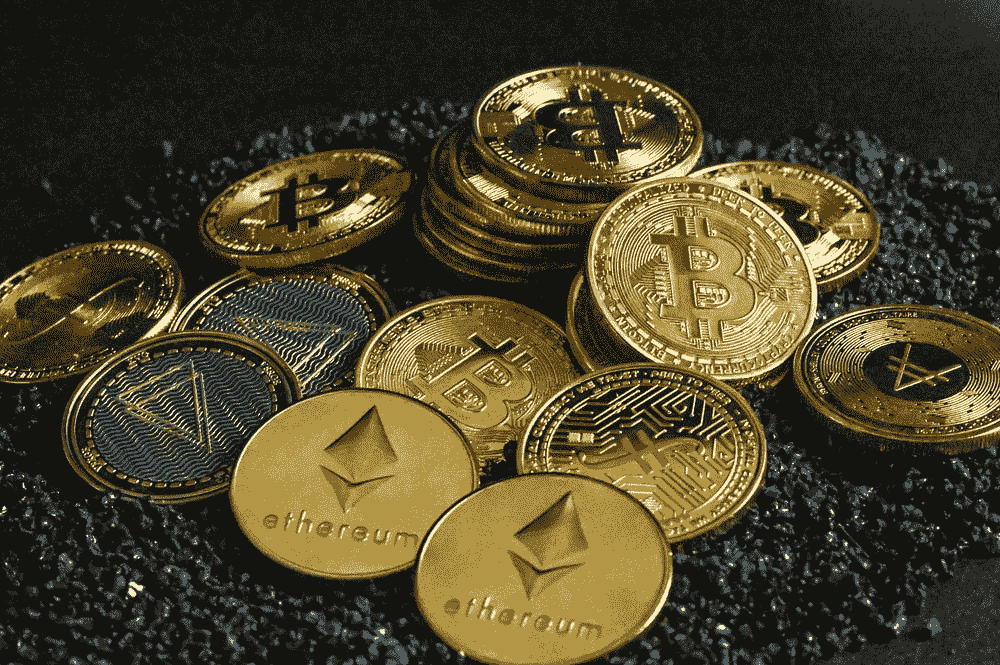

# 暂停加密取款——你应该担心吗？

> 原文：<https://medium.com/coinmonks/suspended-crypto-withdrawals-should-you-be-worried-e675a8d5682c?source=collection_archive---------36----------------------->

## 这在过去已经发生过。

Photo by [Quantitatives](https://unsplash.com/@quantitatives?utm_source=unsplash&utm_medium=referral&utm_content=creditCopyText) on [Unsplash](https://unsplash.com/s/photos/crypto?utm_source=unsplash&utm_medium=referral&utm_content=creditCopyText)

> 披露:这篇文章包含附属链接。

过去几周一直被加密交易所暂停取款的消息所困扰，这引起了许多人的恐慌。

让我第一个告诉你，没有什么可担心的，加密交换总是暂停取款(不总是，但你明白这一点)。

所以，为了减轻你的担忧，我列出了一些密码交易所暂停取款的例子以及之后发生的事情。

# 2014 年— Bitstamp 和 Mt. Gox

2014 年 2 月，当时最受欢迎的两家交易所 Bitstamp 和 Mt. Gox 暂停了比特币提现。这是由于造成欺诈交易的 DDOS 攻击。

尽管 Bitstamp 和 [Mt. Gox](https://www.coindesk.com/markets/2014/02/07/mt-gox-halts-all-bitcoin-withdrawals-price-drop-follows/#:~:text=Gox%20has%20issued%20a%20statement,is%20temporarily%20pausing%20bitcoin%20withdrawals.&text=UPDATE%20(7th%20February%2C%2011%3A,Gox%20wallet%20balances.) 都暂停了取款，但只有 Bitstamp 幸免于难。 [Mt. Gox 申请破产](https://www.bloomberg.com/news/articles/2021-10-20/mt-gox-trustee-says-creditor-reimbursement-plan-is-approved#:~:text=Tokyo%2Dbased%20Mt.,%2466%2C000%20registered%20Wednesday%20for%20Bitcoin.)在数百万加密资产之后，包括那些属于他们用户的。

幸运的是，Bitstamp 躲过了攻击，并能够在攻击后的几天内恢复取款。

# 2017 — Okcoin、Huobi 和 Bitkan

因为中国加强对加密货币的控制和监控， [Okcoin、火币、](https://www.reuters.com/article/us-china-bitcoin-idUSKBN15P0HE)和 [Bitkan](https://www.scmp.com/business/china-business/article/2110889/bitkan-suspends-over-counter-bitcoin-trading-services) 在 2017 年暂停了比特币提现。

几个月后，交易所恢复了撤资。但是一年后，中国政府完全禁止了国内的加密货币交易。

有办法绕过禁令，但有报道称，由于禁令，中国的密码交易价格低于市场价格。

# 2018 年—币安

2018 年 3 月，[币安](https://cryptonewsreview.com/binance-suspends-withdrawals-amidst-irregularities-trading-activity-bitcoin-drops/)暂停取款，原因是怀疑是账户受损导致交易违规。问题解决后，币安恢复了正常交易。

然而，在第一次事件发生几个月后，[币安再次因网络拥塞而暂停](https://www.coindesk.com/markets/2018/10/15/binance-pauses-tether-withdrawals-after-denying-delist-rumor/)USDT 的撤资。这导致了其被交易所摘牌的传言，币安立即否认了这一传言。

在这两起事件中，加密取款都恢复正常，用户的资金没有损失。

> 交易新手？尝试[加密交易机器人](/coinmonks/crypto-trading-bot-c2ffce8acb2a)或[复制交易](/coinmonks/top-10-crypto-copy-trading-platforms-for-beginners-d0c37c7d698c)

# 最后的想法

在所有交易所暂停提款的例子中，只有 Mt. Gox 的投资者失去了他们的加密货币。

然而，在决定将您的硬币留在交易所之前，请记住 Mt. Gox 是攻击发生时最大的交易所之一。尽管如此，他们的用户仍然损失了他们的投资。事实证明，在密码交换的情况下，数字并不安全。

> “不是你的钥匙，不是你的硬币”——某个来自互联网的人。

如果我给一点不请自来的建议，没有人应该把他们的密码留在交易所。毕竟，不是你的钥匙，不是你的硬币。如果你要去 HODL，HODL 在你自己的钱包里。

> [> > > HODL 现在与沙米尔·HODL 一起收拾< < <](https://shop.trezor.io/product/shamir-hodl-pack?offer_id=105&aff_id=31646)

> *加入 Coinmonks* [*电报频道*](https://t.me/coincodecap) *和* [*Youtube 频道*](https://www.youtube.com/c/coinmonks/videos) *了解加密交易和投资*

# 另外，阅读

*   [Bookmap 评论](https://coincodecap.com/bookmap-review-2021-best-trading-software) | [美国 5 大最佳加密交易所](https://coincodecap.com/crypto-exchange-usa)
*   [加密交易机器人](/coinmonks/crypto-trading-bot-c2ffce8acb2a) | [造币评论](https://coincodecap.com/coingate-review)
*   最佳加密[硬件钱包](/coinmonks/hardware-wallets-dfa1211730c6) | [Bitbns 评论](/coinmonks/bitbns-review-38256a07e161)
*   [新加坡十大最佳加密交易所](https://coincodecap.com/crypto-exchange-in-singapore) | [购买 AXS](https://coincodecap.com/buy-axs-token)
*   [红狗赌场评论](https://coincodecap.com/red-dog-casino-review) | [Swyftx 评论](https://coincodecap.com/swyftx-review)
*   [投资印度的最佳密码](https://coincodecap.com/best-crypto-to-invest-in-india-in-2021)|[WazirX P2P](https://coincodecap.com/wazirx-p2p)|[Hi Dollar Review](https://coincodecap.com/hi-dollar-review)