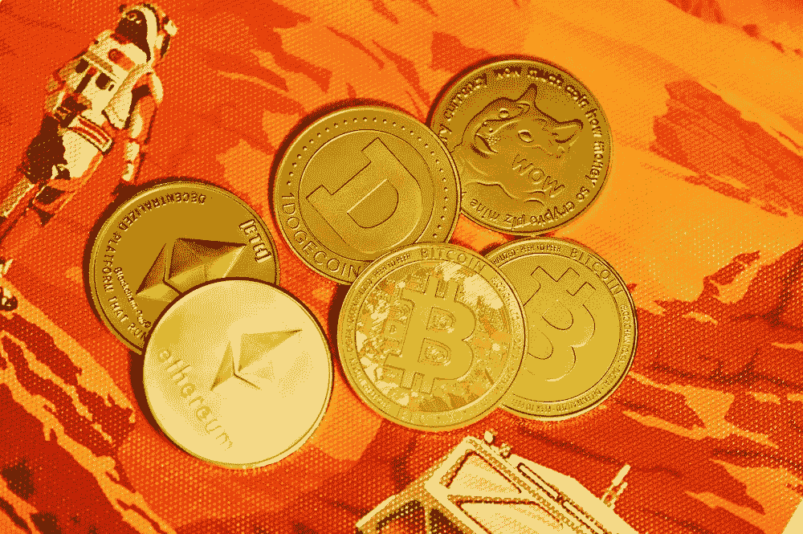

# 可持续加密组合

> 原文：<https://medium.com/coinmonks/sustainable-crypto-portfolio-98b440aaae1f?source=collection_archive---------22----------------------->

随着加密行业的成熟，投资者正在寻找建立能够经受时间考验的可持续投资组合的方法。过去，许多投资者把所有的鸡蛋放在一个篮子里，结果却看到他们投资的价值一夜之间化为乌有。

今天，精明的投资者正在用各种不同的资产使他们的投资组合多样化，包括像股票和债券这样的传统资产以及…