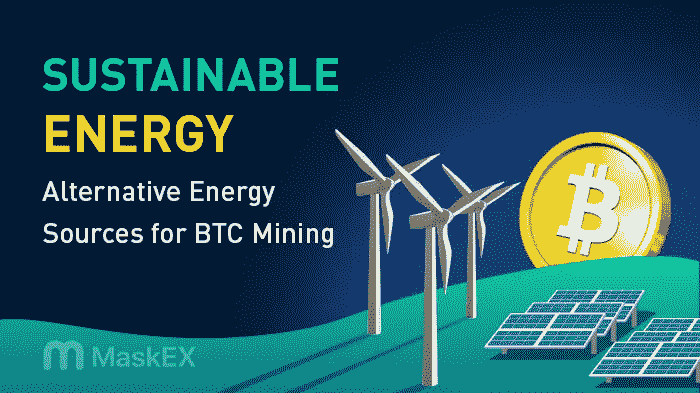

# 可持续能源:BTC 矿业的替代能源

> 原文：<https://medium.com/coinmonks/sustainable-energy-alternative-energy-sources-for-btc-mining-427726eee52e?source=collection_archive---------25----------------------->

加密货币挖掘是一种交易过程，它使用计算机和加密方法来解决复杂的问题，并将数据记录到区块链中。从某些方面来说，这和解决复杂的数学难题是一样的。如果你完成得够快，你会得到一枚硬币作为奖励。然而，如果另一个矿工在你之前解决了它，你就不会得到一个。这个过程被称为工作证明。

由于计算能力不足，典型的计算机无法为比特币和以太坊等加密货币挖掘区块。因此，需要 GPU 和专用集成电路(ASICs)。这种采矿设备消耗大量电力，留下巨大的碳足迹。

此外，采矿技术会产生大量热量，弄清楚如何保持系统冷却至关重要。这个问题可以通过在硬件附近使用电动散热风扇来解决，这也是耗电的。

随着发电和加密货币技术的进步，可再生能源可能会在全球范围内变得更加普遍。

# 什么是可持续能源？

可持续能源是既能满足当代人的需求，又不损害后代人满足自身需求的能力的能源。可持续能源的目标是找到清洁的、自我更新的能源，而不是那些会耗尽的资源

# BTC 矿业的替代能源

以下是 BTC 矿业的替代能源:

**太阳能**

太阳能现在是最常见的可再生能源，因为它使用太阳能。到达地球表面仅一个半小时的太阳能就足以满足地球一整年的全部能量需求。

太阳能也是增长最快的可再生能源，年均增长率为 33%。此外，预计在未来许多年里，它将继续快速发展。

**风**

另一种广泛使用的廉价可再生能源是风力发电，每千瓦时的成本在 0.01 美元到 0.02 美元之间。它也是可再生能源最丰富的来源之一。由于在风的能量过程中没有相关的温室气体产生，它也被认为是一种绿色能源。风能的碳足迹分别比天然气和煤炭低 40%和 90%。

**水电**

水力发电是从河流、小溪和其他水体中提取电能的过程。水电是一种非常可靠的电力来源，尽管是基于位置的，因为工厂必须建立在水体上。每千瓦时 0.04 美元，是最实惠的能源之一。此外，它是最高效的能源之一，因为植物可以将 90%的能量转化为电能，而化石燃料只能转化 50%。

**地热**

地壳中含有大量热量，这些热量可以转化为地热能；这种能量被认为比石油和天然气储量丰富 5 万倍。此外，地热植物被发现比化石燃料植物排放的二氧化碳少 99%，使其成为类似于风力的绿色能源。

# 结论

随着可再生能源的每一次进步，比特币采矿越来越环保。因此，如果矿工愿意购买使用可持续能源，比特币采矿就不必留下这么多碳足迹。

> 交易新手？试试[密码交易机器人](/coinmonks/crypto-trading-bot-c2ffce8acb2a)或者[复制交易](/coinmonks/top-10-crypto-copy-trading-platforms-for-beginners-d0c37c7d698c)