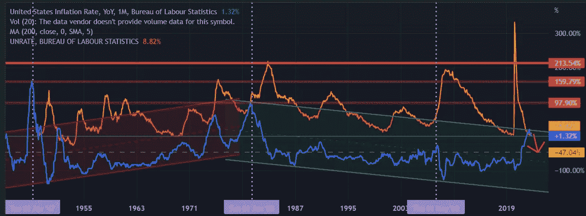

# SVET 市场每周更新(2022 年 11 月 28 日)

> 原文：<https://medium.com/coinmonks/svet-markets-weekly-update-november-28-2022-e4f50f4bfc53?source=collection_archive---------31----------------------->

**上周**主要宏观经济更新包括:

*   耐用品订单(10 月份):增长 1%，而分析预期为 0.4%；
*   新屋销售(10 月):0.632M vs 0.58M
*   首次申请失业救济人数(第 47 周):24 万对 22.8 万

在 FOMC 会议记录显示一些成员对鲍威尔的路线略有不满后，周三市场出现反弹。这是由劳工部发布的首次新失业救济金统计数据(每周提交)增加的，该数据显示上周失业人数增加到 24 万，而预测为 22.5 万。伊利诺伊州和加利福尼亚州出现了大幅增长。看起来科技公司的裁员潮终于冲击了政府的文件。

显然，一些玩家大胆押注 FOMC 将在 12 月 13 日至 14 日的会议上增加 50 点至 3.75 点。也许，太大胆了。不仅因为人口普查局的报告，同时，耐用品订单增加了 1 %,而分析预期为 0.4。

鲍威尔同时在玩两个游戏——政治和经济。然而，即使在共和党明显(虽然，部分)在中期选举中受挫后，他的游戏计划也不能如此彻底地改变。不管宏观指标和他的同事告诉他什么，他已经说服自己再增加 75 个百分点。

这些指标指向经济衰退和持续的通货膨胀(滞胀)——这种情况将迅速增加鲍威尔最亲密盟友中的敌人数量。

现在，在执业经济学家中形成了两大阵营。那些相信 FOMC 的公正性和老年政府的完美效率的人认为隧道将在两年甚至三年后陷入黑暗。他们说，在战争结束、通货膨胀恢复之前，我们必须坚持到底。他们认为鲍威尔是审查官卡托的转世，他喃喃自语着“迦太基·德伦达东部”，直到宇宙中的灯熄灭。

其他人认为鲍威尔远非卡托，而是更早地屈服于双方日益增长的压力。他们指出，2023 年年中(有些人甚至谈到 1 月至 2 月)是 FOMC 政策的潜在逆转点。

技术指标(为纳斯达克和 BTC 绘制)在时间上同意后一个阵营，在月图上显示了两个强阻力区:对纳斯达克来说，一个在 8K(1 月-10 月)，另一个在 5K(8 月-10 月)；为 BTC——在 10K 和 6K。

然而，第一个阵营认为，即使在达到这些阻力位后，市场也不会反弹，而是继续徘徊更长时间(根据一些公司基金分析，2-3 年)，甚至走低。

宏观经济预测支持这一论断，指出世界年生产率增长急剧下降(~ 30%)(根据摩根士丹利的数据，2022 年为 3.0%，2023 年为 2.2%)，一些国家(英国)的增长率大幅下降(从 4.4%到-1.5%)，一些国家的增长率减半(如巴西——从 2.8%到 1.2%)。

显然，整个欧盟地区将受到能源赤字的沉重打击(摩根士丹利分析师预计其 GDP 增长率将从 2022 年的 3.3%降至 2023 年的-0.2%)。

世界的积极因素是中国(增长率从 3.2 提高到 5.0)和中东(3.3 到 3.7)。中国可以依靠其庞大的人口不断增长的国内消费，而这些国家显然是油价上涨的主要受益者。预计美国的增长率将在一年内从 1.9%升至 0.5%。

面对增长速度几乎比平时慢四倍的经济，年老的政治家们会做些什么？当然，他们想像往常一样昏昏欲睡，但我想更年轻、更精明的竞争对手不会允许他们这样做。因此，预算扩张和利率逆转可能会尽快回到议程上来。

但是，对过时的系统不提供担保。整个世界的政治、金融和经济机制是如此陈旧和破败，以至于它可能会因自身运转不良而让两大阵营同时感到惊讶。

**新的一周**(节后)带给我们:

*   周三(11 月 30 日):自动数据处理公司(ADP)公布的就业变化、东亚银行公布的 GDP 增长率以及 BLS 公布的职位空缺；
*   周四(12 月 1 日):个人收入/支出(BEA)和 ISM 制造业 PMI
*   周五(12 月 2 日):失业率和非农就业人数(BLS)

如果我们阅读 10 月份 ADP 全国就业报告摘要(仅显示私营雇主的就业机会)，美国私营劳动力市场似乎保持良好。

(引用:报告)10 月份私营部门就业岗位增加了 239，000 个(高于 9 月份的 192，000 个，11 月份的 198，000 个)，年薪同比增长 7.7%(eq)。

然而，几乎所有的增长(> 87%)都来自休闲/酒店行业(210，000 个工作岗位)，这些行业位于西部(229，000 个工作岗位)/北部(50，000 个工作岗位)地区，而且只是所谓的“中型企业”(50 到 250 名员工)。基本上，除了餐馆、零售商和旅游部门，所有在假期前招聘的企业，要么冻结招聘，要么裁员(特别是企业)。ADP 工作人员指出这一事实是轻描淡写。

(引用:ADP 首席经济学家)虽然我们看到了美联储推动的需求破坏的早期迹象，但它只影响到劳动力市场的某些领域。(情商)

下面是它的详细情况:

自然资源/采矿(11K)；建筑(1.0K)；制造业(-20K)；贸易/运输/公用事业(84K)；信息(-17K)；金融活动(-10K)；专业/商业服务(-14K)；教育/保健服务(-5.0K)；休闲/酒店(210k)；其他服务(-1.0K)。

东北(50K)；中西部(-23.0k)；南:(-17K)；西部(229K)

小型企业(25K)；中型企业(218k)；大型企业(-4.0K)

总而言之，鲍威尔通过摧毁资本主义经济继续做着伟大的工作。

GDP 增长率统计数据(经济分析局的报告)很好地反映了这一点。仅在两年内，经济增长(按季度衡量)就下降了 10 倍，从 2020 年第三季度的+25%降至 2022 年第三季度的+2.6%(第四季度预测为+2.8%)。尽管如此，当权的伪君子仍在给密码行业贴上“狂野西部”的标签，呼吁“安然条例”。

与此同时，由于几个老头过时的“金融政策”，所有部门都受到了沉重的打击。第三季度 GDP 唯一的小幅增长是净贸易的增长。在石油产品的带动下，出口增长了 14.4%，而进口下降了 6.9%。此外，所谓的“非住宅投资”也略有上升(3.7%，主要是交通设备)。

另一方面，“住宅投资”大幅下降(-26.4%)，主要受住房市场的影响，住房市场受到抵押贷款利率飙升的打击。此外，消费者支出持续放缓(Q2 为 1.4%对 2.0%)。

与 APD 的私营部门就业数据相比，劳动统计局(BLS)报告的职位空缺(JOLTs)信息显示了整个经济中的职位空缺数(不是实际雇佣数)——包括政府职位。它显示了同样的趋势。

九月份的访问量高达 1072 万次(八月份为 1020 万次)。据报道，增加最多的是住宿和餐饮服务(+21.5 万)以及交通(+11.1 万)。在其他地方，新工作岗位的数量增加较少，或者大部分是下降的。

鲍威尔向消费者传达的信息之一是，他们必须立即削减支出，否则后果不堪设想。他和他的合作者认为，民主可以与金融独裁携手并进，在金融独裁中，未经选举的公子哥儿以虚构的“经济稳定”的名义告诉我们如何花钱，而根据 100 年来的核心经济统计数据，这根本不存在。

个人支出一直是经济增长的主要驱动力，现在是鲍威尔的主要射击目标之一。尽管通胀率和借贷成本飙升，但这些支出仍在继续增加(9 月份显示环比增长 0.6%，11 月份预计增长 0.4/0.7%)。

实际上，所有服务部门都出现了增长，其中最大的贡献者是住房和旅行/交通。在商品方面，只有汽油和其他能源商品的价格显著下降。(资料来源:经济分析局)

它清楚地表明，即使没有鲍威尔疯狂的加息，对与通胀无关的行业产生负面影响，需求/供应的市场力量也会减少消费者对能源产品的消费。

众所周知，美国联邦储备系统(美联储)成立之初(1913 年 12 月 23 日)，就“获得了国会的授权”。历史记录确凿地表明(100 多年来),美联储完全没有能力完成其被分配的工作——平衡通货膨胀和失业率。

从 1940 年以来绘制的两张图表(失业和通货膨胀)上，我们可以清楚地看到——通货膨胀的峰值之后是最高的失业率。这是美联储的杰作。为了防止暂时的价格上涨(这必须由需求/供给力量有机地解决)，FOMC 提高了利率，导致了长期失业。因此，美联储只是加倍了人民的苦难。

Inflation vs Unemployment since 1940th

同样的事情也发生在我们的生活中。然而，不同的是，今天美联储加息以前所未有的速度发生，导致市场在企业适应新的疯狂高借款利率之前就崩溃了。例如，自 3 月份以来，失业率一直在 3.5%至 3.7%的范围内。

根据劳工统计局的数据，10 月份失业率上升了 0.2 个百分点，达到 3.7%(9 月份为 3.5%)。失业人数增加了 306 人(606 万)，而就业人数减少了 328 人(1.586 亿)。劳动力参与率从 62.3%小幅降至 62.2%。

当然，这并不意味着这种情况会持续很长时间。

**为更:**

> **交易新手？尝试[加密交易机器人](/coinmonks/crypto-trading-bot-c2ffce8acb2a)或[复制交易](/coinmonks/top-10-crypto-copy-trading-platforms-for-beginners-d0c37c7d698c)**